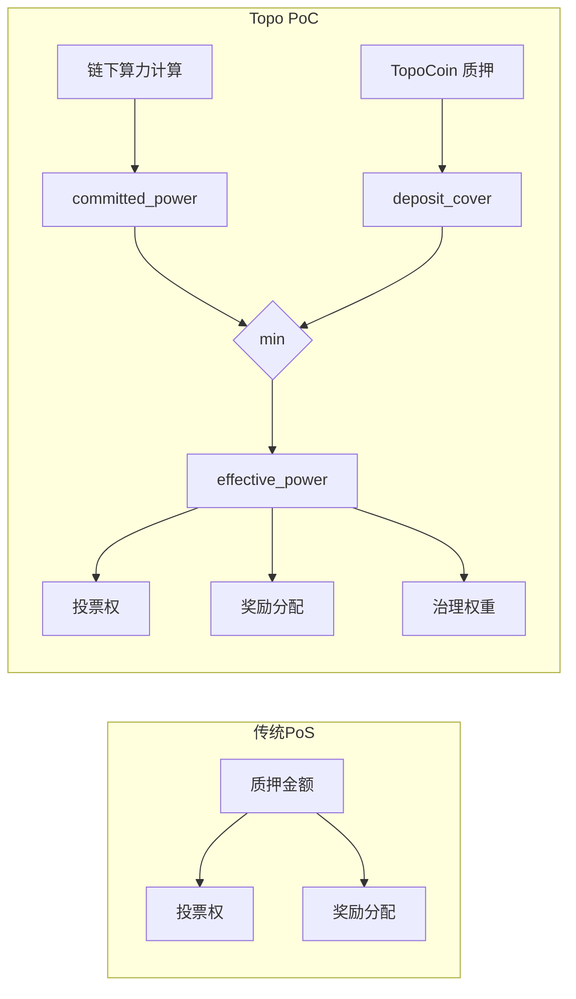
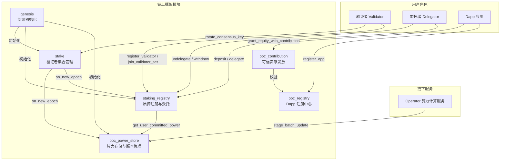
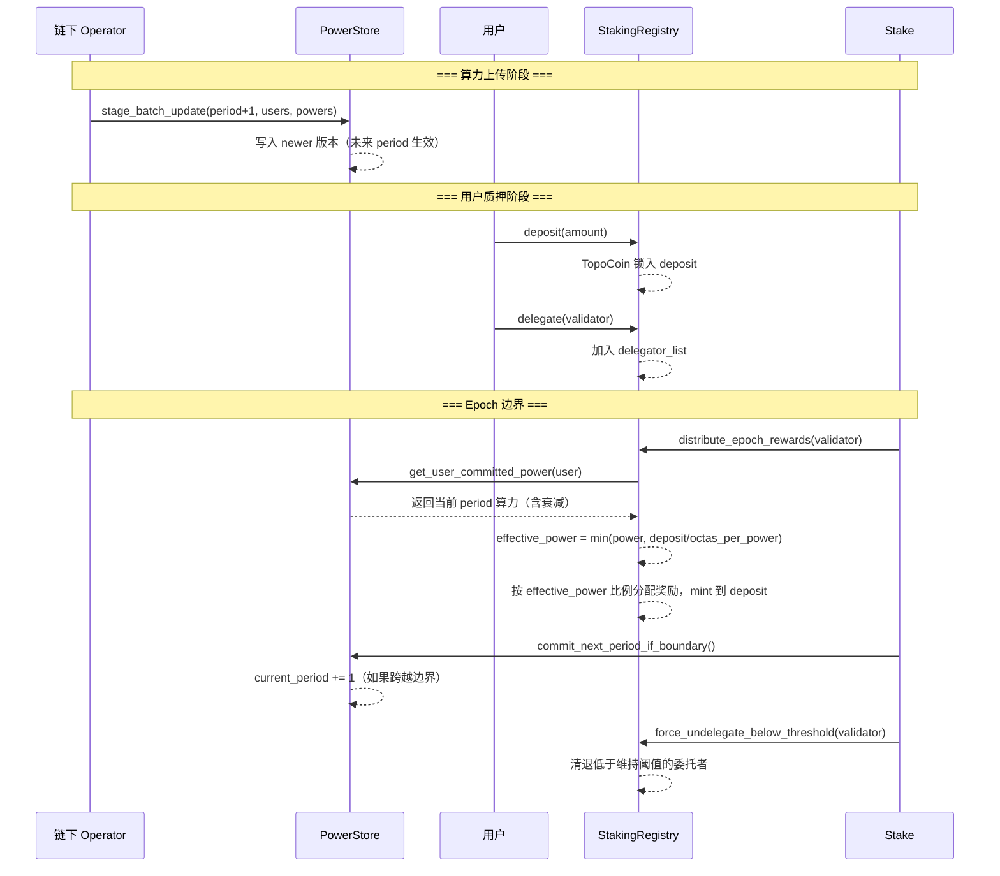

# 01 — PoC 共识系统总览与设计哲学

## 1.1 什么是 PoC（Proof of Contribution）

Topo Chain 采用 **算力质押（PoC）** 共识模型，核心思想是：

> **共识投票权 = 有效算力（effective_power），而非质押金额。**

TopoCoin 仅用于 Gas 费支付和奖励发放，不直接决定投票权重。真正驱动共识的是链下计算、链上存证的 **算力值（committed_power）**。

```
传统 PoS:  投票权 = f(质押金额)
Topo PoC:  投票权 = f(有效算力) = f(min(算力, 质押担保))
```

## 1.2 与传统 PoS 的核心区别



| 维度 | 传统 PoS | Topo PoC |
|------|---------|----------|
| 投票权来源 | 质押金额 | 有效算力 = min(算力, 质押担保) |
| 质押角色 | 直接决定权重 | 仅作为算力的经济担保上限 |
| 奖励分配 | 按质押比例 | 按有效算力比例 |
| 算力来源 | 无 | 链下服务计算，链上存证 |
| 算力衰减 | 无 | 每个 period 按 retention 比例衰减 |
| 经济安全 | 质押锁定 | 质押担保 + 冷却期 |

## 1.3 系统架构全景



## 1.4 模块职责划分

| 模块 | 文件 | 核心职责 |
|------|------|---------|
| `poc_power_store` | `poc/poc_power_store.move` | 算力存储、双版本管理、惰性衰减、period 边界提交 |
| `staking_registry` | `poc/staking_registry.move` | 质押注册、存款/委托/解委托、有效算力计算、奖励分配、强制退出 |
| `stake` | `stake.move` | 验证者集合状态机、epoch 边界编排、共识密钥管理、交易费记录 |
| `genesis` | `genesis.move` | 链创世初始化、验证者引导、首个 epoch 触发 |
| `poc_registry` | `poc/poc_registry.move` | Dapp 应用注册、POC 白名单管理、反查索引 |
| `poc_contribution` | `poc/poc_contribution.move` | 可信贡献发放、股权代币转账、ContributionEvent 发出 |

## 1.5 关键设计原则

### 算力与质押的双重约束

有效算力 = min(committed_power, deposit / octas_per_power)

- **算力不足**：即使质押很多，投票权也受限于实际贡献
- **质押不足**：即使算力很高，投票权也受限于经济担保
- **两者缺一不可**：确保参与者既有真实贡献，又有经济利益绑定

### 惰性衰减（Lazy Decay）

算力不在 epoch 边界全量重写，而是在读取时按 `retention_bps_per_period` 惰性计算衰减值。这意味着：
- epoch 边界 O(1) 复杂度（仅推进 period 计数器）
- 未更新用户的算力自动按比例衰减
- 持续贡献的用户通过 `stage_batch_update` 刷新算力

### 奖励自动复利

奖励直接 mint 到用户的 `deposit` 中，增加的 deposit 可以覆盖更多算力，形成正向循环：

```
贡献 → 算力 → 有效算力 → 奖励 → deposit 增加 → 可覆盖更多算力
```

### 迟滞阈值（Hysteresis）

进入门槛和退出门槛不同，防止边界用户反复进出：
- 进入：`effective_power >= min_active_power`
- 退出：`effective_power < min_active_power * force_exit_power_bps / 10000`

## 1.6 核心数据流



## 1.7 文档导航

| 编号 | 文档 | 内容 |
|------|------|------|
| 01 | 本文 | 系统总览与设计哲学 |
| 02 | 核心数据结构 | 所有模块的 struct、字段、关系图 |
| 03 | 算力存储与版本管理 | PowerStore 双版本、衰减、period 边界 |
| 04 | 质押注册与委托流程 | deposit / delegate / undelegate / withdraw |
| 05 | 有效算力计算 | effective_power 公式与数值示例 |
| 06 | Epoch 边界与奖励分配 | on_new_epoch 五阶段、奖励公式 |
| 07 | 退出状态机与强制退出 | 用户状态转换、冷却期、迟滞机制 |
| 08 | 验证者集合管理 | 加入/离开、投票权重、活性回退 |
| 09 | Dapp 注册与贡献事件 | poc_registry + poc_contribution |
| 10 | 创世初始化流程 | Genesis 完整时序 |
| 11 | 治理与参数配置 | 可治理参数、错误码、事件索引 |
| 12 | 端到端场景分析 | 完整场景走查 |
| 13 | 共识测试框架设计 | Move 逻辑、Epoch 编排与 Rust 接口的完整测试方案 |
| 14 | 端到端测试用例设计 | 独立 Move 测试文件划分、逐场景用例与最小 test_only 接口 |
| 15 | POC 单机 4 节点模拟运行测试方案 | 编译、部署、创世、验证者加入/退出与奖励分发流程 |
| 16 | POC smoke-test 调查改动总结 | 本轮改动、失败原因、修复方案与仍失败原因 |
