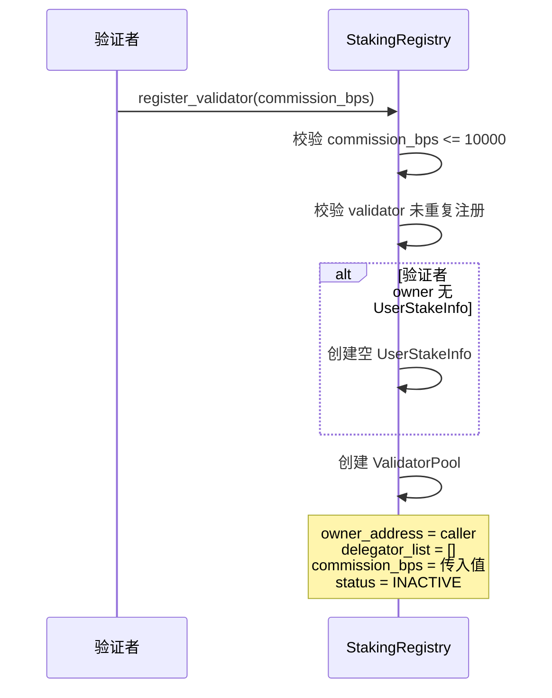
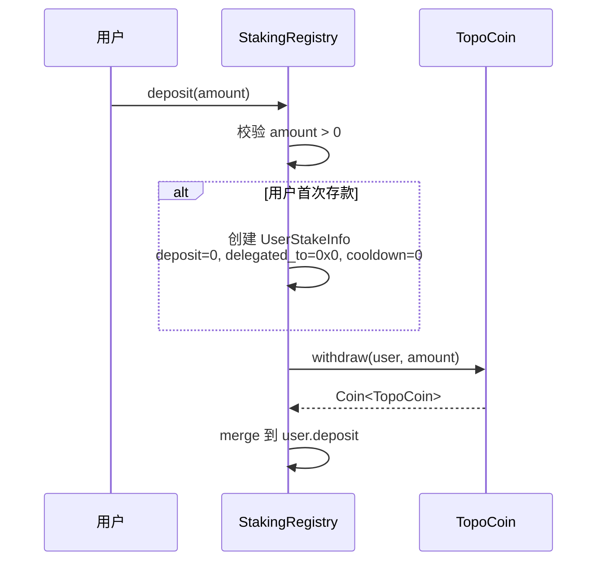
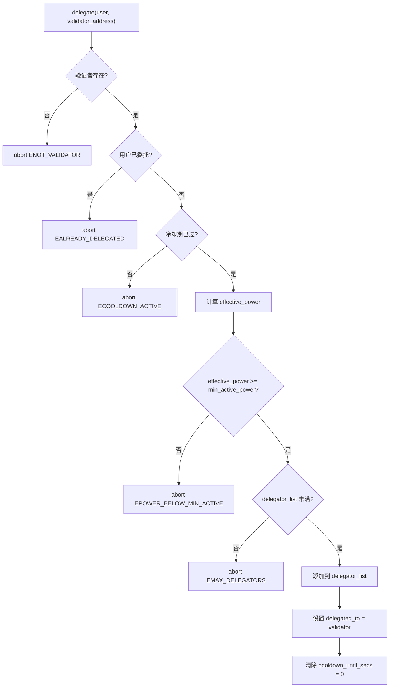
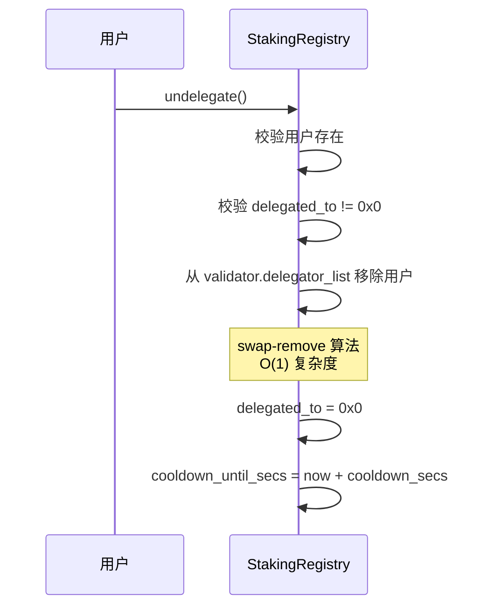
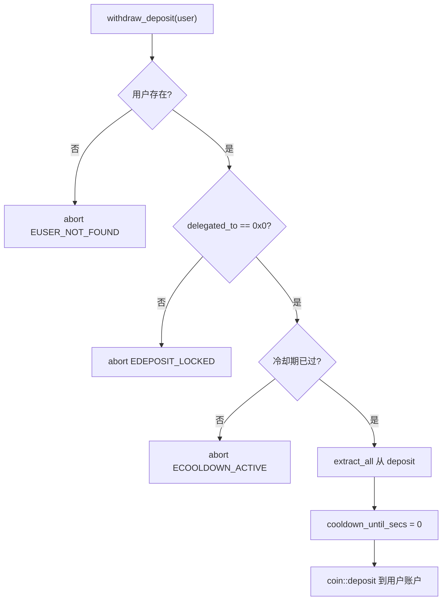
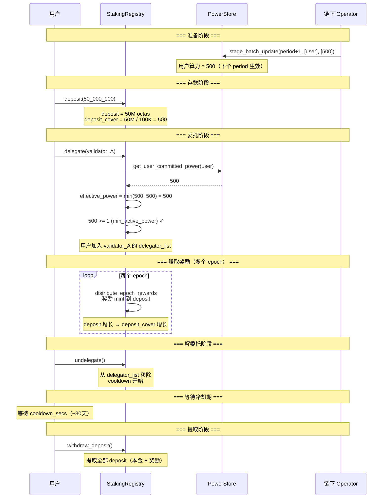

# 04 — 质押注册与委托流程

本文档详细分析 `staking_registry` 模块中验证者注册、用户存款、委托、解委托和提取的完整流程。

**源文件**：`poc/staking_registry.move`

## 4.1 验证者注册

### 注册入口

```move
// 自注册（验证者自己调用）
public entry fun register_validator(validator: &signer, commission_bps: u64)

// Genesis 专用（friend 权限）
public(friend) fun register_validator_for_genesis(owner, validator_address, commission_bps)

// Owner 代注册（friend 权限，stake 模块调用）
public(friend) fun register_validator_for_owner(owner, validator_address, commission_bps)
```

### 注册流程



**关键约束**：
- `commission_bps` 范围 [0, 10000]，即 0% ~ 100%
- 同一地址不能重复注册
- 注册后状态为 `INACTIVE`，需要后续 `join_validator_set` 才能参与共识

## 4.2 用户存款（deposit）



**特点**：
- 可多次存款，金额累加
- 存款不自动委托，需要单独调用 `delegate`
- 存款后 `deposit_cover = deposit / octas_per_power` 增加，可覆盖更多算力

## 4.3 委托（delegate）



**前置条件**：
1. 目标验证者已注册
2. 用户当前未委托给任何验证者
3. 冷却期已过（或从未有冷却期）
4. `effective_power >= min_active_power`（默认 1）
5. 验证者的 `delegator_list` 未达上限（默认 1000）

**委托后效果**：
- 用户加入验证者的 `delegator_list`
- 用户的 `effective_power` 计入验证者的 `total_power`
- 开始参与奖励分配

## 4.4 解委托（undelegate）



**解委托后效果**：
- 立即停止参与奖励分配
- 进入冷却期（默认 30 天）
- 冷却期内不能重新委托，也不能提取存款

### delegator_list 的 swap-remove 算法

```
假设 delegator_list = [A, B, C, D, E]，要移除 B（index=1）

1. 获取 B 的 index = 1
2. last_index = 4（E 的位置）
3. 将 E 移到 index 1: [A, E, C, D, E]
4. 更新 E 的 index 映射: delegator_index[E] = 1
5. pop_back: [A, E, C, D]
6. 删除 B 的 index 映射

结果: delegator_list = [A, E, C, D]
```

## 4.5 提取存款（withdraw_deposit）



**提取条件**：
1. 用户未委托（`delegated_to == 0x0`）
2. 冷却期已过（`now >= cooldown_until_secs`）或无冷却期（`cooldown_until_secs == 0`）

**提取金额**：`deposit` 中的全部余额，包括原始存款 + 累积的奖励。

## 4.6 完整用户生命周期



## 4.7 验证者自委托

验证者必须自委托才能加入验证者集合。在 `join_validator_set` 中会检查：

```move
let self_power = staking_registry::get_validator_joining_power(pool_address);
assert!(self_power > 0, error::invalid_argument(ESTAKE_TOO_LOW));
```

`get_validator_joining_power` 返回验证者 owner 的 effective_power：

```move
public fun get_validator_joining_power(validator_address: address): u64 {
    let pool = registry.validators.borrow(validator_address);
    get_user_effective_power_for_validator(registry, pool.owner_address, validator_address)
}
```

这意味着验证者 owner 必须：
1. 有存款（deposit > 0）
2. 有算力（committed_power > 0）
3. 已委托给自己（delegate(self)）

## 4.8 错误码速查

| 错误码 | 常量 | 触发场景 |
|--------|------|---------|
| 1 | `ENOT_VALIDATOR` | 目标地址不是验证者 |
| 2 | `EALREADY_VALIDATOR` | 已注册为验证者 |
| 3 | `EALREADY_DELEGATED` | 已委托给某验证者 |
| 4 | `ENOT_DELEGATED` | 未委托（解委托时） |
| 5 | `EDEPOSIT_LOCKED` | 存款锁定（仍在委托中） |
| 6 | `ECOOLDOWN_ACTIVE` | 冷却期未过 |
| 7 | `EZERO_DEPOSIT` | 存款金额为 0 |
| 8 | `EMAX_DELEGATORS` | 验证者委托者已满 |
| 9 | `EUSER_NOT_FOUND` | 用户不存在 |
| 10 | `EINVALID_COMMISSION` | 佣金超过 10000 bps |
| 15 | `EPOWER_BELOW_MIN_ACTIVE` | 有效算力低于最低门槛 |
