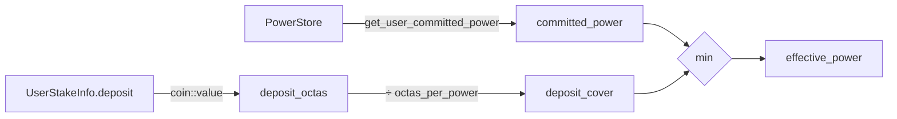
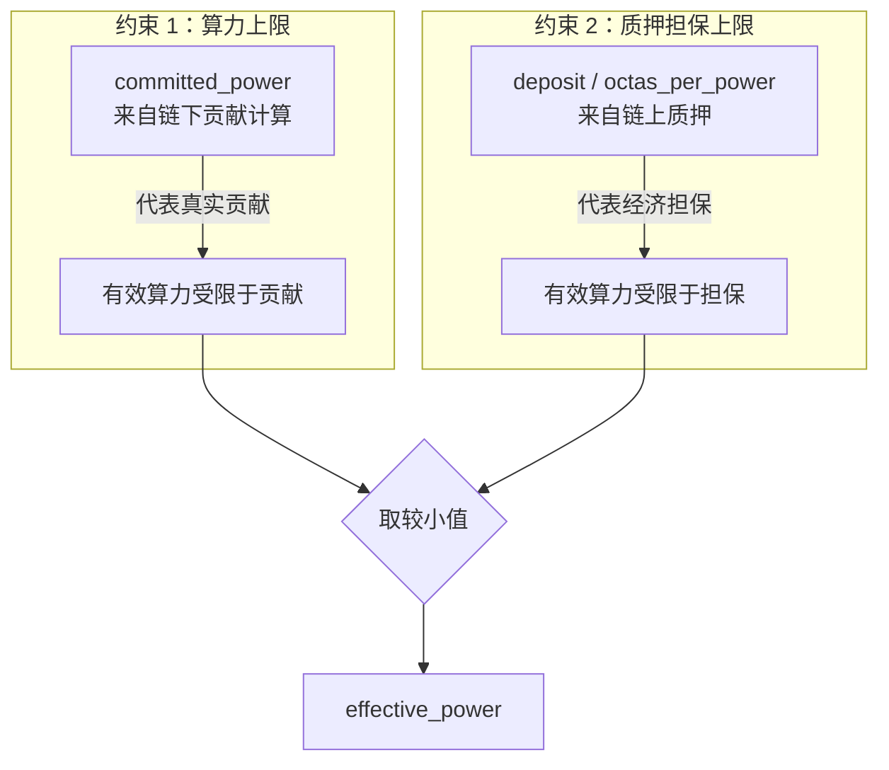
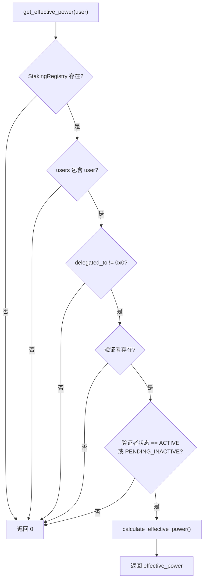
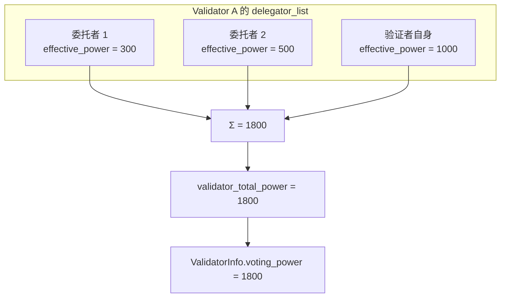

# 05 — 有效算力计算

本文档深入分析 `effective_power` 的计算公式、双重约束机制和数值示例。

**源文件**：`poc/staking_registry.move:883-895`

## 5.1 核心公式

```
effective_power = min(committed_power, deposit_octas / octas_per_power)
```

其中：
- `committed_power` = 从 `PowerStore` 读取的当前 period 算力（含衰减）
- `deposit_octas` = 用户 `UserStakeInfo.deposit` 中的 TopoCoin 余额（octas）
- `octas_per_power` = 每单位算力需要的质押担保（默认 100,000 octas = 0.001 TOPO）



## 5.2 源码实现

```move
fun calculate_effective_power(
    info: &UserStakeInfo,
    octas_per_power: u64,
    user: address,
): u64 {
    let committed_power = poc_power_store::get_user_committed_power(user);
    if (committed_power == 0) {
        return 0
    };
    let deposit_octas = coin::value(&info.deposit);
    let deposit_cover = deposit_octas / octas_per_power;
    math64::min(committed_power, deposit_cover)
}
```

## 5.3 双重约束的经济含义



| 场景 | committed_power | deposit_cover | effective_power | 瓶颈 |
|------|----------------|---------------|-----------------|------|
| 算力充足，质押不足 | 1000 | 200 | 200 | 质押担保 |
| 质押充足，算力不足 | 300 | 1000 | 300 | 算力贡献 |
| 两者均衡 | 500 | 500 | 500 | 均衡 |
| 无算力 | 0 | 1000 | 0 | 无贡献 |
| 无质押 | 1000 | 0 | 0 | 无担保 |

## 5.4 数值走查

### 场景 A：新用户加入

```
初始条件：
  octas_per_power = 100,000
  committed_power = 500（链下 Operator 已上传）

用户操作：deposit(30_000_000)  // 0.3 TOPO

计算：
  deposit_octas = 30,000,000
  deposit_cover = 30,000,000 / 100,000 = 300
  effective_power = min(500, 300) = 300

结论：质押不足，有效算力受限于 300
```

### 场景 B：追加质押

```
接场景 A，用户追加：deposit(20_000_000)  // 再存 0.2 TOPO

计算：
  deposit_octas = 30,000,000 + 20,000,000 = 50,000,000
  deposit_cover = 50,000,000 / 100,000 = 500
  effective_power = min(500, 500) = 500

结论：质押充足，有效算力 = committed_power
```

### 场景 C：算力衰减

```
接场景 B，经过 1 个 period 未更新算力（retention = 99.5%）

计算：
  committed_power = 500 × 0.995 = 497
  deposit_octas = 50,000,000（不变）
  deposit_cover = 500（不变）
  effective_power = min(497, 500) = 497

结论：算力衰减成为瓶颈
```

### 场景 D：奖励复利效应

```
接场景 C，假设本 epoch 获得奖励 5,000,000 octas

计算：
  deposit_octas = 50,000,000 + 5,000,000 = 55,000,000
  deposit_cover = 55,000,000 / 100,000 = 550
  committed_power = 497（衰减后）
  effective_power = min(497, 550) = 497

结论：奖励增加了 deposit_cover 的余量
      即使算力继续衰减到 550 以下，质押仍有余裕
```

## 5.5 get_effective_power 的完整前置检查

公开的 `get_effective_power` view 函数在计算前会做多重检查：



**返回 0 的情况**：
1. 注册中心未初始化
2. 用户不存在
3. 用户未委托
4. 委托的验证者不存在
5. 验证者不在 ACTIVE 或 PENDING_INACTIVE 状态
6. committed_power = 0
7. deposit = 0

## 5.6 验证者总算力

验证者的总投票权 = 所有委托者的 effective_power 之和。

```move
public fun get_validator_total_power(validator_address: address): u64 {
    let pool = registry.validators.borrow(validator_address);
    let total_power = 0u128;
    pool.delegator_list.for_each_ref(|member| {
        total_power += (get_user_effective_power_for_validator(
            registry, *member, validator_address
        ) as u128);
    });
    total_power as u64
}
```



## 5.7 下一 Epoch 算力预测

`get_validator_total_power_for_next_epoch` 用于 `stake` 模块预测下一 epoch 的投票权，额外考虑了强制退出阈值：

```move
fun get_user_effective_power_for_validator_for_next_epoch(
    registry, user, validator_address, maintain_threshold
): u64 {
    // ... 前置检查 ...
    let committed_power = poc_power_store::get_user_committed_power_for_next_epoch(user);
    let deposit_cover = deposit_octas / octas_per_power;
    let effective_power = min(committed_power, deposit_cover);

    // 如果低于维持阈值，预测为 0（将被强制退出）
    if (effective_power < maintain_threshold) { 0 } else { effective_power }
}
```

这使得 `next_validator_consensus_infos()` 能准确预测下一 epoch 的验证者集合。

## 5.8 octas_per_power 的经济意义

`octas_per_power = 100,000` 意味着：

| 质押金额 | 可覆盖算力 |
|---------|-----------|
| 0.001 TOPO (100,000 octas) | 1 |
| 0.01 TOPO (1,000,000 octas) | 10 |
| 0.1 TOPO (10,000,000 octas) | 100 |
| 1 TOPO (100,000,000 octas) | 1,000 |
| 10 TOPO (1,000,000,000 octas) | 10,000 |

**调整 octas_per_power 的影响**：
- 增大 → 每单位算力需要更多质押，提高经济安全性
- 减小 → 每单位算力需要更少质押，降低参与门槛
- 可通过治理提案调整
