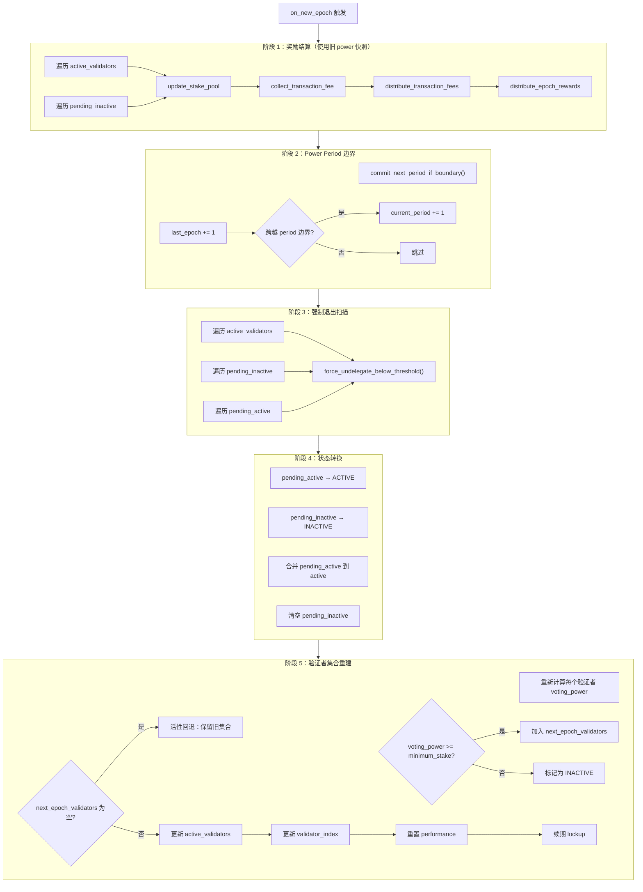
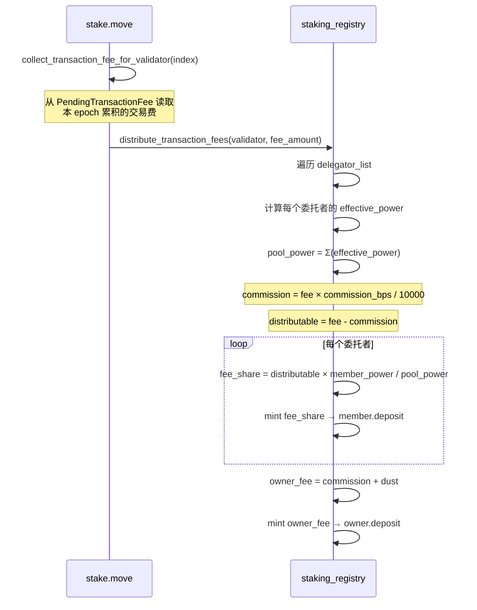
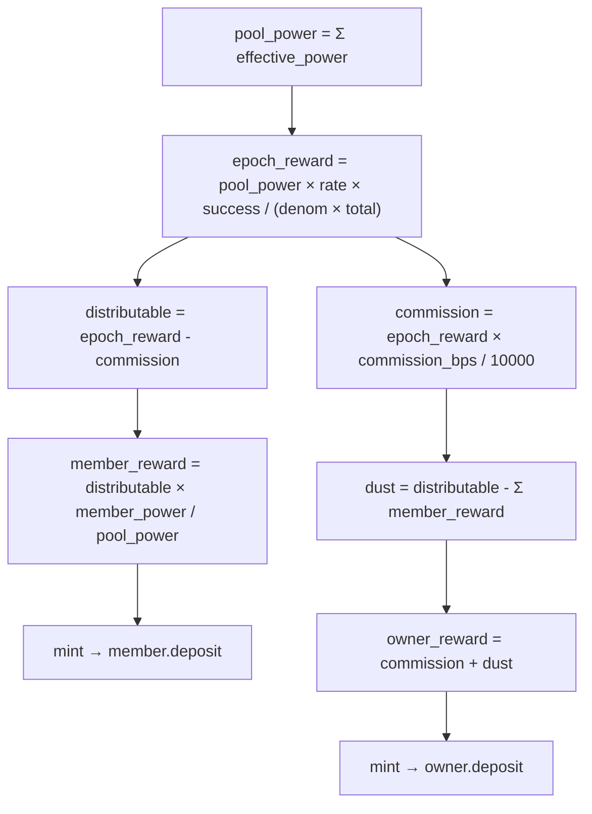
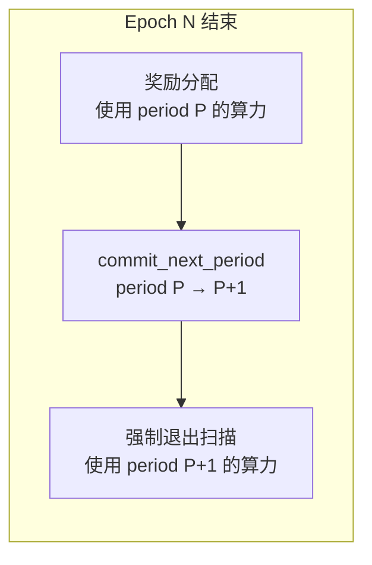
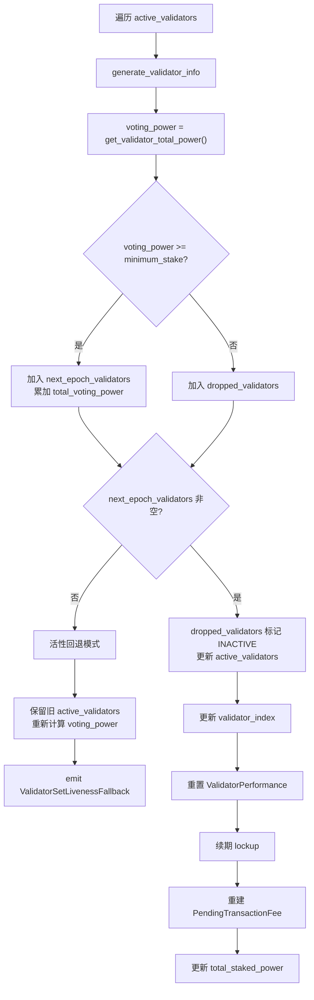
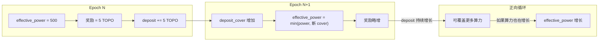
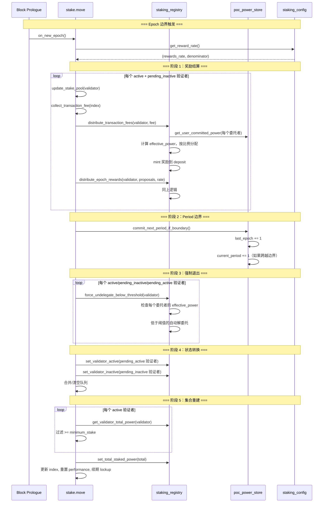

# 06 — Epoch 边界与奖励分配

本文档深入分析 `on_new_epoch()` 的完整五阶段流程、奖励计算公式、交易费分配机制。

**源文件**：`stake.move:1101-1355`, `poc/staking_registry.move:513-642`

## 6.1 on_new_epoch 五阶段总览



## 6.2 阶段 1：奖励结算

### 6.2.1 交易费分配



### 6.2.2 Epoch 奖励分配

```move
public(friend) fun distribute_epoch_rewards(
    validator_address: address,
    num_successful_proposals: u64,
    num_total_proposals: u64,
    rewards_rate: u64,
    rewards_rate_denominator: u64,
)
```

**奖励计算公式**：

```
epoch_reward = pool_power × rewards_rate × num_successful_proposals
               ÷ (rewards_rate_denominator × num_total_proposals)
```

**分配流程**：



### 6.2.3 数值示例

```
假设：
  验证者 A 有 3 个委托者：
    - Owner:  effective_power = 1000
    - User1:  effective_power = 500
    - User2:  effective_power = 300
  pool_power = 1800
  commission_bps = 1000 (10%)
  rewards_rate = 1, rewards_rate_denominator = 100
  num_successful = 95, num_total = 100

计算：
  epoch_reward = 1800 × 1 × 95 / (100 × 100) = 17 (整数截断)
  commission = 17 × 1000 / 10000 = 1
  distributable = 17 - 1 = 16

  Owner reward = 16 × 1000 / 1800 = 8
  User1 reward = 16 × 500 / 1800 = 4
  User2 reward = 16 × 300 / 1800 = 2
  sum_distributed = 8 + 4 + 2 = 14
  dust = 16 - 14 = 2

  Owner 最终获得 = commission(1) + dust(2) + reward(8) = 11
  User1 获得 = 4
  User2 获得 = 2
  总计 = 11 + 4 + 2 = 17 ✓
```

### 6.2.4 u128 防溢出

奖励计算中使用 u128 中间运算：

```move
let reward = (((distributable as u128) * (member_power as u128)) / pool_power) as u64;
```

这防止了 `distributable × member_power` 在 u64 范围内溢出。

## 6.3 阶段 2：Power Period 边界

```move
// stake.move:1166
poc_power_store::commit_next_period_if_boundary();
```

**关键时序**：奖励分配在 period 推进之前完成，确保：
- 奖励按旧 period 的算力分配（公平性）
- 新 period 的算力变化不影响本 epoch 的奖励



## 6.4 阶段 3：强制退出扫描

对所有三个队列（active、pending_inactive、pending_active）的验证者执行强制退出检查。

```move
// stake.move:1167-1178
validator_set.active_validators.for_each_ref(|v| {
    staking_registry::force_undelegate_below_threshold(v.addr);
});
validator_set.pending_inactive.for_each_ref(|v| {
    staking_registry::force_undelegate_below_threshold(v.addr);
});
validator_set.pending_active.for_each_ref(|v| {
    staking_registry::force_undelegate_below_threshold(v.addr);
});
```

详见 [07-退出状态机与强制退出.md](07-退出状态机与强制退出.md)。

## 6.5 阶段 4：状态转换

```move
// pending_active → ACTIVE
validator_set.pending_active.for_each_ref(|v| {
    staking_registry::set_validator_active(v.addr);
});

// pending_inactive → INACTIVE
validator_set.pending_inactive.for_each_ref(|v| {
    staking_registry::set_validator_inactive(v.addr);
});

// 合并队列
append(&mut validator_set.active_validators, &mut validator_set.pending_active);
validator_set.pending_inactive = vector::empty();
```

## 6.6 阶段 5：验证者集合重建



### 活性回退机制

当所有验证者的 `voting_power` 都低于 `minimum_stake` 时，系统进入紧急模式：

```move
if (next_epoch_validators.is_empty()) {
    // 保留旧验证者集合，重新计算投票权
    let refreshed_validators = vector::empty();
    // ... 遍历旧 active_validators，刷新 voting_power ...
    validator_set.active_validators = refreshed_validators;
    event::emit(ValidatorSetLivenessFallback { ... });
}
```

这确保链不会因为没有合格验证者而停机。

### generate_validator_info

```move
fun generate_validator_info(pool_address: address, config: ValidatorConfig): ValidatorInfo {
    let voting_power = staking_registry::get_validator_total_power(pool_address);
    ValidatorInfo { addr: pool_address, voting_power, config }
}
```

投票权直接来自 `staking_registry` 的算力计算，不再依赖 `StakePool` 中的 coin 余额。

## 6.7 奖励自动复利机制



奖励直接 mint 到 `deposit`，无需用户手动操作：
- `deposit` 增长 → `deposit_cover` 增长
- 如果 `committed_power` 是瓶颈，奖励积累为未来的担保余量
- 如果 `deposit_cover` 是瓶颈，奖励直接提升 `effective_power`

## 6.8 交易费记录与分配

### 记录阶段（每个区块）

```move
// 由 VM 调用，记录每个验证者的交易费
public(friend) fun record_fee(
    vm: &signer,
    fee_distribution_validator_indices: vector<u64>,
    fee_amounts_octa: vector<u64>,
)
```

交易费按 `validator_index` 累积到 `PendingTransactionFee` 的 `Aggregator` 中。

### 收集阶段（epoch 边界）

```move
fun collect_transaction_fee_for_validator(validator_index: u64): u64
```

从 `PendingTransactionFee` 中读取并清零该验证者的累积交易费。

### 分配阶段

交易费的分配逻辑与 epoch 奖励完全相同：
1. 计算佣金
2. 按 effective_power 比例分配
3. dust 归验证者 owner

## 6.9 完整时序图


