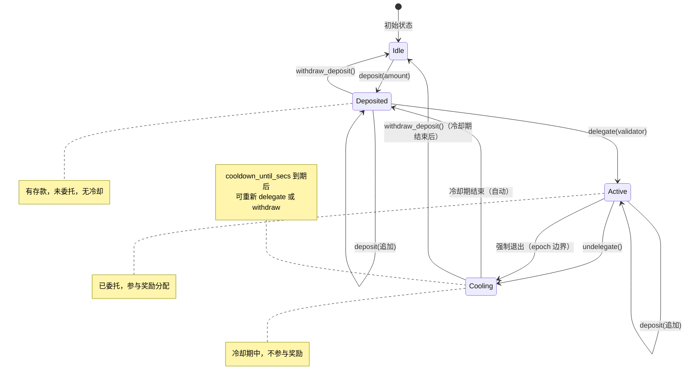
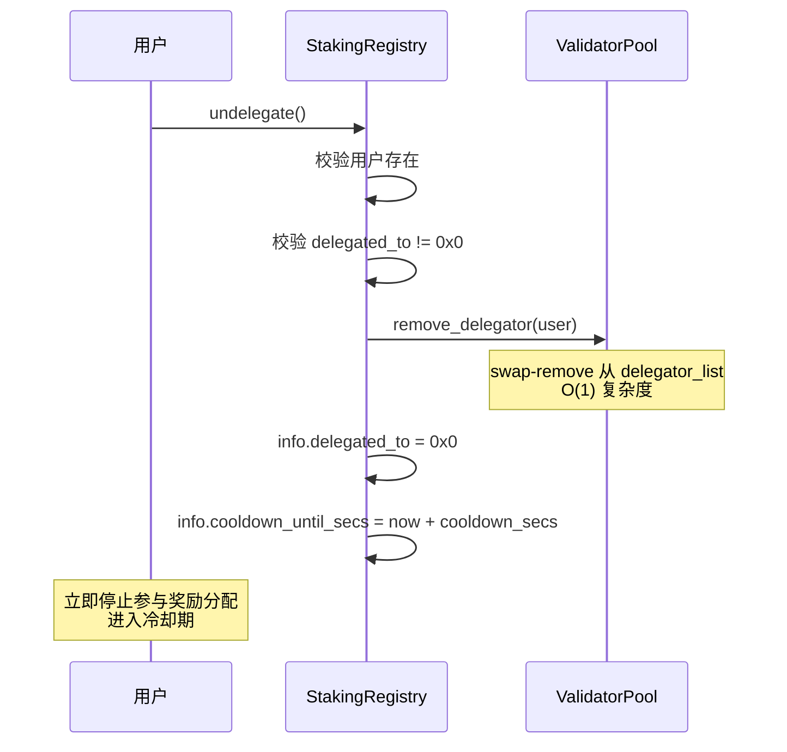
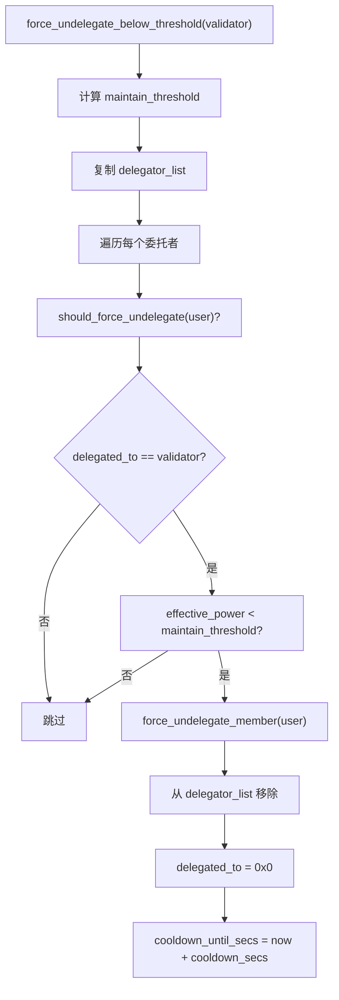
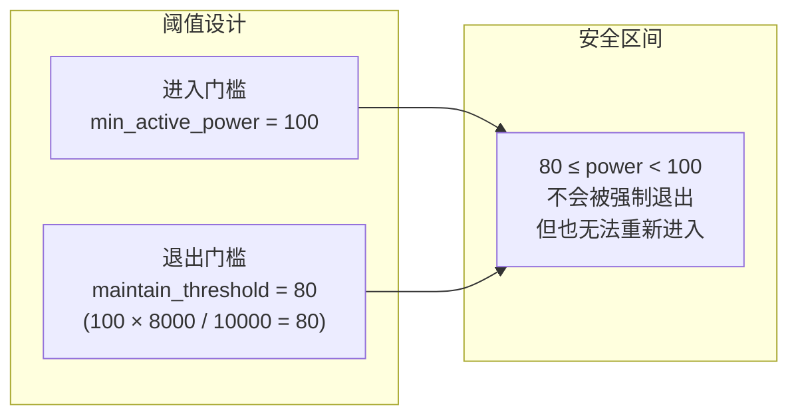
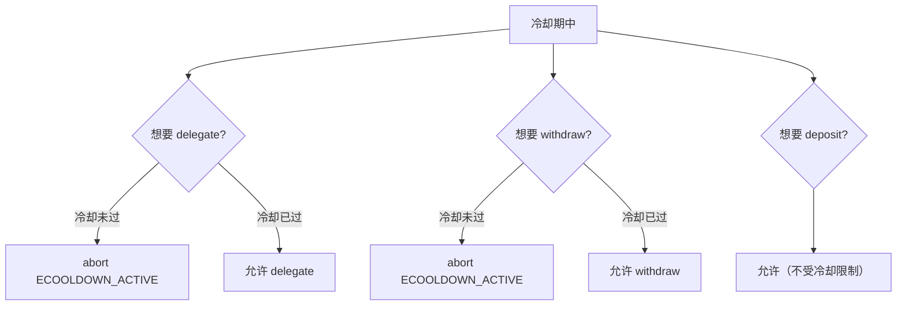
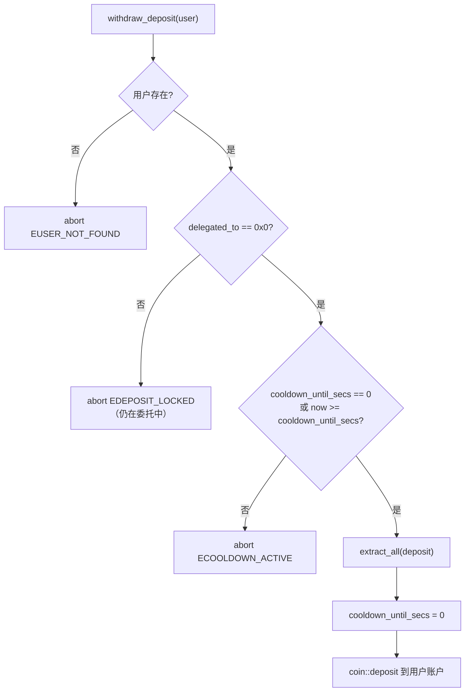
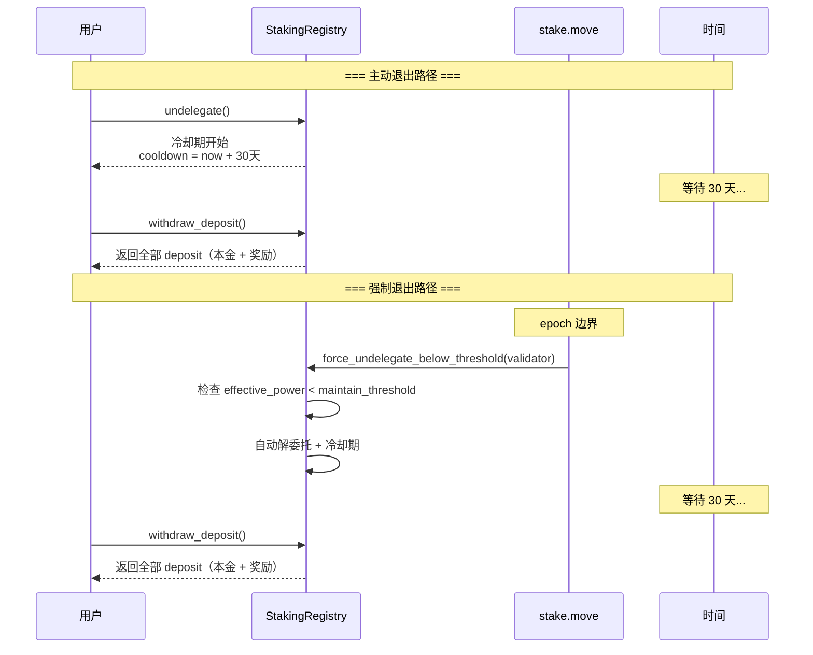

# 07 — 退出状态机与强制退出

本文档详细分析用户的状态转换、冷却期机制、强制退出阈值和迟滞设计。

**源文件**：`poc/staking_registry.move:460-495, 706-762, 842-881`

## 7.1 用户状态机



### 状态判定规则

| 状态 | delegated_to | cooldown_until_secs | deposit |
|------|-------------|-------------------|---------|
| Idle | 0x0 | 0 | 0 |
| Deposited | 0x0 | 0 或已过期 | > 0 |
| Active | 验证者地址 | 0 | > 0 |
| Cooling | 0x0 | 未来时间 | > 0 |

## 7.2 主动解委托（undelegate）



**即时效果**：
- 从验证者的 `delegator_list` 中移除
- 不再参与后续 epoch 的奖励分配
- 冷却期开始计时

## 7.3 强制退出机制

### 7.3.1 触发时机

在 `on_new_epoch()` 的阶段 3，对所有验证者的委托者执行检查：

```move
// stake.move:1167-1178
// 在 commit_next_period_if_boundary() 之后执行
// 此时 current_period 已推进，算力可能因衰减而降低
validator_set.active_validators.for_each_ref(|v| {
    staking_registry::force_undelegate_below_threshold(v.addr);
});
validator_set.pending_inactive.for_each_ref(|v| {
    staking_registry::force_undelegate_below_threshold(v.addr);
});
validator_set.pending_active.for_each_ref(|v| {
    staking_registry::force_undelegate_below_threshold(v.addr);
});
```

### 7.3.2 维持阈值计算

```move
fun calculate_force_exit_power(min_active_power: u64, force_exit_power_bps: u64): u64 {
    let numerator = (min_active_power as u128) * (force_exit_power_bps as u128)
                    + ((BPS_DENOMINATOR - 1) as u128);  // 向上取整
    (numerator / (BPS_DENOMINATOR as u128)) as u64
}
```

**公式**：

```
maintain_threshold = ⌈min_active_power × force_exit_power_bps / 10000⌉
```

默认值：`⌈1 × 8000 / 10000⌉ = ⌈0.8⌉ = 1`

### 7.3.3 强制退出流程



**注意**：遍历前先复制 `delegator_list`，因为在遍历过程中会修改原列表。

### 7.3.4 强制退出 vs 主动解委托

| 维度 | 主动解委托 | 强制退出 |
|------|----------|---------|
| 触发者 | 用户自己 | 系统（epoch 边界） |
| 触发条件 | 用户调用 `undelegate()` | `effective_power < maintain_threshold` |
| 冷却期 | 有 | 有（相同时长） |
| 奖励影响 | 立即停止 | 本 epoch 奖励已分配完毕 |
| 时机 | 任意时刻 | 仅在 epoch 边界 |

## 7.4 迟滞机制（Hysteresis）



**迟滞的作用**：

```
场景：min_active_power = 100, force_exit_power_bps = 8000, retention = 99.5%

用户 A: effective_power = 95
  - 无法新委托（95 < 100 进入门槛）
  - 不会被强制退出（95 >= 80 维持门槛）
  - 处于安全区间，等待算力恢复

用户 B: effective_power = 75
  - 无法新委托（75 < 100）
  - 会被强制退出（75 < 80）
  - 进入冷却期

注意：retention = 99.5% 意味着衰减非常缓慢，
从 100 衰减到 80 需要约 45 个 period。
```

**防止抖动**：

```
无迟滞（进入=退出=100）：
  epoch N:   power=101 → 活跃
  epoch N+1: power=99  → 强制退出 + 冷却
  epoch N+K: power=101 → 重新委托
  epoch N+K+1: power=99 → 又被退出
  → 反复进出，浪费 gas，影响验证者稳定性

有迟滞（进入=100，退出=80）：
  epoch N:   power=101 → 活跃
  epoch N+1: power=99  → 仍然活跃（99 >= 80）
  epoch N+2: power=95  → 仍然活跃（95 >= 80）
  epoch N+5: power=79  → 强制退出（79 < 80）
  → 只有持续下降才会被退出
```

## 7.5 冷却期（Cooldown）

### 冷却期时长

```move
// genesis.move:217-222
let cooldown_secs = if (recurring_lockup_duration > governance_voting_duration) {
    recurring_lockup_duration
} else {
    governance_voting_duration
};
```

冷却期 = max(recurring_lockup_duration, governance_voting_duration)，通常约 30 天。

### 冷却期的约束



**冷却期内可以做的事**：
- `deposit(amount)` — 追加存款（为重新委托做准备）

**冷却期内不能做的事**：
- `delegate(validator)` — 重新委托
- `withdraw_deposit()` — 提取存款

### 冷却期的安全意义

冷却期确保：
1. **经济安全**：防止验证者在作恶后立即提取质押逃跑
2. **治理安全**：确保投票权变更有足够的观察窗口
3. **网络稳定**：防止大量质押快速流出导致验证者集合剧烈变化

## 7.6 提取存款（withdraw_deposit）



**提取金额** = deposit 中的全部余额，包括：
- 原始存款本金
- 累积的 epoch 奖励
- 累积的交易费分成

## 7.7 完整退出时序



## 7.8 边界情况

### 验证者 owner 被强制退出

如果验证者 owner 自身的 `effective_power` 低于维持阈值：
- Owner 被从自己的 `delegator_list` 中移除
- 在阶段 5 重建验证者集合时，`get_validator_total_power` 不再包含 owner 的算力
- 如果总算力低于 `minimum_stake`，验证者被移出活跃集合

### 所有委托者被强制退出

如果验证者的所有委托者都被强制退出：
- `delegator_list` 变为空
- `get_validator_total_power` 返回 0
- 验证者在阶段 5 被移出活跃集合（0 < minimum_stake）

### 冷却期内算力恢复

用户在冷却期内如果算力恢复（链下 Operator 上传了新数据）：
- 冷却期仍然需要等待完成
- 冷却期结束后可以重新 `delegate`
- 重新委托时会再次检查 `effective_power >= min_active_power`
