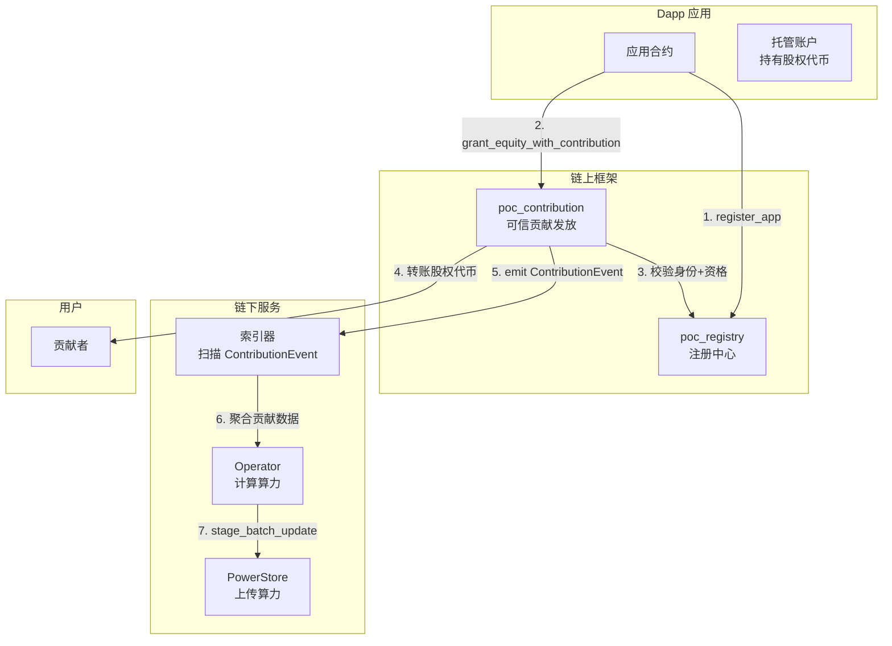
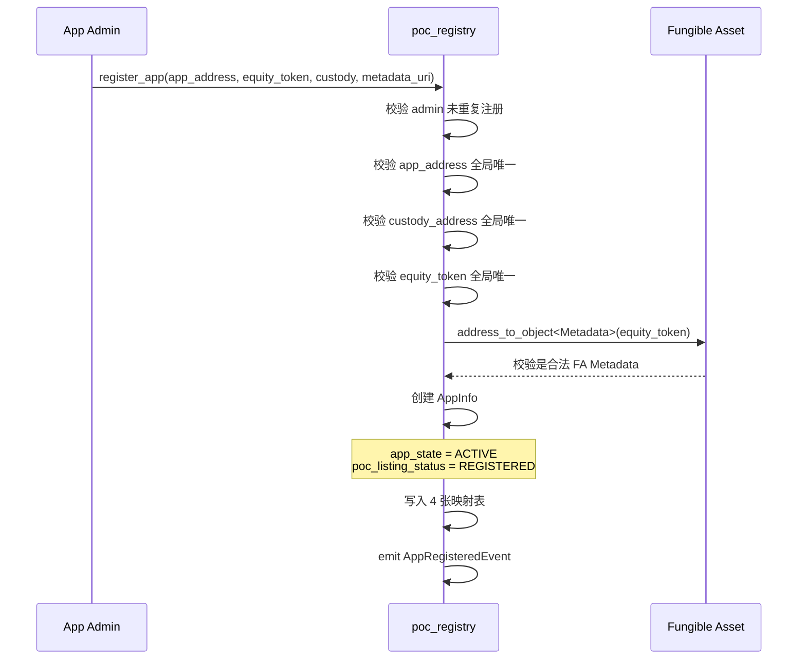
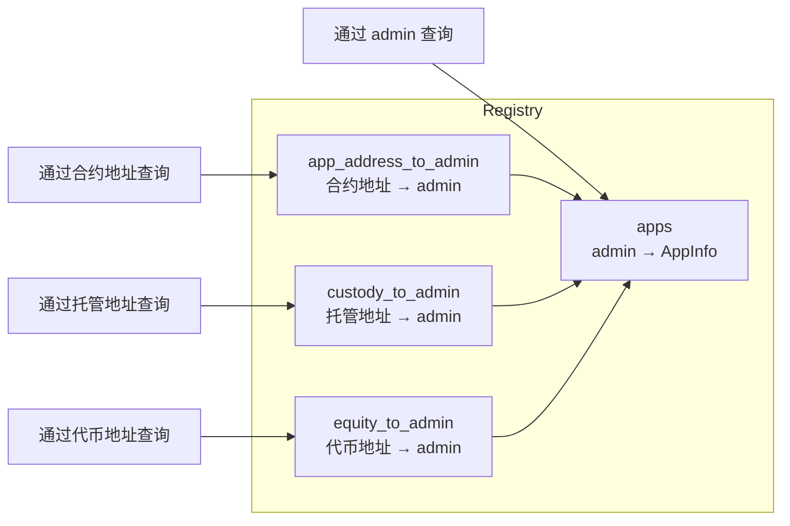
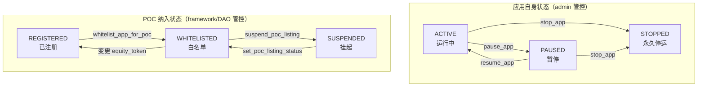
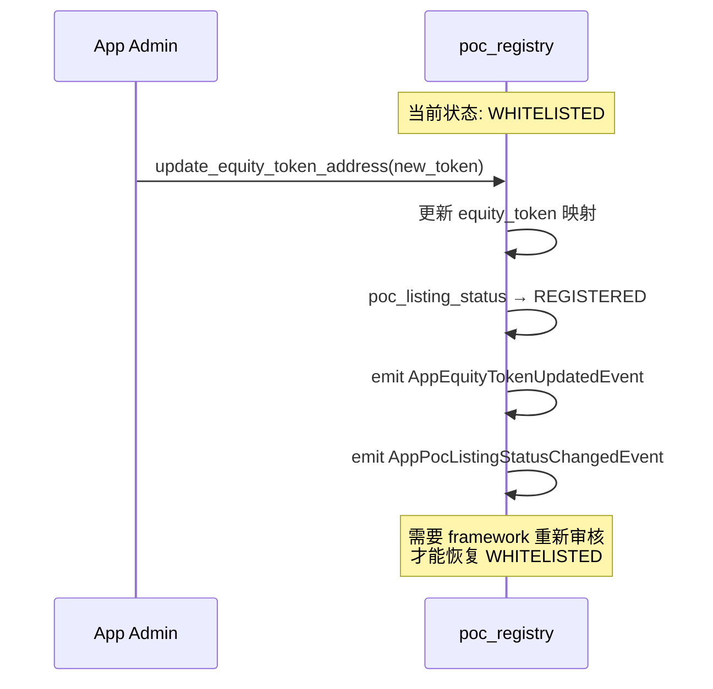
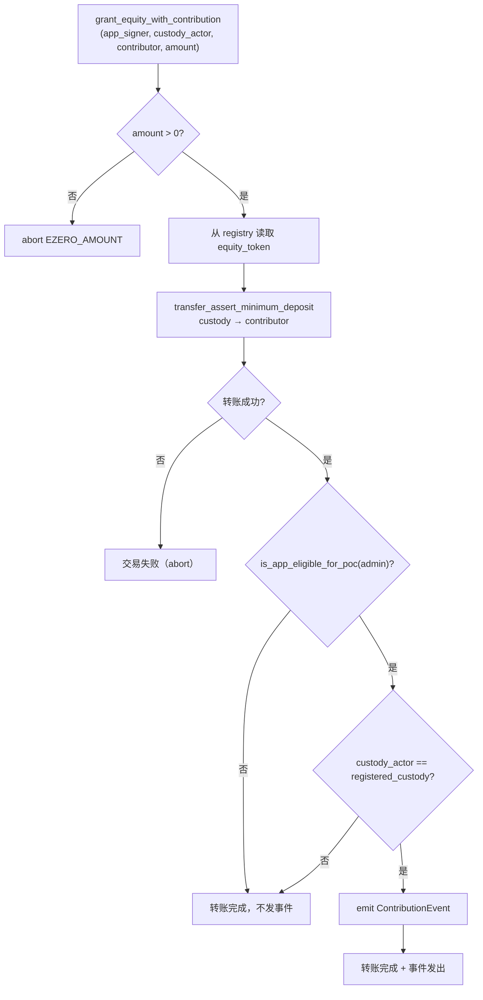
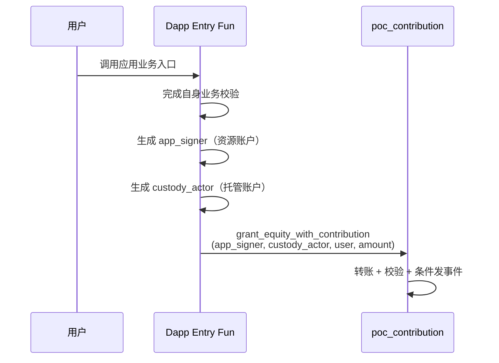
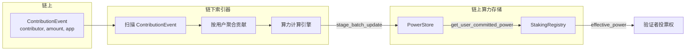

# 09 — Dapp 注册与贡献事件

本文档详细分析 `poc_registry` 和 `poc_contribution` 模块，涵盖 Dapp 应用注册、POC 白名单管理和可信贡献发放路径。

**源文件**：`poc/poc_registry.move`, `poc/poc_contribution.move`

## 9.1 POC 贡献体系总览



## 9.2 Dapp 注册流程

### 注册入口



### 四维度反查索引



**全局唯一性约束**：
- 一个 admin 只能注册一个应用
- `app_address`、`equity_token_address`、`custody_address` 各自全局唯一
- 防止不同应用共用同一地址导致的身份混淆

## 9.3 应用状态管理

### 双层状态模型



### POC 资格判定

应用必须同时满足两个条件才有资格发出可信贡献事件：

```move
public fun is_app_eligible_for_poc(app_admin: address): bool {
    let info = get_app_info(app_admin);
    info.app_state == APP_STATE_ACTIVE &&
        info.poc_listing_status == POC_LISTING_STATUS_WHITELISTED
}
```

| app_state | poc_listing_status | 有资格? |
|-----------|-------------------|---------|
| ACTIVE | WHITELISTED | 是 |
| ACTIVE | REGISTERED | 否 |
| ACTIVE | SUSPENDED | 否 |
| PAUSED | WHITELISTED | 否 |
| STOPPED | 任意 | 否 |

### 股权代币变更的安全重置



**设计意图**：核心资产标识变了，之前的审计假设可能不再成立。

## 9.4 可信贡献发放

### grant_equity_with_contribution

这是 Dapp 发出平台认可的贡献事件的唯一入口。



### 核心设计原则：不干涉应用主业务

```
转账失败 → 交易失败（转账本身的错误仍会 abort）
转账成功但校验不通过 → 转账生效，不发事件
转账成功且校验通过 → 转账生效，发出 ContributionEvent
```

**为什么这样设计**：
- 股权代币转账是应用的核心业务，不应因 POC 校验失败而阻断
- ContributionEvent 只是 POC 算力体系的信号，不影响实际资产流转
- 应用可以在不满足 POC 条件时正常运营，只是贡献不计入算力

### transfer_assert_minimum_deposit

```move
primary_fungible_store::transfer_assert_minimum_deposit(
    custody_actor,  // 转出方签名者
    metadata,       // 股权代币 Metadata
    contributor,    // 接收方地址
    equity_amount,  // 转账金额
    equity_amount,  // 最小到账金额断言
);
```

**为什么使用 minimum_deposit 断言**：
- 某些 FA 可能带 dispatchable hook、手续费或特殊存取逻辑
- 平台认可的贡献金额必须等于用户实际收到的最小金额
- 防止 `ContributionEvent.equity_amount` 大于真实到账量

### ContributionEvent

```move
struct ContributionEvent has drop, store {
    contributor: address,           // 贡献者地址
    equity_token: Object<Metadata>, // 股权代币对象
    equity_amount: u64,             // 发放金额
    app_address: address,           // 应用合约地址
}
```

**可信性来源**：
1. 事件由 `poc_contribution` 模块发出（非应用自行 emit）
2. 事件只在真实转账成功后发出
3. 关键资产参数由注册表给出，非外部传入
4. 链下索引器可通过同交易的 FA 转账事实做交叉验证

## 9.5 调用方式设计

`grant_equity_with_contribution` 是 `public fun`（而非 `entry fun`），Dapp 需要在自己的 entry fun 中调用：



**为什么不是 entry fun**：
- 链下索引器可以通过交易 payload 的入口模块地址做应用归因
- 如果是 entry fun，所有应用的贡献交易都会显示为 `poc_contribution::grant_equity_with_contribution`
- 作为 public fun，交易入口是应用自己的模块，便于区分不同应用的贡献

## 9.6 信息变更接口

| 函数 | 调用者 | 效果 |
|------|--------|------|
| `update_app_address(new)` | admin | 更新合约部署地址 |
| `update_equity_token_address(new)` | admin | 更新股权代币地址 + 重置 POC 状态 |
| `update_custody_address(new)` | admin | 更新托管地址 |
| `pause_app()` | admin | 暂停应用 |
| `resume_app()` | admin | 恢复应用（STOPPED 不可恢复） |
| `stop_app()` | admin | 永久停运（不可逆） |
| `whitelist_app_for_poc(admin)` | framework | 加入 POC 白名单 |
| `suspend_poc_listing(admin)` | framework | 挂起 POC 资格 |
| `set_poc_listing_status(admin, status)` | framework | 设置任意 POC 状态 |

## 9.7 事件索引

| 事件 | 触发时机 | 关键字段 |
|------|---------|---------|
| `AppRegisteredEvent` | `register_app` | admin, app_address, equity_token, custody |
| `AppAddressUpdatedEvent` | `update_app_address` | admin, old, new |
| `AppEquityTokenUpdatedEvent` | `update_equity_token_address` | admin, old, new |
| `AppCustodyUpdatedEvent` | `update_custody_address` | admin, old, new |
| `AppStateChangedEvent` | `pause/resume/stop_app` | admin, old_state, new_state |
| `AppPocListingStatusChangedEvent` | POC 状态变更 | admin, old_status, new_status |
| `ContributionEvent` | `grant_equity_with_contribution` | contributor, equity_token, amount, app_address |

## 9.8 从贡献到算力的完整链路



**链下计算的灵活性**：
- 算力计算逻辑完全在链下，可以灵活调整
- 不同应用的贡献可以有不同的权重
- 可以引入时间衰减、反作弊等复杂逻辑
- 链上只存储最终结果，保持简洁
