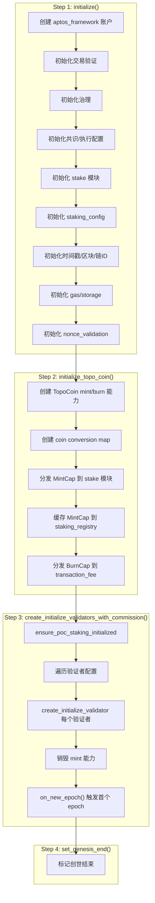
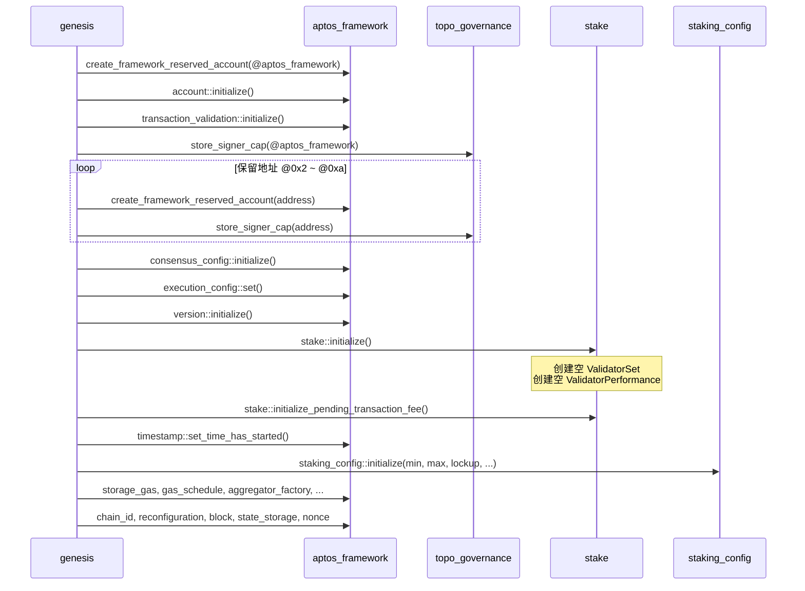
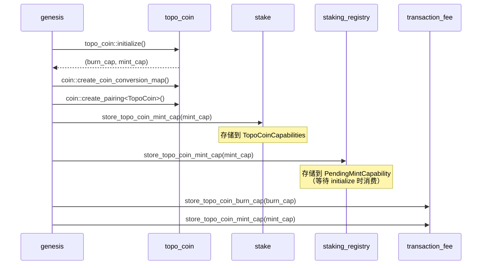
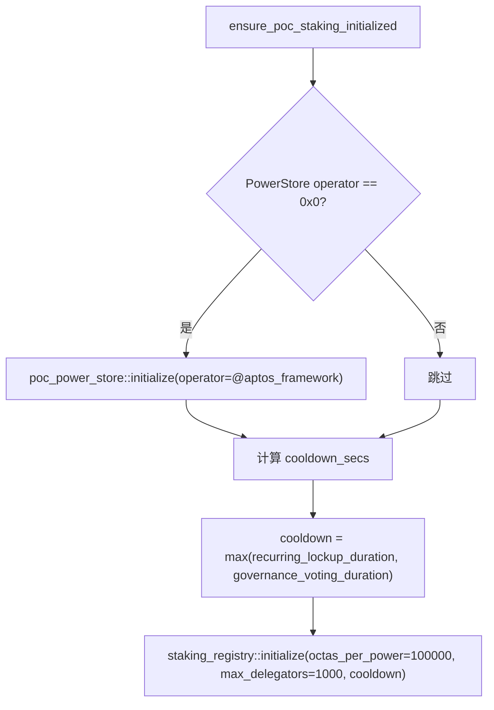
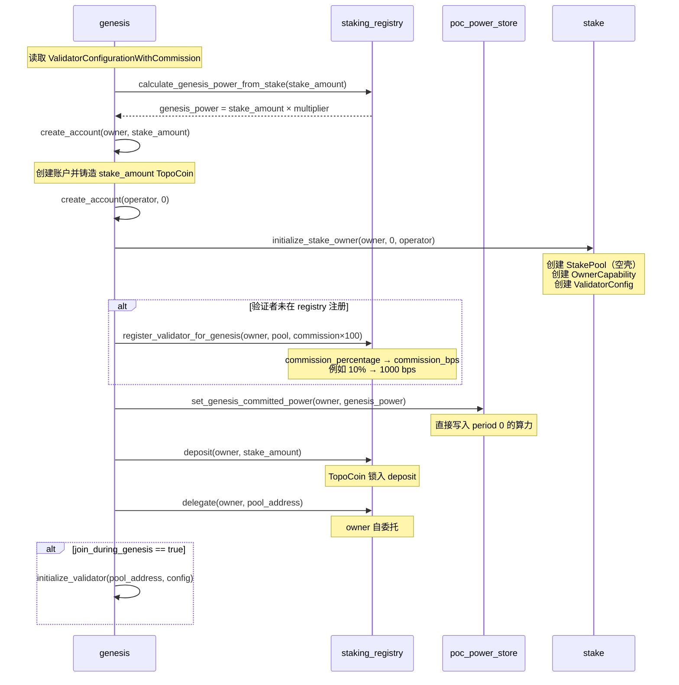
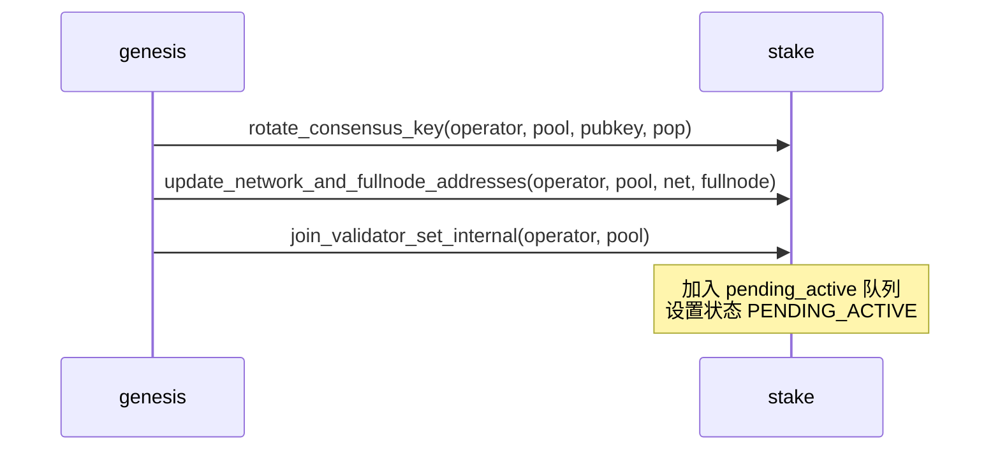
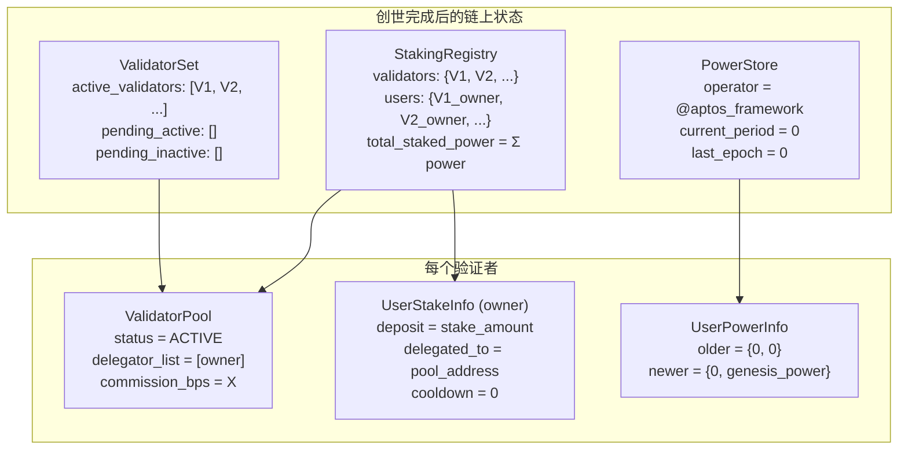
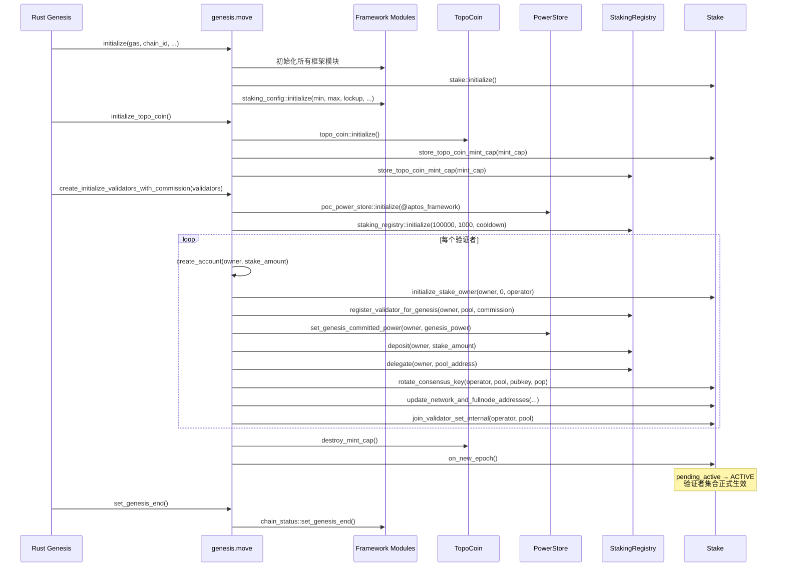

# 10 — 创世初始化流程

本文档详细分析 Genesis 模块的完整初始化时序、验证者引导和首个 epoch 触发。

**源文件**：`genesis.move`

## 10.1 创世初始化总览



## 10.2 Step 1：框架初始化

```move
fun initialize(
    gas_schedule: vector<u8>,
    chain_id: u8,
    initial_version: u64,
    consensus_config: vector<u8>,
    execution_config: vector<u8>,
    epoch_interval_microsecs: u64,
    minimum_stake: u64,
    maximum_stake: u64,
    recurring_lockup_duration_secs: u64,
    allow_validator_set_change: bool,
    rewards_rate: u64,
    rewards_rate_denominator: u64,
    voting_power_increase_limit: u64,
)
```

### 初始化顺序



## 10.3 Step 2：TopoCoin 初始化



**MintCap 的分发路径**：
- `stake` 模块：保留一份（历史兼容）
- `staking_registry`：缓存到 `PendingMintCapability`，在 `initialize()` 时移入 `StakingRegistry`
- `transaction_fee`：用于 mint 退款

## 10.4 Step 3：验证者初始化

### ensure_poc_staking_initialized



**默认参数**：
- `octas_per_power = 100,000`（0.001 TOPO / 算力单位）
- `max_delegators_per_validator = 1,000`
- `cooldown_secs = max(lockup_duration, voting_duration)`

### create_initialize_validator（每个验证者）



### initialize_validator



### 首个 epoch 触发

```move
// create_initialize_validators_with_commission 末尾
topo_coin::destroy_mint_cap(aptos_framework);
stake::on_new_epoch();
```

**关键**：
1. 销毁 `aptos_framework` 的 mint 能力（创世后不能再随意铸币）
2. 触发 `on_new_epoch()`，将 pending_active 验证者激活为 ACTIVE

## 10.5 创世数据结构

### ValidatorConfiguration

```move
struct ValidatorConfiguration has copy, drop {
    owner_address: address,             // 所有者地址
    operator_address: address,          // 运营者地址
    voter_address: address,             // 投票者地址（治理用）
    stake_amount: u64,                  // 创世质押金额（octas）
    consensus_pubkey: vector<u8>,       // BLS 共识公钥
    proof_of_possession: vector<u8>,    // 公钥持有证明
    network_addresses: vector<u8>,      // 网络地址
    full_node_network_addresses: vector<u8>, // 全节点地址
}
```

### ValidatorConfigurationWithCommission

```move
struct ValidatorConfigurationWithCommission has copy, drop {
    validator_config: ValidatorConfiguration,
    commission_percentage: u64,     // 佣金百分比（0-100）
    join_during_genesis: bool,      // 是否在创世时加入验证者集合
}
```

## 10.6 创世算力计算

```move
public(friend) fun calculate_genesis_power_from_stake(stake_amount: u64): u64 {
    let wide_power = (stake_amount as u128) * (genesis_stake_power_multiplier as u128);
    assert!(wide_power <= MAX_U64, ...);
    wide_power as u64
}
```

默认 `genesis_stake_power_multiplier = 1`，所以：

```
genesis_power = stake_amount × 1 = stake_amount
```

**含义**：创世验证者的初始算力等于其质押金额（octas）。后续算力由链下 Operator 计算并上传。

## 10.7 创世后的状态快照



## 10.8 创世时序图（完整）


