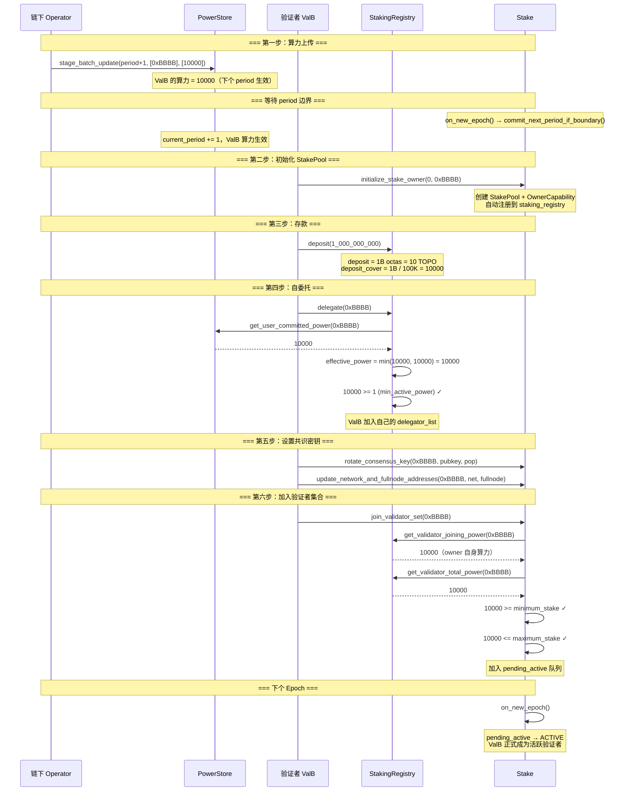
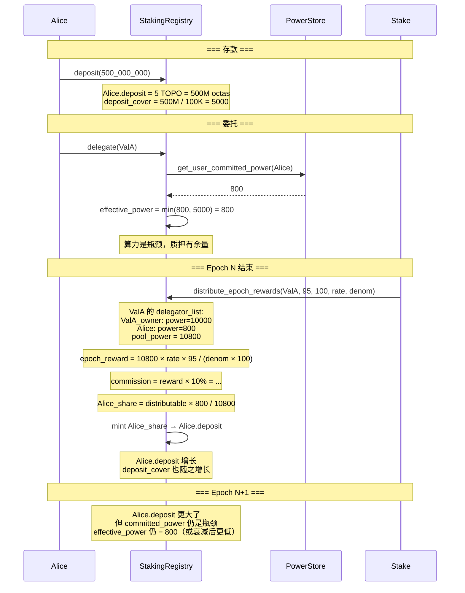
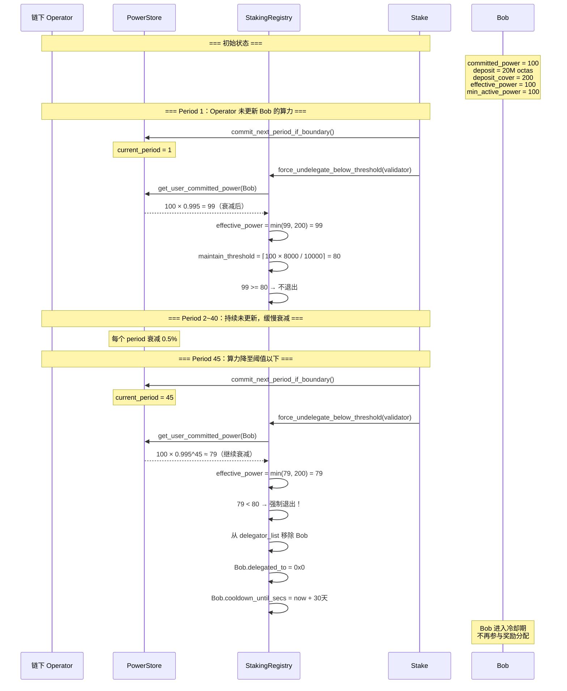
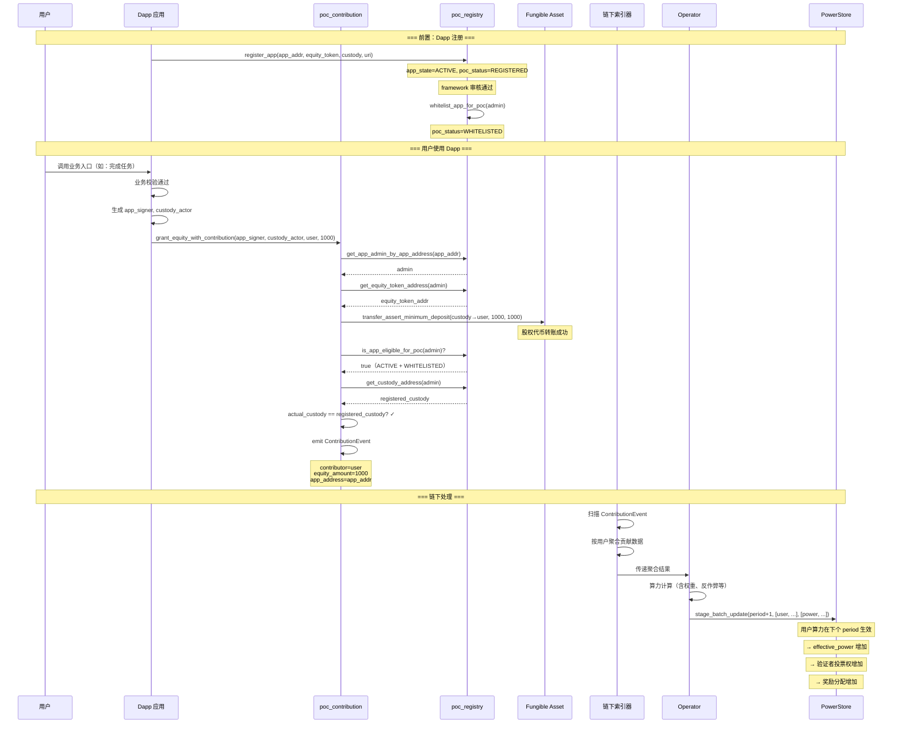
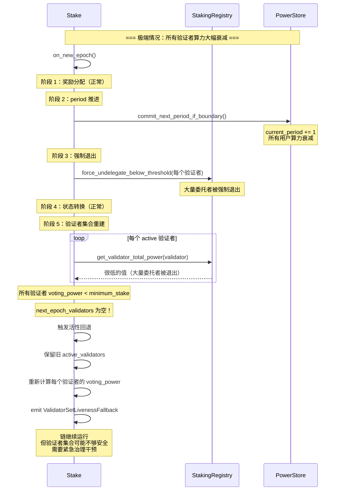
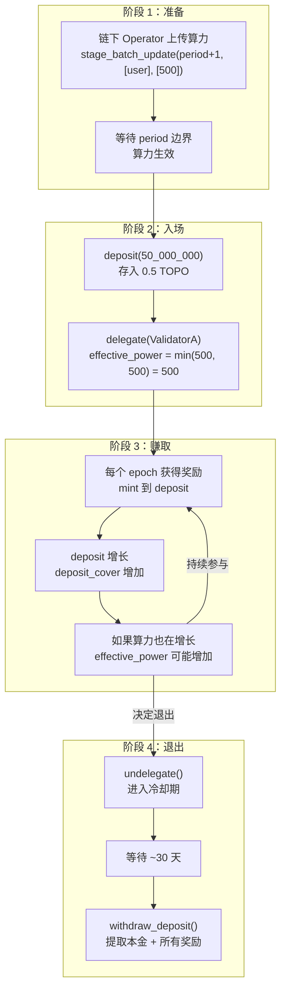
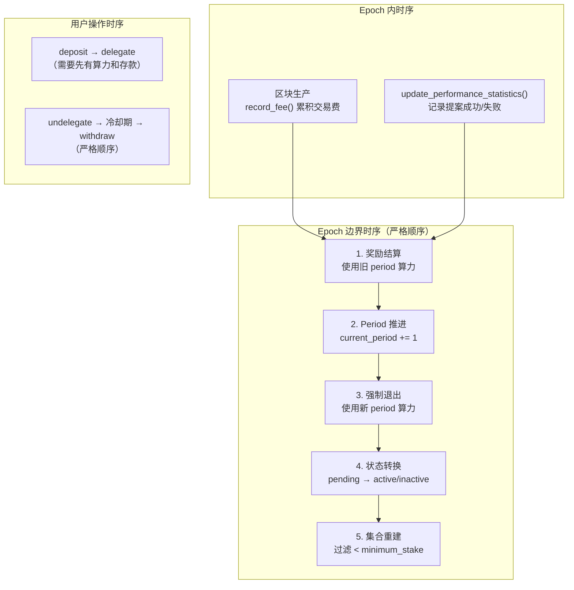

# 12 — 端到端场景分析

本文档通过完整的场景走查，串联所有模块的交互逻辑，帮助理解 PoC 共识系统的实际运行过程。

## 12.1 场景一：验证者从零上线

### 前置条件

- 链已完成创世，至少有一个活跃验证者
- 新验证者 `ValB`（owner = operator = `0xBBBB`）
- 链下 Operator 已为 `ValB` 计算了算力

### 完整流程



## 12.2 场景二：用户质押并赚取奖励

### 前置条件

- 验证者 `ValA` 已活跃，commission = 10%（1000 bps）
- 用户 `Alice`（`0xAAAA`）有 5 TOPO
- 链下 Operator 已为 Alice 上传算力 = 800



### 奖励复利效应数值走查

```
假设：
  rewards_rate = 1, rewards_rate_denominator = 1000
  ValA pool_power = 10800, commission = 10%
  Alice power = 800, 成功提案率 = 95%

Epoch N:
  epoch_reward = 10800 × 1 × 95 / (1000 × 100) = 10 (截断)
  commission = 10 × 1000 / 10000 = 1
  distributable = 10 - 1 = 9
  Alice_reward = 9 × 800 / 10800 = 0 (截断，太小)

  → 实际场景中 rewards_rate 会更大，这里简化演示

假设更大的 pool 和 rate:
  pool_power = 1,000,000, Alice power = 80,000
  rewards_rate = 100, denominator = 10000
  成功率 = 100%

  epoch_reward = 1,000,000 × 100 / 10000 = 10,000
  commission = 10,000 × 10% = 1,000
  distributable = 9,000
  Alice_reward = 9,000 × 80,000 / 1,000,000 = 720

  Alice.deposit += 720 octas
  新 deposit_cover = (原 deposit + 720) / 100,000
```

## 12.3 场景三：算力衰减与强制退出



### 衰减时间线

```
min_active_power = 100, force_exit_power_bps = 8000
maintain_threshold = 80, retention = 99.5%

Period 0:  power = 100  → effective = 100 ✓ (>= 80)
Period 1:  power = 99   → effective = 99  ✓
Period 10: power = 95   → effective = 95  ✓
Period 44: power = 80   → effective = 80  ✓ (刚好)
Period 45: power = 79   → effective = 79  ✗ (< 80, 强制退出)
```

## 12.4 场景四：Dapp 贡献发放全链路



## 12.5 场景五：验证者佣金调整与委托者影响

```
假设：
  ValA commission 从 10% 调整为 20%
  pool_power = 100,000
  epoch_reward = 1,000

调整前（commission = 10%）：
  commission = 1,000 × 10% = 100
  distributable = 900
  委托者按算力比例分 900

调整后（commission = 20%）：
  commission = 1,000 × 20% = 200
  distributable = 800
  委托者按算力比例分 800

影响：
  - 验证者 owner 收入增加（200 vs 100 佣金 + 自身算力份额）
  - 委托者收入减少（分配池从 900 降到 800）
  - 委托者可能选择解委托，转投其他验证者
```

## 12.6 场景六：活性回退触发



## 12.7 场景七：用户完整生命周期



### 数值走查

```
初始：
  committed_power = 500
  deposit = 50,000,000 octas (0.5 TOPO)
  octas_per_power = 100,000
  deposit_cover = 500
  effective_power = min(500, 500) = 500

经过 10 个 epoch（假设每 epoch 奖励 100 octas）：
  deposit = 50,000,000 + 1,000 = 50,001,000
  deposit_cover = 50,001,000 / 100,000 = 500（整数截断，变化微小）

经过 1 个 period（算力衰减 0.5%，无新上传）：
  committed_power = 500 × 0.995 = 497
  effective_power = min(400, 500) = 400
  → 算力衰减导致有效算力下降

Operator 上传新算力 = 600：
  committed_power = 600（下个 period 生效）
  effective_power = min(600, 500) = 500
  → 质押成为瓶颈，需要追加存款才能完全利用算力

追加 deposit(10,000,000)：
  deposit = 60,001,000
  deposit_cover = 600
  effective_power = min(600, 600) = 600
  → 均衡状态

解委托后提取：
  withdraw_deposit() → 获得 60,001,000 octas
  → 比初始投入多了 10,001,000（奖励部分）
  → 实际收益 = 累积奖励 - 追加存款的机会成本
```

## 12.8 关键时序约束总结



**为什么奖励在 period 推进之前分配**：
- 公平性：用户在旧 period 的贡献应该按旧 period 的算力获得奖励
- 如果先推进 period，算力衰减后再分配，用户会少得奖励

**为什么强制退出在 period 推进之后执行**：
- 及时性：新 period 的算力衰减应该立即反映在退出检查中
- 如果用旧 period 检查，已经衰减的用户会多留一个 epoch
