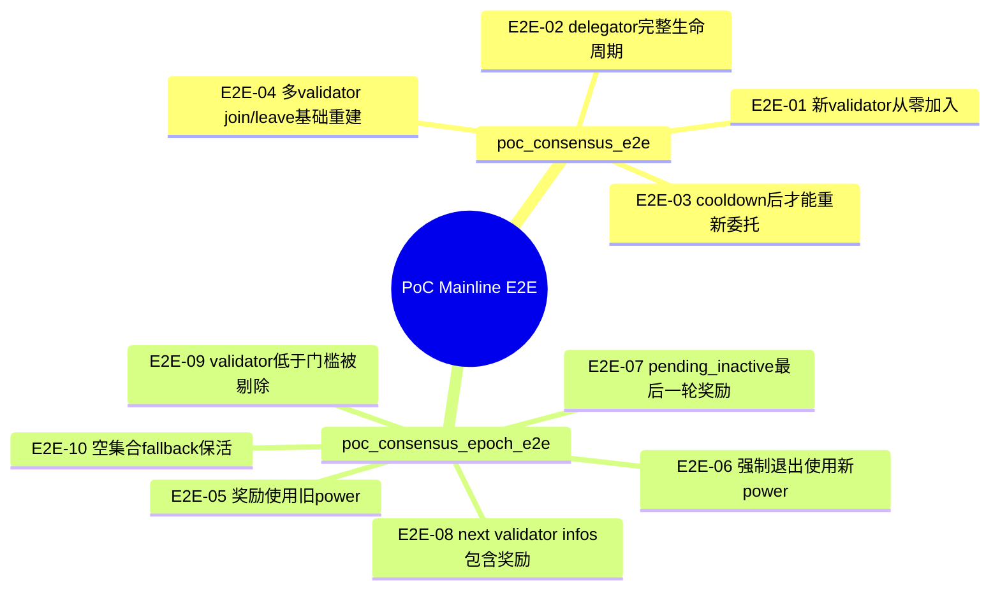

# 14 — 端到端测试用例设计

本文档只设计一类测试：

- **主链路外置 Move e2e 测试**

也就是说，这里只讨论应该放在：

- `aptos-move/framework/aptos-framework/tests/*.move`

里的 PoC 主状态机场景。

以下内容不在本文展开：

- `genesis.move` 的 PoC 初始化接缝测试
- `topo_governance.move` 的治理接缝测试
- Rust 薄接口契约测试

这些内容仍然重要，但它们不应被当成外置 e2e 主集合的一部分。

---

## 14.1 端到端测试在这里的精确定义

只有满足下面两个条件，才算本文所说的 e2e：

1. 场景覆盖 PoC 主链路状态机，而不是某个边界模块接缝。
2. 场景需要跨 `poc_power_store`、`staking_registry`、`stake` 跑完整流程。

所以本文的 e2e 重点是：

- validator lifecycle
- delegator lifecycle
- epoch boundary ordering
- validator set rebuild

而不是：

- 创世初始化幂等
- proposal helper 初始化
- Rust 读取 config/event

---

## 14.2 最终外置文件只保留两个

```text
aptos-move/framework/aptos-framework/tests/
├── poc_test_utils.move
├── poc_consensus_e2e.move
└── poc_consensus_epoch_e2e.move
```

### 为什么只保留两个测试文件

因为当前 PoC 主链路本质上只有两类高价值场景：

1. 生命周期场景
2. epoch / validator set 顺序场景

再继续细拆会带来三个副作用：

- 重复初始化环境
- 重复造 validator / delegator
- 倒逼暴露更多 `#[test_only]` 接口

所以这里不再按“lifecycle / validator_set / governance / genesis”切五六个文件，而是收敛成两个主文件。

---

## 14.3 文件职责

### 14.3.1 `poc_test_utils.move`

只做公共编排 helper，不放具体用例。

建议包含：

- `setup_poc_env(...)`
- `create_validator(...)`
- `create_active_validator(...)`
- `create_delegator_with_power_and_stake(...)`
- `advance_to_target_period(...)`
- `assert_validator_state(...)`
- `assert_voting_power(...)`
- `assert_delegator_deposit(...)`

原则：

- helper 只包装正式逻辑
- 不直接写资源
- 不绕过正式状态机

### 14.3.2 `poc_consensus_e2e.move`

职责：

- 主生命周期场景

这一文件关注：

- validator 从零加入网络
- delegator 进入、退出、提取
- cooldown
- 多 validator join / leave 后的基本集合变化

### 14.3.3 `poc_consensus_epoch_e2e.move`

职责：

- epoch 边界与顺序敏感场景

这一文件关注：

- reward / fee / performance 输入
- next period power 生效
- force undelegate
- pending_inactive 最后一轮奖励
- `next_validator_consensus_infos`
- fallback

---

## 14.4 场景总图



这里故意去掉了：

- 创世场景
- 治理场景

因为它们应回到模块内接缝测试，不再作为外置 e2e 主集合的一部分。

---

## 14.5 `poc_consensus_e2e.move` 详细设计

## 14.5.1 E2E-01 新 validator 从零加入网络

- 目标：验证一个普通 validator 从无状态到进入 active set 的完整路径
- 风险点：注册、power、stake、join、epoch 切换链路
- 前置状态：
  - 基础 PoC 环境已初始化
- 操作步骤：
  1. 创建 validator signer
  2. 调 `stake::initialize_test_validator(..., should_join_validator_set = false, should_end_epoch = false)`
  3. 校验当前状态为 `INACTIVE`
  4. 调 `join_validator_set`
  5. 校验变为 `PENDING_ACTIVE`
  6. 调 `end_epoch`
- 核心断言：
  - epoch 后状态为 `ACTIVE`
  - `cur_validator_consensus_infos` 包含该 validator
  - voting power 与当前 total power 一致

## 14.5.2 E2E-02 delegator 完整生命周期

- 目标：验证 delegator 从进入到退出提取的完整流程
- 风险点：deposit、delegate、reward、undelegate、withdraw 整链路
- 前置状态：
  - 至少一个 active validator
- 操作步骤：
  1. 创建 active validator
  2. 创建 delegator，写入 committed power，deposit 并 delegate
  3. 驱动至少一个 epoch，使其获得奖励
  4. 调 `undelegate`
  5. cooldown 前尝试 `withdraw_deposit`
  6. 冷却后再次 `withdraw_deposit`
- 核心断言：
  - reward 增加 deposit
  - undelegate 后 `delegated_to == 0x0`
  - cooldown 前 withdraw 失败
  - cooldown 后 withdraw 成功

## 14.5.3 E2E-03 cooldown 后才能重新委托

- 目标：验证 stake hopping 被 cooldown 正确阻断
- 风险点：undelegate 后重委托边界
- 前置状态：
  - validator A、validator B 已 active
  - delegator 当前委托给 validator A
- 操作步骤：
  1. delegator `undelegate`
  2. cooldown 未结束时 `delegate` 给 validator B
  3. 快进到 cooldown 后再次 `delegate`
- 核心断言：
  - cooldown 内重委托失败
  - cooldown 结束后重委托成功
  - `delegated_to` 更新为 validator B

## 14.5.4 E2E-04 多 validator join / leave 基础重建

- 目标：验证多 validator join / leave 后 active 集合和 index 基本正确
- 风险点：多节点顺序与 index 维护
- 前置状态：
  - 至少 3 个 validator 已初始化
- 操作步骤：
  1. 按顺序 join 多个 validator
  2. `end_epoch`
  3. 对其中一个 leave，另一个继续保持 active
  4. 再次 `end_epoch`
- 核心断言：
  - leave 前后状态转换符合 `ACTIVE -> PENDING_INACTIVE -> INACTIVE`
  - remaining validators 的 `validator_index` 与 active 顺序一致
  - `cur_validator_consensus_infos` 与 active 集合一致

---

## 14.6 `poc_consensus_epoch_e2e.move` 详细设计

## 14.6.1 E2E-05 奖励使用旧 power

- 目标：验证本轮 reward 基于当前 epoch power，而不是 next period power
- 风险点：`on_new_epoch()` 内 reward 与 power commit 顺序
- 前置状态：
  - delegator 当前 power = 高
  - next period staged power = 低
- 操作步骤：
  1. 建立 validator + delegator
  2. 为 delegator 写入当前高 power
  3. 为 next period staged 一个明显更低的 power
  4. 设定 validator performance
  5. `end_epoch`
- 核心断言：
  - 本轮 reward 仍按旧 power 带来 deposit 增长
  - 不是直接按 next period 低 power 缩减到错误值

## 14.6.2 E2E-06 强制退出使用新 power

- 目标：验证 force undelegate 判断基于 next period 生效后的 power
- 风险点：reward 与 force exit 判定使用同一套 power 会出错
- 前置状态：
  - 当前 power 满足活跃条件
  - next period power 低于 maintain threshold
- 操作步骤：
  1. 建立 validator + delegator
  2. staged 写入 next period 低 power
  3. 推进到跨期 epoch
  4. `end_epoch`
- 核心断言：
  - delegator 被强制 undelegate
  - deposit 保留但 `delegated_to == 0x0`
  - cooldown 被设置

## 14.6.3 E2E-07 `pending_inactive` 仍拿最后一轮奖励

- 目标：验证 leave 后当前 epoch 奖励仍发放
- 风险点：离场过早失去当前 epoch 收益
- 前置状态：
  - validator 当前 active
  - 当前 epoch 有 performance
- 操作步骤：
  1. validator active
  2. 调 `leave_validator_set`
  3. 设定 performance
  4. `end_epoch`
- 核心断言：
  - leave 后先进入 `PENDING_INACTIVE`
  - 本轮奖励已进入 deposit / pool power
  - 下一轮才变 `INACTIVE`

## 14.6.4 E2E-08 `next_validator_consensus_infos` 包含奖励

- 目标：验证 next-epoch 预测集已反映 reward / fee 后的 power
- 风险点：Rust 读取 next validator set 时看到 stale power
- 前置状态：
  - validator committed power 高于当前 deposit cover
  - reward 足以提升 cover
- 操作步骤：
  1. 初始化 validator
  2. 设置 rewards rate
  3. 设置 performance
  4. 调 `next_validator_consensus_infos`
  5. 再执行 `end_epoch`
- 核心断言：
  - `next_validator_consensus_infos` 中 voting power 已提升
  - `end_epoch` 后 `cur_validator_consensus_infos` 与其一致

## 14.6.5 E2E-09 validator 低于门槛被剔除

- 目标：验证 validator set 重建时会移除不满足 `minimum_stake` 的 validator
- 风险点：active 集合污染
- 前置状态：
  - 至少 2 个 active validators
- 操作步骤：
  1. 提高 `minimum_stake`
  2. 让其中一个 validator 的 total power 低于门槛
  3. `end_epoch`
- 核心断言：
  - 低于门槛的 validator 被移除
  - `cur_validator_consensus_infos` 不再包含它

## 14.6.6 E2E-10 空集合 fallback 保活

- 目标：验证极端情况下 active set 不会被清空
- 风险点：链进入无 validator 状态
- 前置状态：
  - 当前 active set 非空
  - next set 理论上所有 validator 都不达标
- 操作步骤：
  1. 通过调高门槛或降低 power 让 next set 理论为空
  2. `end_epoch`
- 核心断言：
  - `ValidatorSetLivenessFallback` 事件发出
  - active set 未被清空
  - `total_voting_power` 仍为 fallback 后的旧集合结果

---

## 14.7 每条 e2e 用例的统一断言模板


每条用例至少要覆盖：

### 1. 入口结果

- 成功
- 或明确 abort code / location

### 2. 资源状态

- `get_user_stake_info`
- `get_effective_power`
- `get_validator_state`
- deposit / cooldown

### 3. 集合状态

- `cur_validator_consensus_infos`
- `next_validator_consensus_infos`
- `get_validator_index`

### 4. 事件或数值

- `ValidatorSetLivenessFallback`
- reward 带来的 deposit 变化
- fee 带来的 deposit 变化
- total voting power 变化

---

## 14.8 对应的最小 `test_only` 接口需求

外置 e2e 只保留两项必要能力：

- `stake::set_validator_performance_for_test(...)`
- `stake::record_fee_for_test(...)`

理由：

- 生命周期场景大多已可通过现有 helper 完成
- 真正缺的是精确构造 reward / fee / next epoch 预测输入

不再把以下接口列为外置 e2e 的实现前提：

- `topo_governance::*_for_test(...)`
- `genesis::*_for_test(...)`

原因：

- 它们服务的是治理 / 创世接缝测试
- 这些测试已经被移出外置 e2e 主集合
- 外置 e2e 的实现不应再以公开这些私有 helper 为前提

---

## 14.9 推荐实现顺序

### 第一批

- `poc_test_utils.move`
- `poc_consensus_e2e.move`

先把 validator / delegator 生命周期主回归建立起来。

### 第二批

- `poc_consensus_epoch_e2e.move`

再补顺序敏感和 fallback 场景。

### 第三批

- Rust `poc_consensus.rs`

最后再补薄接口契约。

---

## 14.10 与 13 号文档的关系

### `13-共识测试框架设计.md`

回答：

- 哪些测试应外置
- 哪些测试不应外置
- 文件结构为什么收敛成两个 e2e 文件

### 本文档

回答：

- 这两个 e2e 文件分别装哪些场景
- 每条场景的步骤与断言是什么

---

## 14.11 最终结论

优化后的端到端测试用例设计，不再追求“覆盖所有边界模块”，而是只覆盖 PoC 主链路状态机。

最终外置 Move e2e 文件只保留：

1. `poc_consensus_e2e.move`
2. `poc_consensus_epoch_e2e.move`

这样设计之后：

- 场景更贴近真实主链路
- 文件粒度更稳定
- 需要新增的 `#[test_only]` 接口最少
- 不会为了文档设计把 `genesis` / `topo_governance` 私有 helper 大量公开
