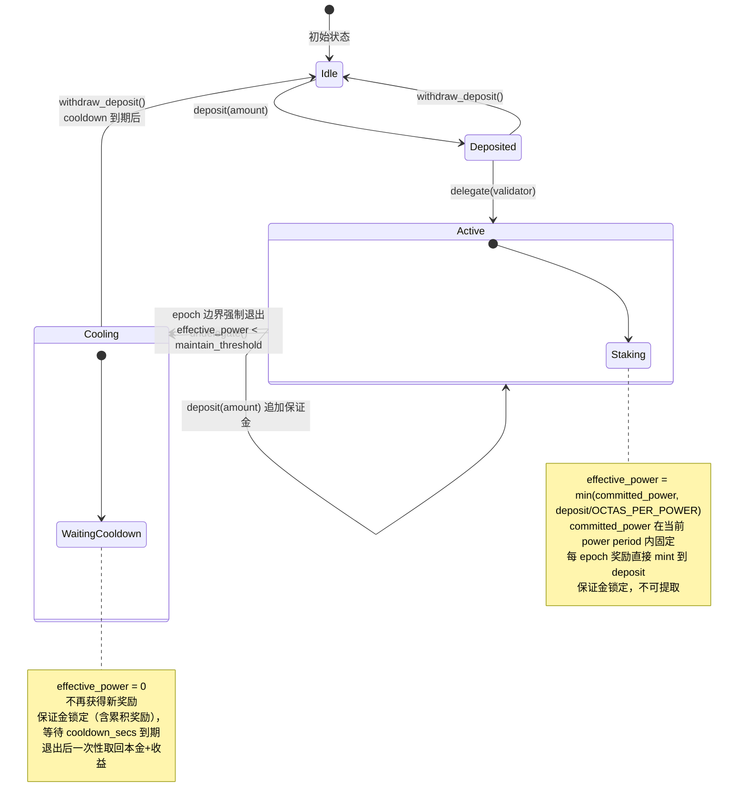

# 3. 退出状态机与锁定语义

## 3.1 当前 lockup 语义（需要替换的部分）

当前系统中 `StakePool.locked_until_secs` 同时承担三个角色：

| 角色 | 使用位置 | 说明 |
|------|---------|------|
| 质押解锁门控 | `stake::update_stake_pool()` L1877 | `pending_inactive → inactive` 仅在 lockup 到期后发生 |
| 治理投票资格 | `topo_governance::stake_pool_is_eligible_to_vote()` L364 | `proposal_expiration < get_lockup_secs(pool)` |
| 自动续期 | `stake::on_new_epoch()` L1483-1489 | 每 epoch 自动续期 validator lockup |

新模型中这三个角色需要分别处理：

| 角色 | 新模型处理方式 |
|------|-------------|
| 质押解锁门控 | 替换为 **冷却期**（cooldown）：undelegate 后等待 `cooldown_secs` 才能 withdraw_deposit |
| 治理投票资格 | 替换为 **有效算力 > 0** 且 **处于委托状态**（不再绑定 lockup） |
| 自动续期 | 不再需要（冷却期是一次性的，不自动续期） |

## 3.2 用户状态机



### 状态定义

| 状态 | 条件 | effective_power | 保证金 | 奖励 |
|------|------|----------------|--------|------|
| Idle | `deposit == 0 && delegated_to == 0x0` | 0 | 无 | - |
| Deposited | `deposit > 0 && delegated_to == 0x0 && cooldown_until == 0` | 0 | 可提取 | 不产生 |
| Active | `deposit > 0 && delegated_to != 0x0` | `min(committed_power, deposit/R)` | 锁定，奖励自动 mint 进来 | 每 epoch mint 到 deposit |
| Cooling | `delegated_to == 0x0 && cooldown_until > now` | 0 | 锁定（含累积奖励） | 不产生 |

补充说明：
- 当前周期内 `deposit` / `delegate` / `undelegate` 会改变保证金或委托状态。
- raw power 来源只会在新的 power period 边界提交后，从 `pending_updates` + carry-forward 结果切换到新的 `committed_power`。
- 为限制数组规模，`delegate()` 需要先满足 `effective_power >= min_active_power`。
- 已入场用户如果在 epoch 边界重算后跌破 `maintain_threshold = ceil(min_active_power * force_exit_power_bps / 10000)`，会被系统自动踢出到 `Cooling`。

### 关键约束

- `withdraw_deposit()` 前置条件：`delegated_to == 0x0 && now >= cooldown_until`
- `undelegate()` 触发：设置 `cooldown_until = now + cooldown_secs`，清除 `delegated_to`
- `delegate()` 前置条件：`deposit > 0 && delegated_to == 0x0 && cooldown_until <= now && effective_power >= min_active_power`
- 强制退出触发：`commit_next_period_if_boundary()` 之后，若用户 `effective_power < maintain_threshold`，系统等价执行一次 `undelegate()`

## 3.3 冷却期（Cooldown）

冷却期替代了原有的 lockup 解锁机制，提供以下安全保障：

| 保障 | 说明 |
|------|------|
| 退出延迟 | 防止验证者/delegator 在发现即将被 slash 时瞬间退出 |
| 治理稳定性 | 防止投票后立即退出逃避责任 |
| 经济安全 | 给系统时间检测和处理异常行为 |

```move
/// UserStakeInfo 中的冷却期字段
struct UserStakeInfo has store {
    deposit: Coin<TopoCoin>,        // 保证金 + 累积奖励（合并存储）
    delegated_to: address,
    cooldown_until_secs: u64,       // undelegate 后的冷却到期时间，0 = 无冷却
}
```

冷却期参数 `cooldown_secs` 建议初始值与当前 `recurring_lockup_duration_secs` 一致（如 30 天），可通过治理调整。

## 3.4 奖励机制（简化）

奖励直接 mint 到用户的 `deposit` 中，不存在独立的奖励账本。详见 `05-reward-ledger.md`。

```
|--- delegate ---|--- 每 epoch 奖励 mint 到 deposit ---|--- undelegate ---|--- cooldown ---|--- withdraw_deposit ---|
                 |                                      |                   |               |
                 |  deposit 持续增长（本金+收益）          |<-- 奖励停止 ----->|               |
                 |                                                         |<-- cooldown ->|
                 |                                                                         |
                 |                                                         取回全部 deposit（本金+收益）
```

不需要 reward_lockup 机制——冷却期本身就是提取锁定。

## 3.5 治理投票资格（替代 lockup 检查）

当前 `topo_governance` 中的 `stake_pool_is_eligible_to_vote()` 检查 `proposal_expiration < stake::get_lockup_secs(pool)`。

新模型替换为：

```move
/// 用户是否有资格参与治理投票
/// 条件：effective_power > 0，即已委托到 active validator + 有保证金 + 有算力
inline fun is_eligible_to_vote(user: address): bool {
    staking_registry::get_effective_power(user) > 0
}
```

投票权定义域约束：
- 只有委托到 **active validator** 的用户才有 effective_power > 0（因为 `get_effective_power` 要求 `delegated_to != 0x0`，而只有 active validator 才在 ValidatorSet 中）
- `total_staked_power` 只统计 active validator 的 delegator_list 成员，与投票资格定义域一致
- 早期决议阈值 = `total_staked_power / 2 + 1`，分子分母同域

不再要求 lockup 覆盖提案过期时间。理由：
- 算力由链下赋予，不可转移，不存在"投完票立即卖掉质押"的风险
- `cooldown_secs >= voting_duration_secs` 不变量保证用户在提案结束前无法完成退出
- 保证金锁定在委托期间，提供经济约束

## 3.6 未来 Slash 窗口

冷却期天然提供了 slash 窗口：

```
|--- Active (可被 slash) ---|--- Cooling (仍可被 slash) ---|--- Idle (不可 slash) ---|
```

在冷却期内，保证金仍然锁定在 registry 中，治理可以通过提案对违规验证者/delegator 执行 slash（扣除部分保证金）。具体 slash 机制在本方案中不实现，但数据结构已预留支持。
