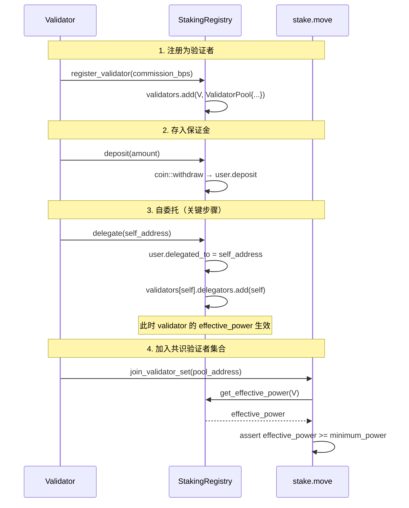

# 4. Validator 自抵押与 Genesis 启动规则

## 4.1 Validator 与 Delegator 的统一模型

Validator 和 Delegator 共用同一个 `UserStakeInfo` 结构。Validator 的特殊之处仅在于：
- 在 `validators` 表中有一条 `ValidatorPool` 记录
- 可以接受其他用户的委托
- 外部输入使用 `commission_percentage`，registry 内部存储为 `commission_bps`

Validator 自身的算力参与方式与 Delegator 完全一致：**自委托**。

## 4.2 Validator 注册与自委托流程



### 关键规则

- Validator **必须自委托**才有 effective_power，才能加入 ValidatorSet
- Validator 自委托后，自己同时出现在 `ValidatorPool.delegators` 列表中
- 奖励分配时，validator 作为 delegator 按算力比例获得份额，同时获得佣金
- 这保证了 validator 和 delegator 的奖励计算逻辑完全统一

### register_validator 签名

```move
/// 注册为验证者（不含 deposit，deposit 是独立操作）
public entry fun register_validator(
    validator: &signer,
    commission_bps: u64,    // 佣金比例，basis points (0-10000)
)
```

注意：`register_validator` 不接受 deposit 参数。保证金通过独立的 `deposit()` 函数存入，与 delegator 一致。

## 4.3 Genesis 启动流程

```move
/// genesis.move 中的初始化流程
/// 注意：顺序严格，后续步骤依赖前序步骤的 resource
fun initialize_poc_staking(
    aptos_framework: &signer,
    validators: vector<ValidatorConfigurationWithCommission>,
) {
    // 1. 初始化 stake.move 基础设施（ValidatorSet 等）
    stake::initialize(aptos_framework);
    staking_config::initialize(aptos_framework, ...);

    // 2. 初始化 TopoCoin，分发 mint_cap
    let (burn_cap, mint_cap) = topo_coin::initialize(aptos_framework);
    stake::store_topo_coin_mint_cap(aptos_framework, mint_cap); // copy
    staking_registry::store_topo_coin_mint_cap(aptos_framework, mint_cap); // copy

    // 3. 初始化 poc_power_store
    // 当前默认入口把 power_period_in_epochs 设为 60；
    // 若需要非默认周期，可改为 initialize_with_power_period(...) / initialize_power_store_with_period(...)
    poc_power_store::initialize(aptos_framework, poc_operator_address);

    // 4. 初始化 staking_registry
    staking_registry::initialize(
        aptos_framework,
        100_000,
        1000,
        2_592_000, // cooldown_secs，必须 >= voting_duration_secs
    );
    // registry.config.genesis_stake_power_multiplier 默认 = 1

    // 5. 初始化治理（必须在 registry 之后，cooldown 不变量检查依赖 governance config）
    topo_governance::initialize(aptos_framework, ...);

    coin::destroy_burn_cap(burn_cap);

    // 6. 每个 genesis validator: 创建 StakePool + 注册 + 自委托 + 设置 raw power + 加入 ValidatorSet
    validators.for_each_ref(|v| {
        let validator = &v.validator_config;
        let validator_signer = create_signer(validator.owner_address);
        let genesis_power =
            staking_registry::calculate_genesis_power_from_stake(validator.stake_amount);

        // 6a. 创建 StakePool（保留，ValidatorConfig 等依赖它）
        stake::initialize_stake_owner(
            &validator_signer,
            0,  // 不需要质押代币到 StakePool
            validator.operator_address,
        );

        // 6b. 注册到 registry + 存保证金 + 自委托
        // genesis 输入用 commission_percentage，落表前转成 bps
        staking_registry::register_validator_for_genesis(
            validator.owner_address,
            validator.owner_address,
            v.commission_percentage * 100,
        );
        staking_registry::deposit(&validator_signer, validator.stake_amount);
        staking_registry::delegate(&validator_signer, validator.owner_address); // 自委托

        // 6c. 根据链上配置计算 genesis committed power
        // genesis 特例：允许在 period 0 直接种入 committed snapshot
        poc_power_store::set_genesis_committed_power(
            aptos_framework,
            validator.owner_address,
            genesis_power,
        );

        // 6d. 设置共识密钥 + 网络地址
        let operator = create_signer(validator.operator_address);
        stake::rotate_consensus_key(
            &operator, validator.owner_address, validator.consensus_pubkey, validator.proof_of_possession
        );
        stake::update_network_and_fullnode_addresses(
            &operator, validator.owner_address, validator.network_addresses, validator.full_node_network_addresses
        );

        // 6e. 加入 ValidatorSet
        stake::join_validator_set_internal(&operator, validator.owner_address);
    });

    // 7. 触发首次 epoch
    stake::on_new_epoch();
}
```

### Genesis 输入结构

```move
struct ValidatorConfiguration has copy, drop {
    owner_address: address,
    operator_address: address,
    voter_address: address,
    consensus_pubkey: vector<u8>,
    proof_of_possession: vector<u8>,
    network_addresses: vector<u8>,
    full_node_network_addresses: vector<u8>,
    // 语义变更：这里表示 genesis 保证金金额（octas）
    stake_amount: u64,
}

struct ValidatorConfigurationWithCommission has copy, drop {
    validator_config: ValidatorConfiguration,
    // genesis 输入保持百分比语义，便于与 staking_contract / vesting 一致
    commission_percentage: u64,
    join_during_genesis: bool,
}
```

说明：
- 不再从 Rust 侧传 `initial_power`
- Rust 侧对应输入结构名为 `ValidatorWithCommissionRate`，字段名为 `validator_commission_percentage`
- genesis raw power 由链上按 `stake_amount * genesis_stake_power_multiplier` 计算
- genesis 初始算力通过 `set_genesis_committed_power()` 写入 period 0 的 committed snapshot
- 常规运行期 operator 应调用 `stage_batch_update(target_period = current_period + 1, ...)`；旧 `batch_update()` 仅作为兼容别名保留
- 当前代码默认 `poc_power_store::initialize()` 的 `power_period_in_epochs = 60`；如果部署需要其他周期，可在初始化路径显式调用可配置入口
- `genesis_stake_power_multiplier` 当前默认值为 `1`
- registry 内部仍以 `commission_bps` 存储佣金，genesis 入口只在落表时做 `commission_percentage * 100`
