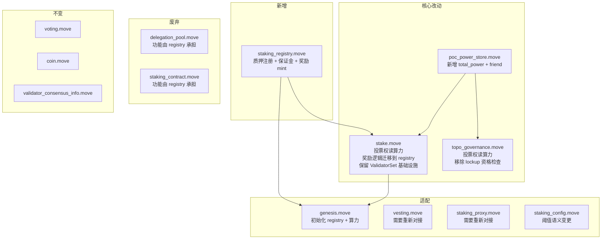

# 7. 迁移矩阵：现有模块兼容性分析

## 7.1 总览

## 7.2 逐模块分析

### 7.2.1 stake.move — 核心改动，保留骨架

stake.move 是 Aptos 共识层的核心，不能废弃。改动策略：**保留 ValidatorSet 管理骨架，替换投票权来源和奖励逻辑**。

| 保留 | 移除/替换 |
|------|----------|
| `ValidatorSet` / `ValidatorInfo` / `ValidatorConfig` 结构体 | `get_next_epoch_voting_power()` 内部逻辑 → 读 registry |
| `ValidatorPerformance` 追踪 | `update_stake_pool()` 中的奖励 mint/merge → 调 registry |
| `on_new_epoch()` 骨架（遍历 validator、重建集合） | `generate_validator_info()` 中读 coin::value → 读算力 |
| `join_validator_set_internal()` 骨架 | 入场门槛从 coin 改为算力 |
| `set_operator()` / `set_delegated_voter()` | set_operator 保留；set_delegated_voter 废弃（用户直接投票） |
| `OwnerCapability` | `distribute_rewards()` / `calculate_rewards_amount()` |
| `initialize_validator()` / `rotate_consensus_key()` | lockup 自动续期（废弃，cooldown 替代） |
| `remove_validators()` | `get_current_epoch_voting_power()` 内部逻辑 → 读 registry |
| `cur_validator_consensus_infos()` / `next_validator_consensus_infos()` | `compute_simulated_validator_info()` 内部逻辑 |
| `StakePool` 结构体（保留但不再承载经济逻辑） | |

`StakePool` 保留的原因：`ValidatorConfig` 和 `OwnerCapability` 等结构体存储在 pool_address 下，大量现有代码（包括 Rust 侧的 `AptosValidatorInterface`）依赖 `StakePool` 的存在。保留结构但清空经济语义，是最低风险的迁移路径。

### 7.2.2 delegation_pool.move — 废弃

当前 delegation_pool 承载的功能及迁移去向：

| 当前功能 | 代码位置 | 迁移去向 |
|---------|---------|---------|
| 多人委托质押 | `add_stake()` | `staking_registry::delegate()` |
| pool_u64 shares 模型 | `active_shares` / `inactive_shares` | 废弃，改为按算力比例记账 |
| 奖励分配（share price） | `synchronize_delegation_pool()` | `staking_registry::distribute_epoch_rewards()` |
| 佣金 | `operator_commission_percentage` | `staking_registry::ValidatorPool.commission_bps` |
| 佣金生效周期 | `NextCommissionPercentage` + lockup cycle | 简化：治理提案直接生效，或下一 epoch 生效 |
| Partial governance voting | `GovernanceRecords` / `DelegatedVotes` | 废弃。用户直接以自身地址投票，RecordKey 主键从 stake_pool 改为 voter address，投票权 = effective_power |
| Voter delegation | `VoteDelegation` | 废弃。不再有代投机制，每个用户用自己的 effective_power 直接投票 |
| Allowlisting | `DelegationPoolAllowlisting` | 可选迁移到 registry，或废弃 |
| Beneficiary for operator | `BeneficiaryForOperator` | 可选迁移到 registry |

废弃方式：不删除模块代码（避免破坏已部署的 resource），但标记所有 entry 函数为 `#[deprecated]`，新功能全部走 registry。

### 7.2.3 staking_contract.move — 废弃

当前 staking_contract 承载的功能及迁移去向：

| 当前功能 | 迁移去向 |
|---------|---------|
| 1:1 staker-operator 委托 | `staking_registry::delegate()` |
| principal 追踪 | 废弃（保证金即 principal） |
| distribution_pool shares | 废弃（奖励按算力比例记账） |
| 佣金计算 `(active - principal) * %` | `staking_registry` 中直接按 epoch 奖励计算佣金 |
| `unlock_stake()` / `distribute()` | `staking_registry::undelegate()` + `withdraw_deposit()` |
| `switch_operator()` | `staking_registry` 中新增或保留 `stake::set_operator()` |
| `reset_lockup()` | 废弃（lockup 由 registry 管理） |

### 7.2.4 vesting.move — 需要重新对接

vesting.move 深度依赖 staking_contract（6 个生产函数调用）。废弃 staking_contract 后，vesting 需要：

| 当前依赖 | 改造方案 |
|---------|---------|
| `staking_contract::create_staking_contract_with_coins()` | 改为 `staking_registry::deposit()` + `delegate()` |
| `staking_contract::unlock_stake()` | 改为 `staking_registry::undelegate()` + `withdraw_deposit()` |
| `staking_contract::distribute()` | 改为 `staking_registry::undelegate()` + `withdraw_deposit()` |
| `staking_contract::staking_contract_amounts()` | 改为读 `staking_registry::get_user_stake_info()` |
| `staking_contract::switch_operator()` | 改为 `staking_registry::undelegate()` + `delegate(new_validator)` |
| `staking_contract::update_voter()` | 废弃（用户直接以自身地址投票，无代投） |
| `staking_contract::update_commision()` | 改为 `staking_registry::update_commission()` |
| `staking_contract::reset_lockup()` | 废弃 |
| `stake::get_stake()` (termination) | 改为读 registry 的 deposit (含累积奖励) |
| `stake::get_lockup_secs()` (event) | 改为读 registry 的 cooldown_until_secs |

改动量：中等。vesting 的核心逻辑（vesting schedule、vest/distribute 周期）不变，只是底层从 staking_contract 切换到 registry。

### 7.2.5 staking_proxy.move — 需要重新对接

staking_proxy 是一个"一站式"代理，同时操作 stake / staking_contract / vesting 的 operator/voter。

| 当前功能 | 改造方案 |
|---------|---------|
| `set_stake_pool_operator()` | 保留（stake.move 的 operator 仍有意义） |
| `set_staking_contract_operator()` | 废弃（staking_contract 废弃） |
| `set_vesting_contract_operator()` | 跟随 vesting 改造 |
| `set_stake_pool_voter()` | 废弃（用户直接投票，无代投） |
| `set_staking_contract_voter()` | 废弃 |
| `set_vesting_contract_voter()` | 废弃 |

### 7.2.6 genesis.move — 适配

| 当前调用 | 改造 |
|---------|------|
| `stake::initialize()` | 保留 |
| `staking_config::initialize()` | 保留，参数语义变更 |
| `stake::initialize_stake_owner()` | 保留（StakePool 仍需创建） |
| `staking_contract::create_staking_contract()` | 替换为 registry 操作 |
| `stake::join_validator_set_internal()` | 保留 |
| `stake::on_new_epoch()` | 保留 |
| 新增 | `poc_power_store::initialize()` |
| 新增 | `staking_registry::store_topo_coin_mint_cap()` + `staking_registry::initialize(...)` |
| 新增 | `poc_power_store::set_genesis_committed_power()` 设置 period 0 初始算力 |
| 新增 | `staking_registry::register_validator/deposit/delegate` |

### 7.2.7 staking_config.move — 语义变更

| 字段 | 当前语义 | 新语义 | 是否改名 |
|------|---------|--------|---------|
| `minimum_stake` | 最低质押量 (octas) | 最低有效算力阈值 | 建议改为 `minimum_power` |
| `maximum_stake` | 最高质押量 (octas) | 最高有效算力上限 | 建议改为 `maximum_power` |
| `rewards_rate` | 质押奖励率 | 算力奖励率 | 不改名 |
| `rewards_rate_denominator` | 奖励率分母 | 不变 | 不改名 |
| `recurring_lockup_duration_secs` | 质押锁定期 | 废弃（迁移到 registry config） | 保留但不再使用 |
| `voting_power_increase_limit` | 每 epoch 投票权增长限制 | 不变 | 不改名 |

### 7.2.8 不需要改的模块

| 模块 | 原因 |
|------|------|
| `voting.move` | 通用投票框架，只接收 `num_votes: u64`，不关心来源 |
| `coin.move` / `topo_coin.move` | Coin 体系完全不变 |
| `validator_consensus_info.move` | 结构不变，上游填入的值变了 |
| `state_storage.move` | 存储计量，无关 |
| `fungible_asset.move` | 无关 |

## 7.3 迁移风险矩阵

| 模块 | 改动量 | 风险 | 关键风险点 |
|------|--------|------|-----------|
| staking_registry (新) | 大 | 中 | 新模块，需充分测试 |
| stake.move | 大 | 高 | 共识层核心，改错会停链 |
| topo_governance.move | 中 | 中 | 治理逻辑，lockup 检查替换 |
| poc_power_store.move | 小 | 低 | 新增字段和 friend |
| delegation_pool.move | 大(废弃) | 中 | 已部署 resource 需保留 |
| staking_contract.move | 大(废弃) | 中 | vesting 依赖需先解耦 |
| vesting.move | 中 | 高 | 深度依赖 staking_contract |
| genesis.move | 中 | 高 | 创世流程，改错无法启链 |
| staking_config.move | 小 | 低 | 语义变更 |
| staking_proxy.move | 小 | 低 | 代理层 |
