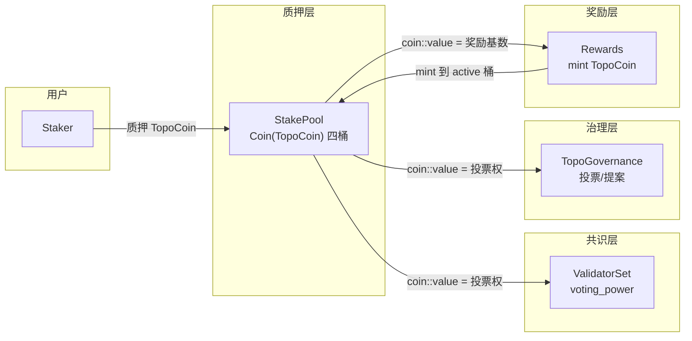
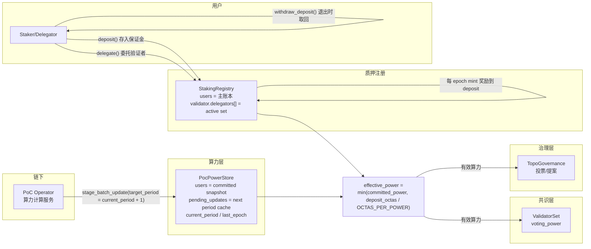
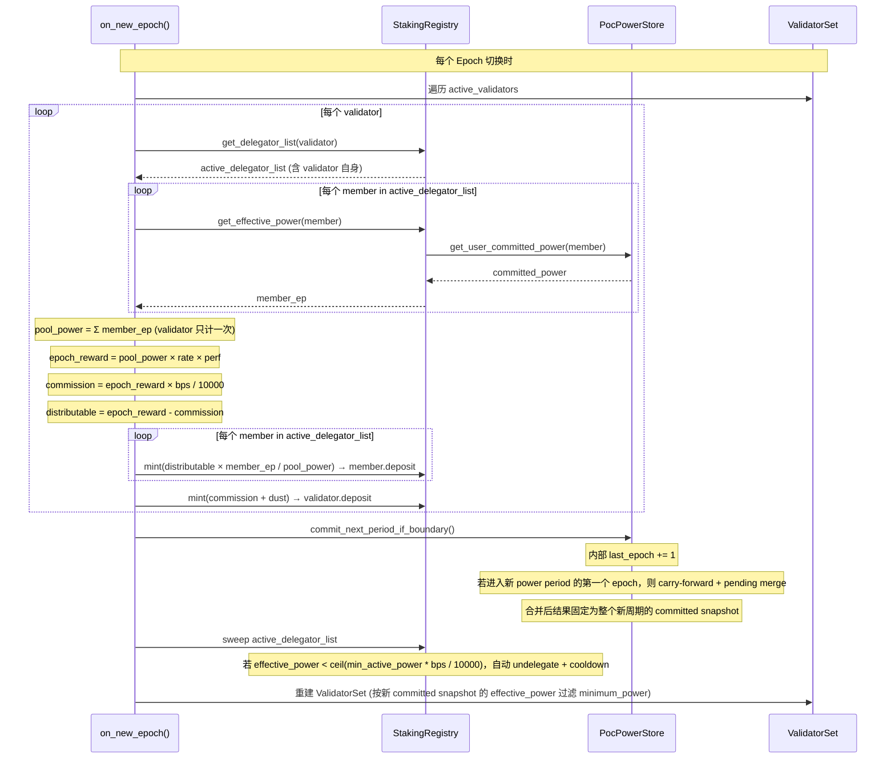
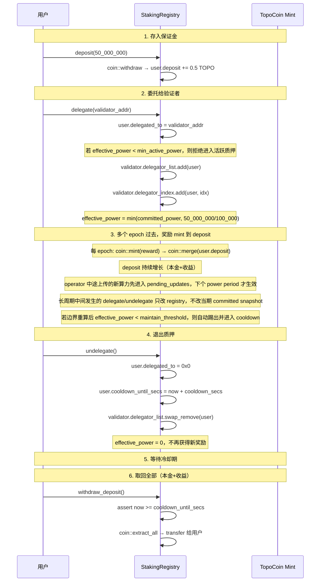
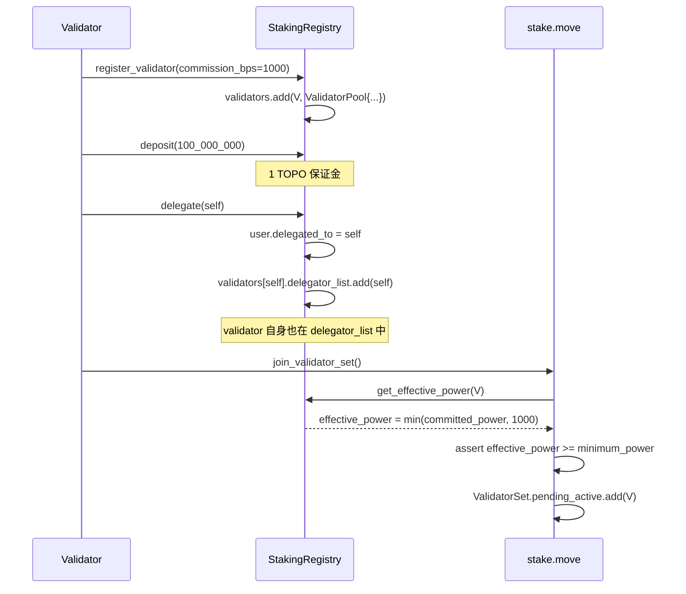
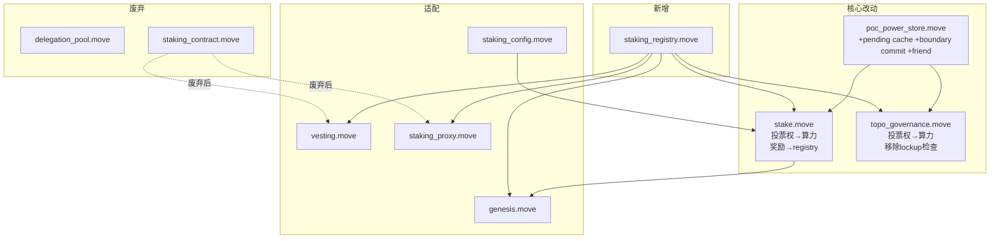

# 8. 架构图与流程图

## 8.1 当前数据流

## 8.2 目标数据流

说明：
- `PowerStore.users` 表实际保存当前 power period 的 committed snapshot。
- `pending_updates` 只保存下一周期待生效更新。
- operator 只需要为 `target_period = current_period + 1` 上传有活动用户；未上传的历史用户在边界提交时自动 carry-forward。
- `StakingRegistry.users` 与 validator 的 `delegator_list` 语义分离：前者是全量主账本，后者只保存通过 `min_active_power` 门槛的 active 成员。
- 旧 `batch_update()` 仍存在，但只是 `stage_batch_update()` 的兼容别名。

## 8.3 Epoch 奖励分配与周期边界流程

## 8.4 用户完整生命周期

## 8.5 Validator 自委托流程

## 8.6 改动范围依赖图

