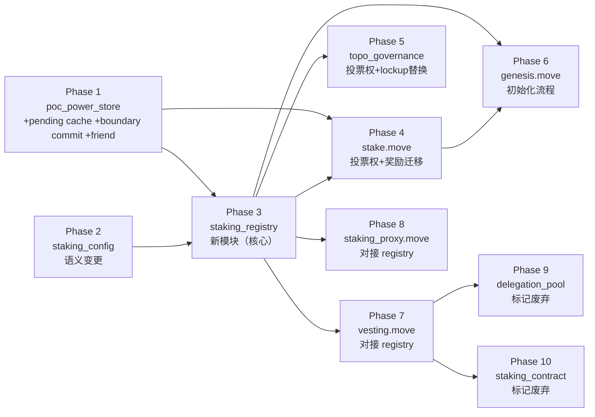

# 9. 实施顺序与验证方案

## 9.1 实施顺序

v3 中 Phase 3（stake.move）依赖 Phase 5（StakingRegistry）但排在前面，编译不通。v4 修正依赖关系：



| 阶段 | 模块 | 依赖 | 说明 | 可编译检查点 |
|------|------|------|------|------------|
| Phase 1 | poc_power_store.move | 无 | 新增 `users=committed snapshot`、`pending_updates`、`last_epoch`、边界提交 API、friend 声明 | `cargo check -p aptos-framework` |
| Phase 2 | staking_config.move | 无 | 字段改名 minimum_stake → minimum_power 等 | `cargo check -p aptos-framework` |
| Phase 3 | staking_registry.move (新) | P1 | 完整新模块：主账本 + active delegator set、`min_active_power` / `force_exit_power_bps`、deposit/delegate/undelegate/withdraw_deposit、distribute_epoch_rewards | `cargo check -p aptos-framework` |
| Phase 4 | stake.move | P1, P2, P3 | 投票权读 registry、on_new_epoch 调 registry 并驱动 power-store 边界提交、边界后 sweep active set、移除旧奖励逻辑 | `cargo check -p aptos-framework` |
| Phase 5 | topo_governance.move | P1, P3 | get_voting_power 读 registry、移除 lockup 资格检查 | `cargo check -p aptos-framework` |
| Phase 6 | genesis.move | P1, P3, P4 | 初始化 registry + poc_power_store、genesis validator 流程 | `cargo build -p aptos-cached-packages` |
| Phase 7 | vesting.move | P3 | 从 staking_contract 切换到 registry | `cargo test -p aptos-framework -- vesting` |
| Phase 8 | staking_proxy.move | P3 | 对接 registry | `cargo check -p aptos-framework` |
| Phase 9 | delegation_pool.move | P7 | 标记 `#[deprecated]`，保留 resource 结构 | `cargo check -p aptos-framework` |
| Phase 10 | staking_contract.move | P7 | 标记 `#[deprecated]`，保留 resource 结构 | `cargo check -p aptos-framework` |

关键变化：**StakingRegistry（Phase 3）必须在 stake.move（Phase 4）之前完成**，因为 stake.move 需要调用 `staking_registry::get_effective_power()` 和 `staking_registry::distribute_epoch_rewards()`。

## 9.2 每阶段验证

### Phase 1: poc_power_store

```bash
cargo check -p aptos-framework
env TEST_FILTER=poc_power_store cargo test -p aptos-framework move_framework_unit_tests -- --nocapture
```

验证点：
- `users` 只保存当前 power period committed snapshot
- `stage_batch_update(target_period, users, powers)` 强制 `target_period == current_period + 1`
- 周期中途 stage 不会立刻改变 `get_user_committed_power()`
- `commit_next_period_if_boundary()` 内部推进 `last_epoch`，并在边界执行 carry-forward + pending merge
- `batch_update()` 兼容别名与 `stage_batch_update()` 语义一致
- `set_genesis_committed_power()` 仅能在初始化阶段调用
- `total_power` 在每次边界提交后仍正确表示 committed snapshot 总和

### Phase 3: staking_registry

```bash
cargo check -p aptos-framework
cargo test -p aptos-framework -- staking_registry
```

验证点：
- deposit / withdraw_deposit 的 Coin 流转正确
- delegate / undelegate 的 delegator_index + delegator_list 一致性
- `delegate()` 需要满足 `effective_power >= min_active_power`
- `maintain_threshold = ceil(min_active_power * force_exit_power_bps / 10000)`
- `users` 主账本与 active delegator set 语义分离；deposit 用户不会自动进入可遍历数组
- get_effective_power 公式：`min(committed_power, deposit_octas / octas_per_power)`
- distribute_epoch_rewards：奖励按比例分配、dust 归 validator、u128 中间计算不溢出
- cooldown 机制：undelegate 后 cooldown_secs 内不能 withdraw_deposit
- 奖励 mint 到 deposit：coin::mint + coin::merge 正确执行
- 复利效应：deposit 增长后 effective_power 可能提升

### Phase 4: stake.move

```bash
cargo build -p aptos-cached-packages
cargo test -p aptos-framework -- stake
```

验证点：
- `get_next_epoch_voting_power()` 返回 effective_power 而非 coin::value
- `on_new_epoch()` 先结算上一 epoch 奖励，再调用 `poc_power_store::commit_next_period_if_boundary()`
- 周期边界后 sweep active delegator set；跌破维持门槛的成员被自动踢出并进入 cooldown
- ValidatorSet 按 effective_power 过滤 minimum_power
- 验证者 effective_power < minimum_power 时被踢出

### Phase 5: topo_governance

```bash
cargo test -p aptos-framework -- topo_governance
```

验证点：
- `get_voting_power()` 返回 effective_power
- 早期决议阈值基于 `get_total_staked_power()`
- 移除 lockup 资格检查，有效算力 > 0 的用户可投票
- RecordKey 主键从 stake_pool 改为 voter address
- vote_internal() 签名：去掉 stake_pool 参数
- create_proposal_v2_impl() 签名：去掉 stake_pool 参数
- entry 函数 vote/create_proposal/partial_vote：去掉 stake_pool 参数
- Vote/CreateProposal 事件结构：移除 stake_pool 字段
- VotingRecordsV2 按 voter address 记录已用投票权，防止双投
- 委托到非 active validator 的用户 effective_power = 0，不可投票
- total_staked_power 与投票资格定义域一致（仅 active validator backing）

### Phase 6: genesis

```bash
cargo build -p aptos-cached-packages
cargo test -p aptos-framework -- genesis
```

验证点：
- 先通过 `staking_registry::store_topo_coin_mint_cap()` 暂存 mint_cap，再调用 `staking_registry::initialize(...)`
- genesis validator 通过 registry 注册 + 自委托 + 加入 ValidatorSet
- 初始算力通过 `poc_power_store::set_genesis_committed_power()` 种入 period 0 committed snapshot
- cooldown_secs >= voting_duration_secs 不变量在初始化时检查
- on_new_epoch() 首次执行成功

## 9.3 集成测试场景

全部 Phase 完成后的端到端测试：

| # | 场景 | 预期结果 |
|---|------|---------|
| 1 | 保证金充足：deposit=0.5 TOPO, committed_power=500 | effective=500 |
| 2 | 保证金不足：deposit=0.05 TOPO, committed_power=500 | effective=50 |
| 3 | 周期中途上传：stage `target_period = current_period + 1` | 当前周期 `get_user_committed_power()` 不变 |
| 4 | 周期边界提交：旧 committed + pending merge | 新周期 committed snapshot 正确生成 |
| 5 | 连续多个 power period 无新上传 | committed power 在边界继续 carry-forward |
| 6 | 无保证金 | effective=0，不参与奖励 |
| 7 | 未委托但有保证金 | effective=0 |
| 8 | delegate → epoch 切换 | 奖励 mint 到 deposit，deposit 增长 |
| 9 | 多个 epoch 后 deposit 增长 → effective_power 可能提升（复利） | deposit/OCTAS_PER_POWER 增大 |
| 10 | undelegate → 立即 withdraw_deposit | abort ECOOLDOWN_ACTIVE |
| 11 | undelegate → 等待 cooldown → withdraw_deposit | 成功取回全部（本金+收益） |
| 12 | validator effective_power < minimum_power | 被踢出 ValidatorSet |
| 13 | validator 自委托 + delegator 委托 → 奖励按比例分配 | commission 归 validator，剩余按 ep 比例 mint 到各自 deposit |
| 14 | rounding dust | dust 归 validator 的 deposit |
| 15 | 治理投票：effective_power > 0 | 可投票 |
| 16 | 治理投票：effective_power == 0 | 不可投票 |
| 17 | genesis 启动 | 初始 validator 正常出块，period 0 committed snapshot 正常生效 |
| 18 | cooldown 期间不能重新 delegate | abort ECOOLDOWN_ACTIVE |
| 19 | `effective_power < min_active_power` 时尝试 delegate | abort，用户不进入 active delegator set |
| 20 | 用户已入场，边界重算后 `effective_power == ceil(min_active_power * 80%)` | 保持委托，不踢出 |
| 21 | 用户已入场，边界重算后 `effective_power < ceil(min_active_power * 80%)` | 自动 undelegate，进入 cooldown |

## 9.4 涉及文件清单

| 文件 | 改动量 | Phase |
|------|--------|-------|
| `sources/poc/poc_power_store.move` | 小 | 1 |
| `sources/configs/staking_config.move` | 小 | 2 |
| `sources/poc/staking_registry.move` | 新增(大) | 3 |
| `sources/stake.move` | 大 | 4 |
| `sources/topo_governance.move` | 中 | 5 |
| `sources/genesis.move` | 中 | 6 |
| `sources/vesting.move` | 中 | 7 |
| `sources/staking_proxy.move` | 小 | 8 |
| `sources/delegation_pool.move` | 中(废弃标记) | 9 |
| `sources/staking_contract.move` | 中(废弃标记) | 10 |
| `sources/voting.move` | 无 | - |
| `sources/coin.move` | 无 | - |
| `sources/validator_consensus_info.move` | 无 | - |
| `sources/state_storage.move` | 无 | - |
