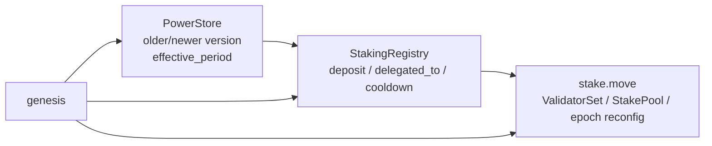
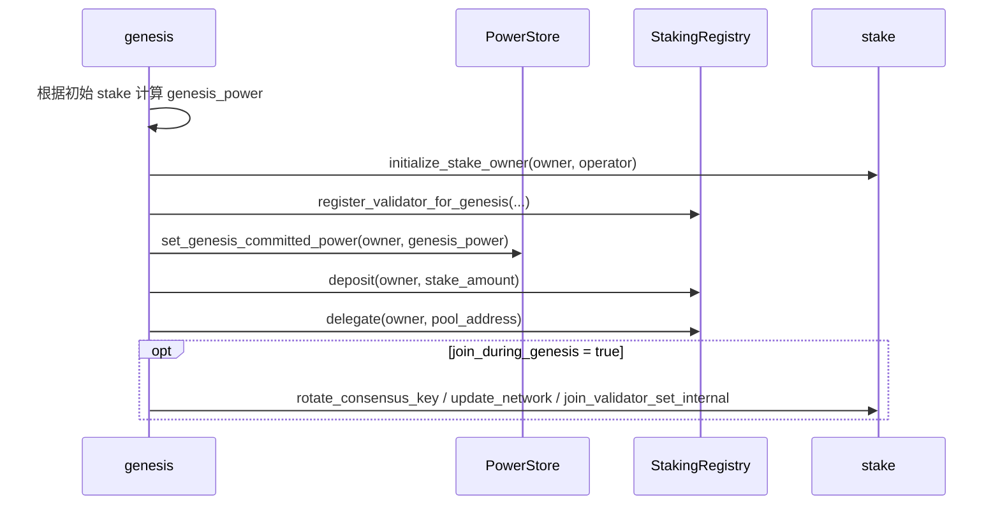
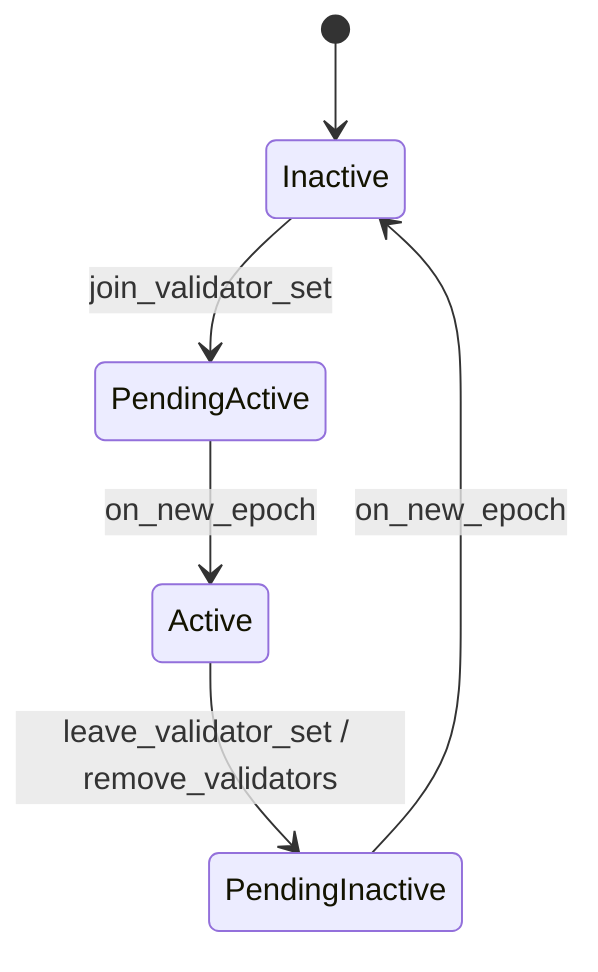
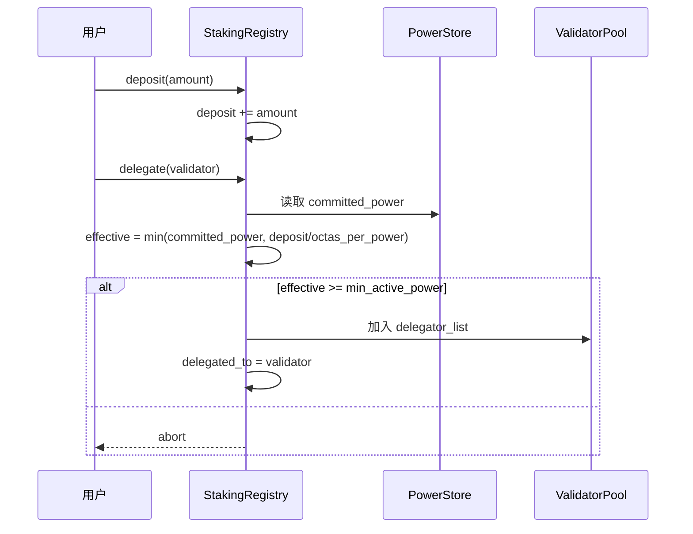
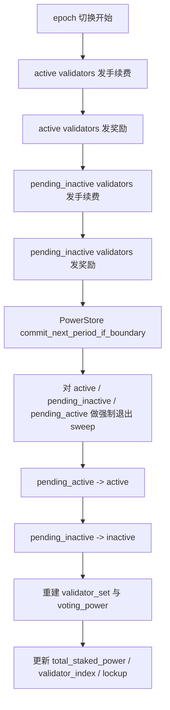
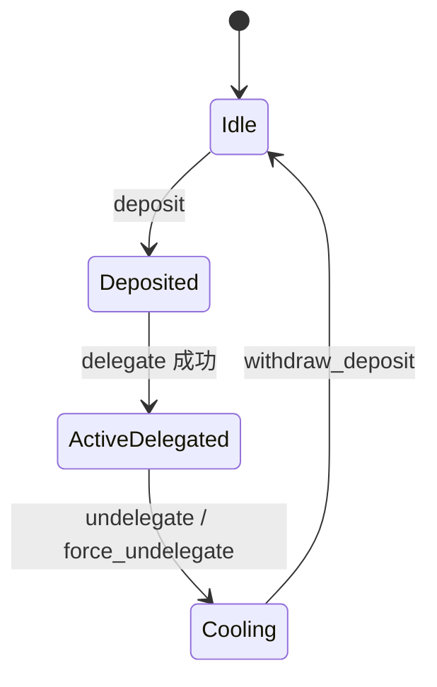

# 11. 当前验证者质押 / 普通用户质押流程分析

本文档分析的是**当前代码已经实现出来的真实流程**，不是早期设计草案。

重点回答四个问题：
- 验证者质押时，资金、算力、validator set 状态分别落在哪里。
- 普通用户质押时，保证金、委托关系、有效算力如何变化。
- 每个 epoch 边界，奖励、手续费、算力周期提交、强制退出按什么顺序执行。
- 当前代码删除 `staking_contract` 后，哪些旧路径已经不再存在。

## 11.1 模块分工

| 模块 | 当前职责 | 不负责什么 |
|------|----------|------------|
| `poc_power_store.move` | 为每个用户保存最近两个 power version；按 `effective_period` 读取当前/下一 epoch committed power；在边界只推进 `current_period` | 不保存保证金，不保存委托关系 |
| `staking_registry.move` | 保存用户保证金、委托关系、cooldown；维护 validator 活跃 delegator 集合；计算 `effective_power`；发放奖励/手续费 | 不管理 `StakePool` 的共识元数据 |
| `stake.move` | 管理 `ValidatorSet`、`ValidatorConfig`、`StakePool` 生命周期；在 epoch 边界驱动重配置 | 不直接保存用户算力，不直接保存普通用户保证金 |
| `genesis.move` | 创世时初始化 validator、初始保证金、初始 committed power | 运行期不参与日常质押流程 |

可以把当前实现理解为：



## 11.2 核心状态与公式

### 11.2.1 用户侧状态

当前普通用户或验证者 owner 的质押状态，核心只看 `staking_registry::UserStakeInfo`：

```move
struct UserStakeInfo {
    deposit: Coin<TopoCoin>,
    delegated_to: address,
    cooldown_until_secs: u64,
}
```

这意味着：
- 当前实现里，奖励和手续费**直接 mint 到 `deposit`**。
- 旧的 `pending_reward` / `pending_fee` 接口已经删除。

### 11.2.2 validator 侧状态

`staking_registry::ValidatorPool` 只维护“活跃可遍历成员”：

```move
struct ValidatorPool {
    owner_address: address,
    delegator_index: SmartTable<address, u64>,
    delegator_list: vector<address>,
    commission_bps: u64,
    status: u64,
}
```

这里的关键点是：
- `delegator_list` 不是全量历史委托人集合。
- 只有通过 `min_active_power` 门槛、当前处于活跃委托关系的用户，才会进入这个数组。
- 这样 `get_validator_total_power()`、奖励分配、边界 sweep 都只遍历“有经济意义的成员”。

### 11.2.3 有效算力公式

当前代码使用：

```text
committed_power = poc_power_store::get_user_committed_power(user)
deposit_cover = deposit_octas / octas_per_power
effective_power = min(committed_power, deposit_cover)
```

补充约束：
- 用户未委托，`effective_power = 0`
- 用户委托到不存在的 validator，`effective_power = 0`
- 用户委托到 `inactive` / `pending_active` validator，`get_effective_power()` 视角下返回 0
- validator 侧统计总算力时，会直接按 `delegator_list` 累加指定 validator 下每个成员的有效算力

### 11.2.4 活跃门槛与强制退出门槛

当前配置：

```text
entry_threshold = min_active_power
maintain_threshold = ceil(min_active_power * force_exit_power_bps / 10000)
```

语义分离如下：
- 用户第一次 `delegate()` 时，必须满足 `effective_power >= min_active_power`
- 已经在活跃集合中的用户，不要求一直高于 `min_active_power`
- 但在 epoch 边界，如果 `effective_power < maintain_threshold`，会被自动踢出并进入 cooldown

这形成一个滞回区间，减少用户在边界附近频繁进出数组。

## 11.3 创世期验证者质押流程

创世时，`genesis.move` 先计算初始 `genesis_power`，然后统一走新 registry 直连路径：

- `stake::initialize_stake_owner()`
- `staking_registry::register_validator_for_genesis()`
- `poc_power_store::set_genesis_committed_power()`
- `staking_registry::deposit()`
- `staking_registry::delegate()`



这里有两个重要结论：
- 创世 committed power 通过 `set_genesis_committed_power()` 直接种入 period 0 snapshot。
- 创世 validator 固定采用 owner 直连路径，`pool_address = owner_address`，不再通过 `staking_contract` 在 genesis 阶段创建 resource account pool。
- 创世 validator 的“质押资金”和“共识元数据”仍然分散在不同模块：保证金在 `staking_registry`，validator 元数据在 `stake`。

## 11.4 运行期验证者质押流程

运行期一个自营验证者想进入 validator set，最小闭环是：

1. 先在 `staking_registry` 注册 validator
2. 给自己 `deposit`
3. 给自己 `delegate`
4. 在 `stake.move` 完成 `initialize_validator` 所需元数据
5. 调 `join_validator_set`
6. 下一个 epoch 开始时，从 `pending_active` 进入 `active`

### 11.4.1 进入 validator set 前的检查

`stake::join_validator_set_internal()` 当前检查：
- 调用者必须是 `StakePool.operator_address`
- validator 当前状态必须是 `inactive`
- `self_power = staking_registry::get_validator_joining_power(pool_address)` 必须大于 0
- `voting_power = staking_registry::get_validator_total_power(pool_address)` 必须在 `[minimum_stake, maximum_stake]`
- 共识公钥不能为空

这里要注意：
- `self_power` 只看 owner 自己在该 validator 下的有效算力
- `voting_power` 看 owner + 普通委托人的总有效算力
- 所以一个 validator 可以依靠“自质押 + 普通用户委托”共同达到最小门槛

### 11.4.2 validator 状态流转



补充说明：
- `pending_active` 在当前 epoch 还不参与 `get_effective_power()` 的 active 视角读取
- 但它会在 `next_validator_consensus_infos()` 中参与下一 epoch 候选集预计算
- `pending_inactive` 在真正移出前，仍然参与本轮 epoch 的奖励/手续费分配

## 11.5 普通用户质押流程

普通用户主路径非常简单，本质上是：

1. `deposit(amount)`
2. `delegate(validator_address)`
3. 等待每个 epoch 自动发奖
4. 如果想退出，则 `undelegate()`
5. 等 cooldown 到期后 `withdraw_deposit()`



### 11.5.1 `deposit()` 只做一件事

`staking_registry::deposit()` 当前只负责：
- 从用户账户提走 `TopoCoin`
- 合并到 `UserStakeInfo.deposit`

它**不会**自动 delegate，也不会自动进入活跃 delegator 集合。

### 11.5.2 `delegate()` 的真实前置条件

当前 `delegate_internal()` 会检查：
- validator 必须存在
- 用户当前未委托
- 若有 cooldown，则必须已经到期
- `effective_power >= min_active_power`
- validator 当前活跃 delegator 数量未超过 `max_delegators_per_validator`

只有全部满足，用户才会：
- 被插入 `ValidatorPool.delegator_list`
- `delegated_to` 被设置成该 validator
- `cooldown_until_secs` 清零

### 11.5.3 普通用户为什么可能“存了钱但没法委托”

当前代码下，下面几种情况都会失败：
- 链下算力服务还没有给这个用户写入 committed power
- 用户 committed power 很大，但保证金不足，`deposit / octas_per_power` 把 `effective_power` 限死在门槛以下
- 用户刚刚 undelegate 过，还在 cooldown 内
- validator 的活跃 delegator 数已满

因此普通用户是否能入场，不只取决于保证金，也取决于：
- 当前 committed power
- 当前 `min_active_power`
- 当前 validator 活跃数组容量

## 11.6 算力更新与长周期行为

### 11.6.1 链下服务上传什么

链下算力服务不直接改当前生效值，而是上传：

```text
stage_batch_update(target_period = current_period + 1, users, powers)
```

含义是：
- 本周期内读取到的 committed power 不变
- 上传值写入用户的 future version，`effective_period = target_period`
- 只有当 `stake::on_new_epoch()` 发现跨入新的 power period，读取侧才会开始选中这个新版本

### 11.6.2 边界提交规则

`poc_power_store::commit_next_period_if_boundary()` 会做：

1. `last_epoch += 1`
2. 计算 `target_period`
3. 如果还没跨到下一个 power period，则直接返回
4. 如果跨期了：
   - 直接更新 `current_period`
   - 不再全表重写历史用户算力
   - 不再做额外的全局合并步骤
   - 历史用户的衰减在读取时按 `target_period - effective_period` 惰性计算

长周期下，这意味着：
- 周期中途的 `deposit / delegate / undelegate` 只会影响保证金与委托关系
- **不会提前改写当期 committed snapshot**
- 所以 stake / reward / governance 在整个 power period 内看到的是同一份 raw power 来源

## 11.7 epoch 边界完整顺序

当前 `stake::on_new_epoch()` 的顺序非常关键：



这条顺序可以拆成三层语义：

### 11.7.1 先发奖，再切 power period

当前实现是先按“旧 committed snapshot + 旧活跃集合”发本 epoch 奖励和手续费，然后才提交下一 power period。

这意味着：
- 当前 epoch 的收益，仍归属于旧周期快照
- 新上传的 future period 版本，不会提前参与本 epoch 收益

### 11.7.2 再做边界强制退出

power period 提交后，会对：
- `active_validators`
- `pending_inactive`
- `pending_active`

三类 validator 的活跃 delegator 集合执行 sweep。

若某个成员：

```text
effective_power < ceil(min_active_power * force_exit_power_bps / 10000)
```

则系统会：
- 从 `delegator_list` 中移除
- `delegated_to = 0x0`
- `cooldown_until_secs = now + cooldown_secs`

这等价于一次系统触发的 `undelegate()`。

### 11.7.3 最后才重建 validator set

validator voting power 的最终重建发生在 sweep 之后。

因此某个 validator 是否还能留在 validator set，最终取决于：
- 这轮发奖后的 deposit 变化
- 这轮 power period commit 后的 committed power 变化
- sweep 后还剩多少活跃 delegator

## 11.8 奖励与手续费如何进入账户

当前实现中，`staking_registry` 的奖励逻辑是：

1. 遍历 validator 的 `delegator_list`
2. 收集每个成员的 `effective_power`
3. 计算 pool 总奖励 / 总手续费
4. 先扣佣金 `commission_bps`
5. 余额按 effective power 比例分配给成员
6. commission + rounding dust 给 validator owner
7. **所有金额直接 mint 并 merge 到各自 `deposit`**

这意味着：
- 当前实现已经是“自动复利”模型
- 用户不需要单独 claim reward 才能让保证金变大
- 下一轮如果 `deposit_cover` 不再是瓶颈，用户的 `effective_power` 可能自然抬升

需要特别注意：
- 对外部调用方来说，真正能提现的资产都在 `deposit`

## 11.9 用户退出流程

普通用户退出分两步：

1. `undelegate()`
2. cooldown 到期后 `withdraw_deposit()`



### 11.9.1 `undelegate()` 做了什么

当前实现：
- 从对应 validator 的 `delegator_list` 中删除
- `delegated_to = 0x0`
- `cooldown_until_secs = now + cooldown_secs`

### 11.9.2 `withdraw_deposit()` 的限制

只有同时满足下面条件，用户才能提走全部保证金：
- `delegated_to == 0x0`
- 当前不在 cooldown 内

提取时：
- `deposit` 会被一次性 `extract_all`
- `cooldown_until_secs` 被清零

## 11.10 已删除的旧路径

当前源码已经删除：

- `staking_contract.move`
- `staking_registry` 中只为 `staking_contract` 服务的 friend 接口
- `claim_pending_income()` / `get_user_pending_income()` 等空壳兼容接口

因此现在只保留一条主路径：

```text
deposit -> delegate -> on_new_epoch 自动发奖 -> undelegate -> cooldown -> withdraw_deposit
```

## 11.11 当前实现的几个关键判断

### 11.11.1 普通用户什么时候真正“算作已质押”

在当前系统里，用户必须同时满足：
- 有 `deposit`
- 有 `delegated_to`
- 对应 validator 处于 `active` 或 `pending_inactive`
- `committed_power > 0`

否则 `get_effective_power()` 返回 0。

### 11.11.2 validator 的 voting power 从哪里来

当前 validator voting power 不是直接读 `StakePool` 金额，而是：

```text
validator_total_power = sum(active delegator list 上每个成员的 effective_power)
```

所以真正决定 validator 能否留在 validator set 的，是：
- 链下上传并边界提交后的 committed power
- 这些用户各自的 deposit 是否足够覆盖 committed power
- 活跃 delegator 是否因为门槛或强退被移出

### 11.11.3 当前代码里哪些旧接口已经“只剩兼容名字”

下面几个接口当前仍然存在，但不应再按旧语义理解：
- `poc_power_store::batch_update()`：现在只是 `stage_batch_update()` 兼容别名
- `poc_power_store::get_user_power()`：现在等于读取 committed power
- `poc_power_store::get_user_decayed_power()`：现在等于 committed power 兼容别名

## 11.12 当前实现的边界与注意点

### 11.12.1 `next_validator_consensus_infos()` 仍是“近似预测”

当前实现已经把这条预测路径改成：
- 前瞻下一 epoch 的 committed power
- 前瞻边界强制退出阈值

但它**还没有精确前瞻**“本轮 reward / fee 先 mint 进 deposit”后的效果。

因此在极端接近门槛的场景下：
- 预测值与 `on_new_epoch()` 真实执行值之间，理论上仍可能存在细微偏差

### 11.12.2 validator owner 自己也只是 registry 里的一个用户

无论是普通 self-stake validator，底层都一样：
- owner/staker 也是 `staking_registry.users` 里的一条用户记录
- owner 的 `deposit + delegated_to + effective_power` 参与 validator 总算力计算

这让“验证者自质押”和“普通用户委托”在经济账本层面保持统一。

## 11.13 一句话总结

当前实现已经收敛成一条统一主线：

- `PowerStore` 决定用户在当前周期的 raw power 上限
- `StakingRegistry` 决定用户实际拿多少保证金、是否已委托、是否在 cooldown、是否进入活跃数组
- `stake.move` 在 epoch 边界把奖励结算、算力换期、强制退出、validator set 重建串起来

因此，理解当前系统的关键不是盯某一个模块，而是始终沿着下面这条链看：

```text
committed_power
  -> effective_power
  -> validator_total_power
  -> validator set 生效 / 退出
  -> epoch 奖励回灌到 deposit
  -> 再反过来影响下一轮 effective_power
```
