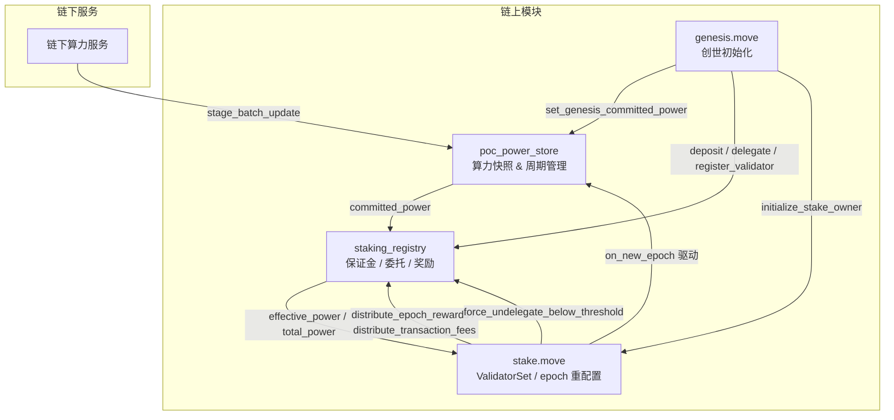
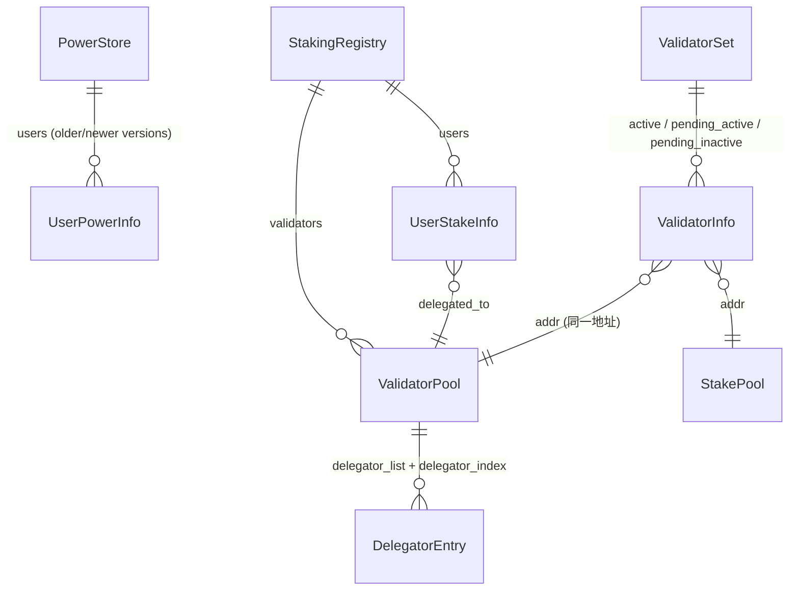
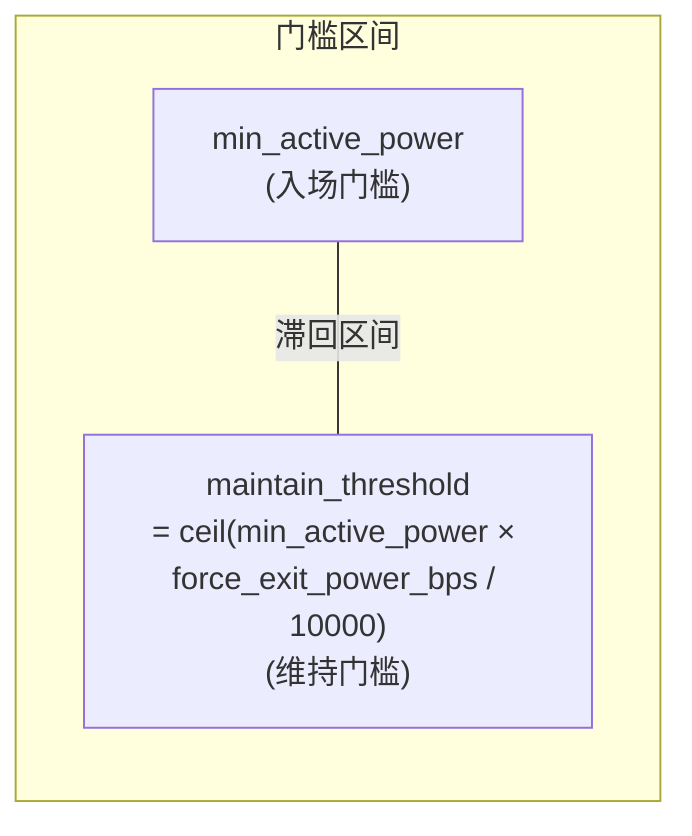
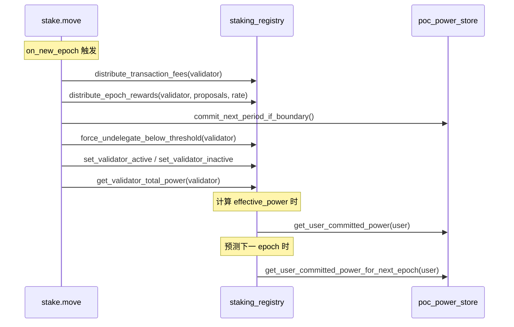

# 12. 模块架构与状态模型

本文档基于当前代码实现，梳理质押系统四大核心模块的职责边界、核心数据结构、状态关联关系。

## 12.1 模块总览



## 12.2 各模块职责矩阵

| 模块 | 核心职责 | 不负责 |
|------|----------|--------|
| `poc_power_store` | 为每个用户维护最近两个 committed power 版本；按 `effective_period` 读取当前/下一 epoch committed power；在 epoch 边界推进 `current_period` | 不保存保证金，不保存委托关系，不参与奖励分配 |
| `staking_registry` | 保存用户保证金 (deposit)、委托关系 (delegated_to)、cooldown；维护 validator 活跃 delegator 集合；计算 effective_power；分发奖励/手续费；执行强制退出 | 不管理 ValidatorSet 共识元数据，不管理 StakePool 生命周期 |
| `stake.move` | 管理 ValidatorSet、ValidatorConfig、StakePool 生命周期；在 epoch 边界驱动奖励结算、算力换期、强制退出、validator set 重建 | 不直接保存用户算力，不直接保存普通用户保证金 |
| `genesis.move` | 创世时初始化 validator、初始保证金、初始 committed power | 运行期不参与日常质押流程 |

## 12.3 核心数据结构

### 12.3.1 poc_power_store::PowerStore

```move
struct PowerStore has key {
    operator: address,
    power_period_in_epochs: u64,
    last_epoch: u64,
    current_period: u64,
    users: Table<address, UserPowerInfo>,
    user_list: vector<address>,
    retention_bps_per_period: u64,
}

struct PowerVersion has store, drop, copy {
    effective_period: u64,
    power: u64,
}

struct UserPowerInfo has store, drop, copy {
    older: PowerVersion,
    newer: PowerVersion,
}
```

关键配置常量：

| 常量 | 默认值 | 含义 |
|------|--------|------|
| `POWER_DECIMALS` | 18 | 算力精度 |
| `DEFAULT_RETENTION_BPS_PER_PERIOD` | 9950 | 每周期保留 99.5%，衰减 0.5% |
| `DEFAULT_POWER_PERIOD_IN_EPOCHS` | 60 | 默认 60 epochs = 1 power period |

### 12.3.2 staking_registry 核心结构

```move
struct StakingRegistry has key {
    validators: Table<address, ValidatorPool>,   // validator 地址 -> 池
    users: Table<address, UserStakeInfo>,         // 用户地址 -> 质押信息
    total_staked_power: u64,                      // 全网总质押算力
    mint_cap: MintCapability<TopoCoin>,           // 奖励铸币权
    config: StakingRegistryConfig,                // 配置参数
}

struct StakingRegistryConfig has store {
    octas_per_power: u64,                         // 保证金到算力的换算率
    max_delegators_per_validator: u64,            // 每个 validator 最大委托人数
    cooldown_secs: u64,                           // 解委托后冷却期（秒）
    genesis_stake_power_multiplier: u64,          // 创世质押算力乘数（默认 1）
    min_active_power: u64,                        // 委托最低有效算力门槛
    force_exit_power_bps: u64,                    // 强制退出门槛比例（默认 8000 = 80%）
}

struct ValidatorPool has store {
    owner_address: address,                       // validator 所有者
    delegator_index: SmartTable<address, u64>,    // 委托人地址 -> 在 list 中的索引
    delegator_list: vector<address>,              // 活跃委托人列表
    commission_bps: u64,                          // 佣金比例 (bps)
    status: u64,                                  // 状态: 1=pending_active, 2=active, 3=pending_inactive, 4=inactive
}

struct UserStakeInfo has store {
    deposit: Coin<TopoCoin>,                      // 保证金
    delegated_to: address,                        // 委托目标 (@0x0 = 未委托)
    cooldown_until_secs: u64,                     // 冷却到期时间 (0 = 无冷却)
}
```

### 12.3.3 stake.move 核心结构（简化）

```move
struct ValidatorSet has key {
    consensus_scheme: u8,
    active_validators: vector<ValidatorInfo>,
    pending_active: vector<ValidatorInfo>,
    pending_inactive: vector<ValidatorInfo>,
    total_voting_power: u128,
    total_joining_power: u128,
}

struct StakePool has key {
    active: Coin<TopoCoin>,
    pending_active: Coin<TopoCoin>,
    pending_inactive: Coin<TopoCoin>,
    inactive: Coin<TopoCoin>,
    locked_until_secs: u64,
    operator_address: address,
    // ... event handles
}
```

### 12.3.4 已删除模块

`staking_contract.move` 已从当前源码删除。

当前系统不再保留单独的 staker-operator 包装层，收益、保证金、委托关系统一收敛到 `staking_registry`。

## 12.4 状态关联关系



核心关联链：

```
用户 committed_power (PowerStore 版本选择 + retention)
  ↕ min()
用户 deposit_cover (UserStakeInfo.deposit / octas_per_power)
  = effective_power
  → 累加到 ValidatorPool.delegator_list 上的所有成员
  = validator_total_power
  → 决定 ValidatorSet 中的 voting_power
```

## 12.5 有效算力公式

```move
// staking_registry::calculate_effective_power()
committed_power = poc_power_store::get_user_committed_power(user)
if committed_power == 0 { return 0 }
deposit_octas = coin::value(&info.deposit)
deposit_cover = deposit_octas / octas_per_power
effective_power = min(committed_power, deposit_cover)
```

这意味着：
- 算力和保证金是**双重约束**，取较小值
- 链下算力服务未上传 → committed_power = 0 → effective_power = 0
- 保证金不足 → deposit_cover 成为瓶颈
- 奖励直接 mint 到 deposit → 自动提升 deposit_cover → 可能提升下一轮 effective_power

## 12.6 活跃门槛与强制退出门槛



| 场景 | 门槛 | 说明 |
|------|------|------|
| 首次 delegate | `effective_power >= min_active_power` | 必须达到入场门槛 |
| 已在活跃集合 | 无实时检查 | 不要求持续高于 min_active_power |
| epoch 边界 sweep | `effective_power < maintain_threshold` | 低于维持门槛则被强制退出 |

默认配置下 `force_exit_power_bps = 8000`，即维持门槛 = 入场门槛的 80%。这形成滞回区间，防止用户在边界附近频繁进出。

## 12.7 模块间调用关系汇总



## 12.8 小结

当前系统的模块分工可以用一句话概括：

- **PowerStore** 管"某个 period 你应该读到多少 raw power"
- **StakingRegistry** 管"你质押了多少钱、委托给谁、能拿多少奖励"
- **stake.move** 管"谁是 validator、什么时候切 epoch、怎么重建共识集合"

三个核心模块通过 `effective_power` 这条主线串联：committed_power × deposit_cover → effective_power → validator_total_power → validator set → epoch 奖励 → 回灌 deposit → 影响下一轮 effective_power。
