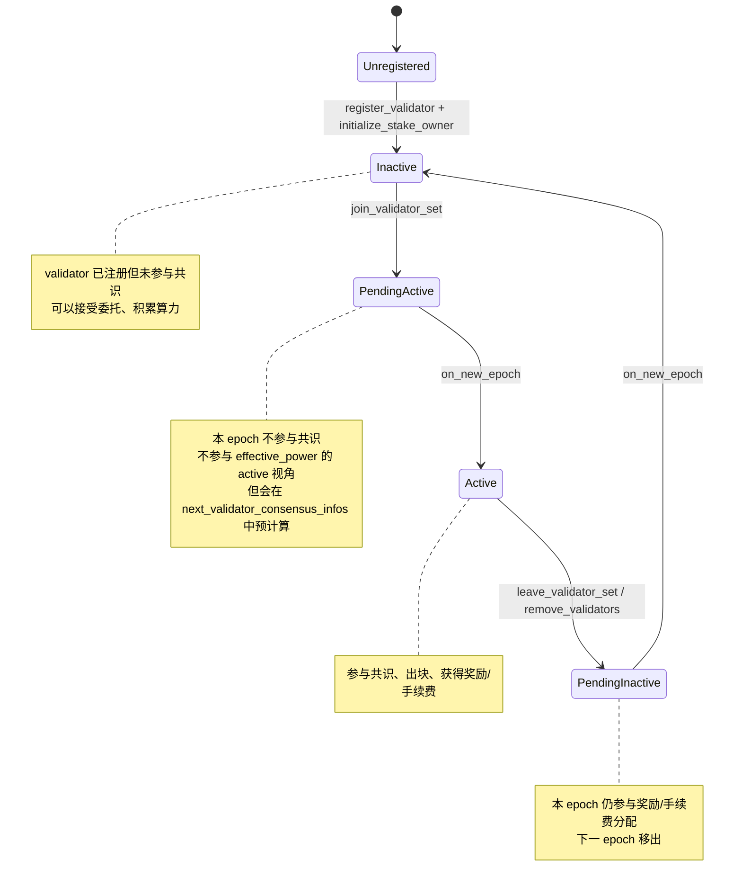
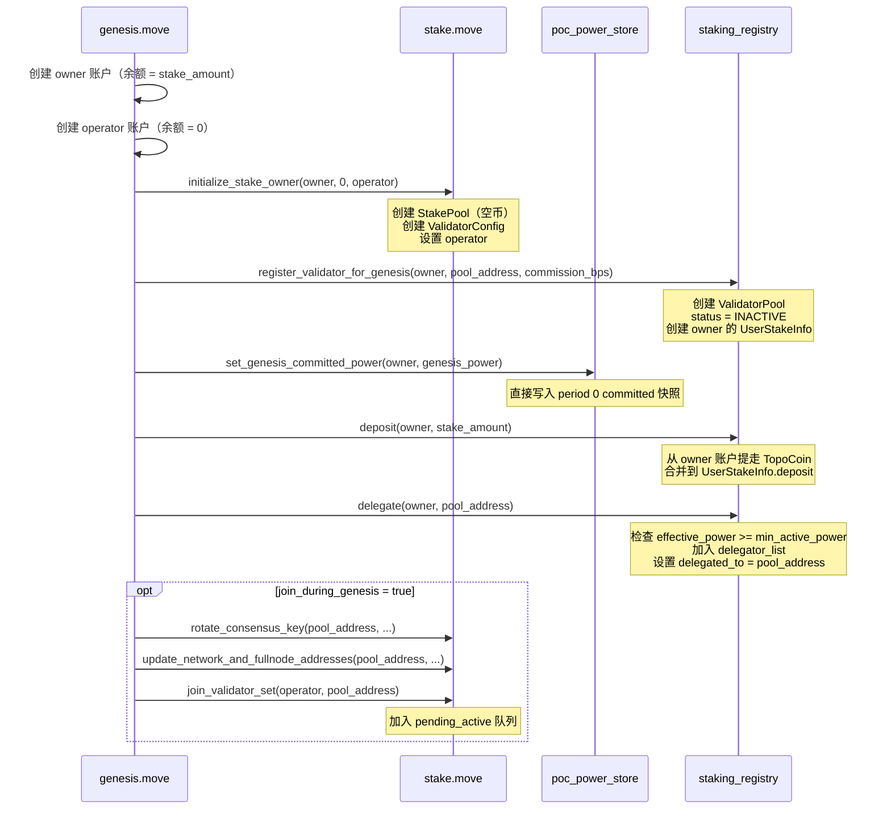
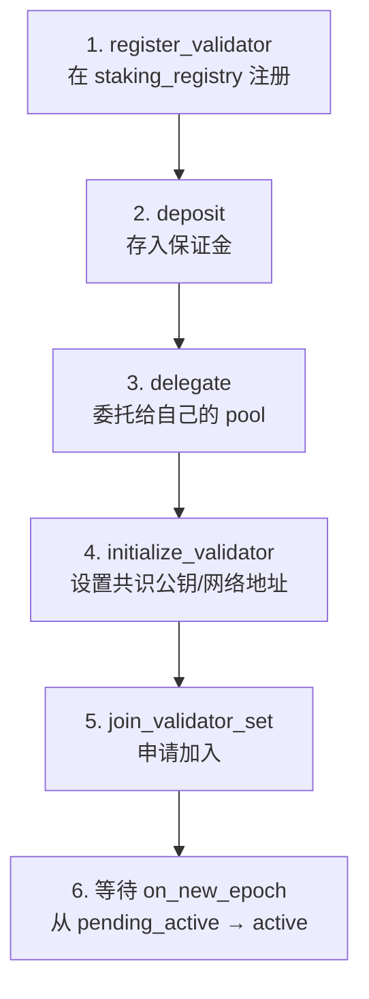
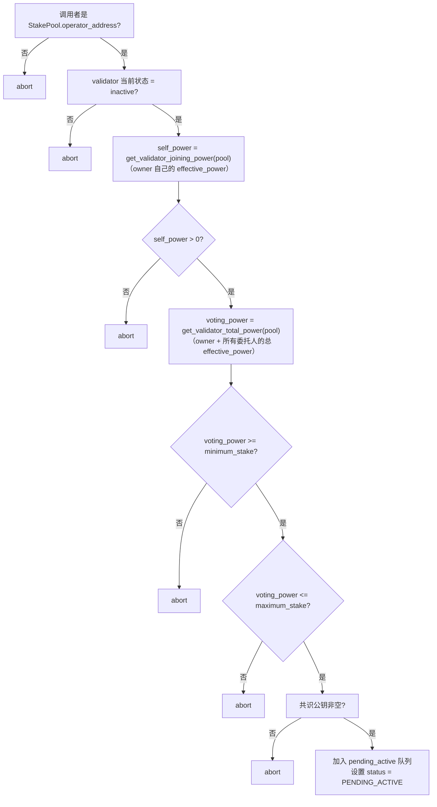
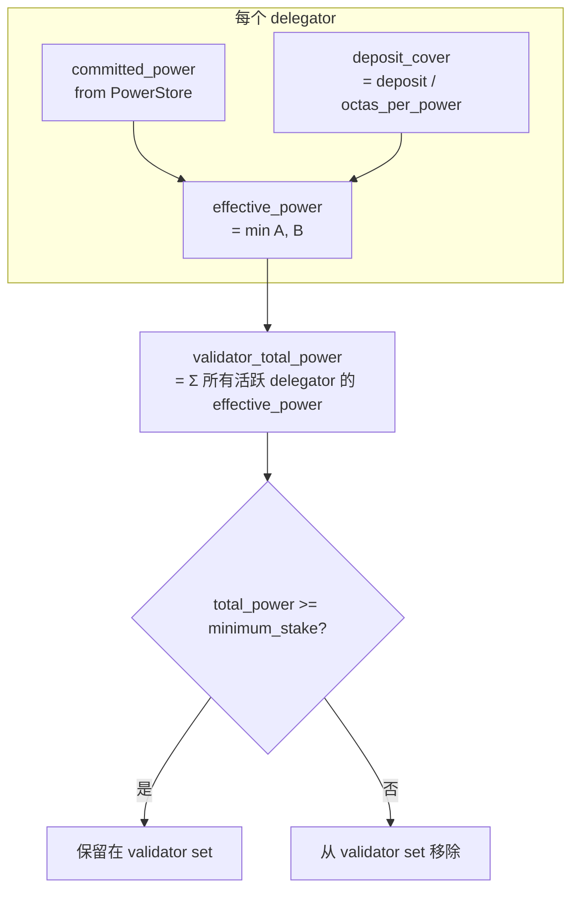
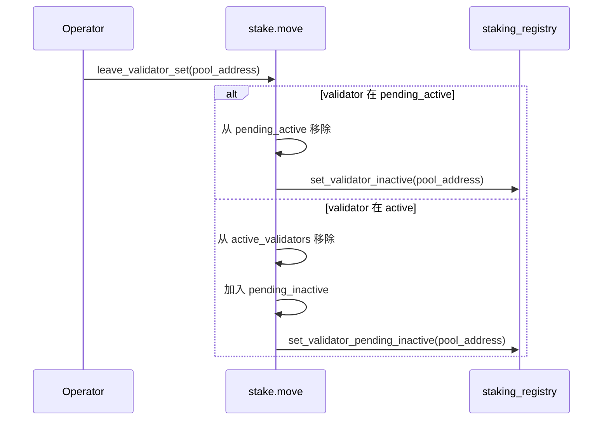
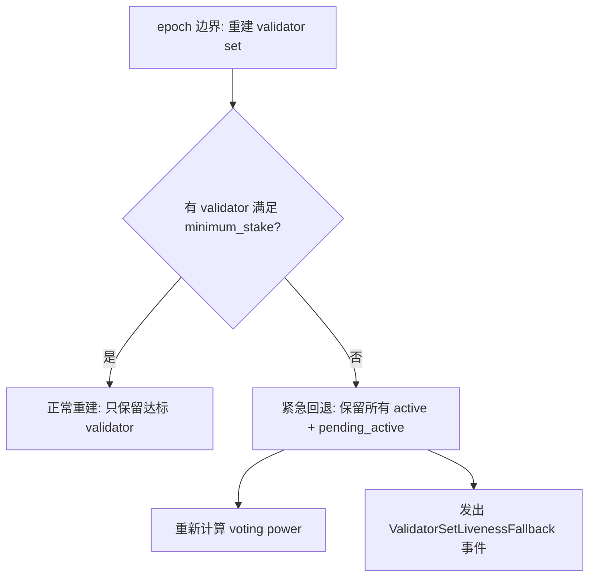
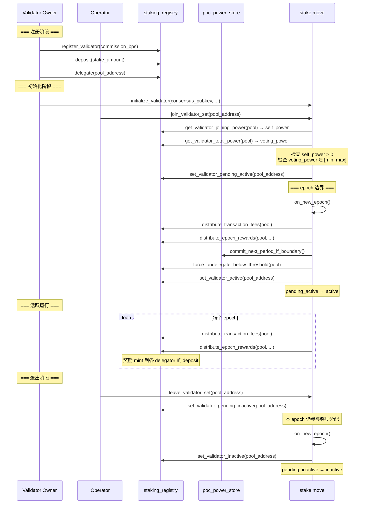

# 13. 验证者质押生命周期

本文档基于当前代码实现，完整梳理验证者从创世初始化 / 运行期注册，到加入 validator set、参与共识、退出的全流程。

## 13.1 验证者状态机



状态值定义（staking_registry）：

| 状态 | 值 | 含义 |
|------|-----|------|
| `VALIDATOR_STATUS_PENDING_ACTIVE` | 1 | 等待下一 epoch 激活 |
| `VALIDATOR_STATUS_ACTIVE` | 2 | 活跃参与共识 |
| `VALIDATOR_STATUS_PENDING_INACTIVE` | 3 | 等待下一 epoch 退出 |
| `VALIDATOR_STATUS_INACTIVE` | 4 | 不参与共识 |

## 13.2 创世期验证者初始化

创世时 `genesis.move` 通过 `create_initialize_validators_with_commission()` 处理每个验证者，当前已统一为新 registry 直连路径。

### 13.2.1 前置初始化

在处理任何验证者之前，`ensure_poc_staking_initialized()` 会：

1. 初始化 `poc_power_store`（如果尚未初始化）
2. 根据 `recurring_lockup_duration_secs` 和 `voting_duration_secs` 计算 `cooldown_secs`
3. 初始化 `staking_registry`，配置：
   - `octas_per_power = 100,000`（DEFAULT_OCTAS_PER_POWER）
   - `max_delegators_per_validator = 1,000`
   - `cooldown_secs`（计算得出）

### 13.2.2 创世算力计算

```move
let genesis_power = staking_registry::calculate_genesis_power_from_stake(validator.stake_amount);
```

将初始质押金额转换为算力值，使用 `genesis_stake_power_multiplier`（默认 1）。

### 13.2.3 创世固定路径：直接 owner 路径



此路径下 `pool_address = owner_address`，即验证者自己的地址就是 stake pool 地址。

### 13.2.4 为什么不再保留创世 staking_contract 路径

`staking_contract` 已从当前源码删除。

它原本的主要价值在于：
- 兼容 1:1 staker-operator 包装模型
- 记录 `principal`
- 用 `distribution_pool` 做收益再分配

但这些都不是创世 validator 进入新 registry 模型所必需的。

因此创世已收敛为单一路径：
- pool 地址直接使用 `owner_address`
- 保证金直接进入 `staking_registry`
- 自委托直接通过 `delegate(owner, owner_address)` 建立
- 不再在 genesis 阶段创建 resource account stake pool

## 13.3 运行期验证者注册与加入

### 13.3.1 最小闭环步骤

一个自营验证者想在运行期进入 validator set，需要完成以下步骤：



### 13.3.2 register_validator 详解

```move
// staking_registry.move
public entry fun register_validator(validator: &signer, commission_bps: u64)
```

内部逻辑（`register_validator_internal`）：
1. 验证 `commission_bps <= 10000`
2. 验证该地址尚未注册为 validator
3. 如果 owner 尚无 UserStakeInfo，自动创建
4. 创建 ValidatorPool：
   - `owner_address = validator_address`
   - 空的 `delegator_list` 和 `delegator_index`
   - `commission_bps` 按传入值
   - `status = INACTIVE`

### 13.3.3 join_validator_set 前置检查

`stake::join_validator_set_internal()` 执行以下检查：



关键点：
- `self_power` 只看 owner 自己在该 validator 下的有效算力，必须 > 0
- `voting_power` 看 owner + 所有委托人的总有效算力，必须在 `[minimum_stake, maximum_stake]` 范围内
- 一个 validator 可以依靠"自质押 + 普通用户委托"共同达到最小门槛

### 13.3.4 initialize_validator 详解

```move
// stake.move
public entry fun initialize_validator(
    account: &signer,
    consensus_pubkey: vector<u8>,
    proof_of_possession: vector<u8>,
    network_addresses: vector<u8>,
    fullnode_addresses: vector<u8>,
)
```

执行步骤：
1. 验证 BLS12381 proof-of-possession（共识公钥有效性）
2. 调用 `initialize_owner()` 创建 StakePool（四个空 Coin 字段）
3. 创建 ValidatorConfig（共识公钥、网络地址）
4. 在 staking_registry 注册为自有 validator

## 13.4 Validator Voting Power 计算

### 13.4.1 当前 epoch 的 voting power

```move
// staking_registry::get_validator_total_power()
fun get_validator_total_power(validator_address): u64 {
    let pool = borrow_validator(validator_address);
    let total: u128 = 0;
    for each member in pool.delegator_list {
        total += get_user_effective_power_for_validator(member, validator_address) as u128;
    }
    return total as u64;
}
```

每个成员的 effective_power：
```
committed_power = poc_power_store::get_user_committed_power(member)
deposit_cover = member.deposit / octas_per_power
effective_power = min(committed_power, deposit_cover)
// 仅当 member.delegated_to == validator_address 时返回非零值
```

### 13.4.2 下一 epoch 的 voting power（预测）

```move
// staking_registry::get_validator_total_power_for_next_epoch()
```

与当前 epoch 的区别：
1. 使用 `get_user_committed_power_for_next_epoch()` 代替 `get_user_committed_power()`
   - 如果下一 epoch 跨入新 power period，会前瞻下一 epoch 对应 target period 的版本选择结果，并按 retention 惰性衰减
2. 额外检查 `effective_power >= maintain_threshold`
   - 低于维持门槛的成员在预测中被排除（因为 sweep 会先于 validator set 重建执行）

此函数用于 `next_validator_consensus_infos()` 预测下一 epoch 的 validator set。

### 13.4.3 voting power 计算流程图



## 13.5 leave_validator_set

验证者主动退出有两种情况：

### 13.5.1 从 pending_active 退出

如果 validator 还在 `pending_active` 队列（尚未激活）：
- 直接从 `pending_active` 中移除
- 减少 `total_joining_power`
- 状态设为 `INACTIVE`

### 13.5.2 从 active 退出

如果 validator 已经是 `active`：
- 从 `active_validators` 中移除
- 验证至少还有一个 validator 留在 active（不能全部退出）
- 加入 `pending_inactive` 队列
- 状态设为 `PENDING_INACTIVE`
- 本 epoch 仍参与奖励/手续费分配
- 下一 epoch 的 `on_new_epoch` 中正式移出



## 13.6 Validator 被动退出

在 epoch 边界，validator 可能因以下原因被动退出：

### 13.6.1 voting power 不足

`on_new_epoch` 重建 validator set 时，如果 validator 的 `voting_power < minimum_stake`，会被直接丢弃，不进入新的 `active_validators`。

### 13.6.2 delegator 被 sweep 导致算力下降

epoch 边界的 `force_undelegate_below_threshold()` 可能移除部分 delegator，导致 validator 总算力下降到 minimum_stake 以下。

### 13.6.3 紧急活性回退

如果 sweep + 重建后没有任何 validator 满足 minimum_stake，系统会触发紧急回退：
- 保留上一轮所有 active + pending_active validator
- 重新计算 voting power
- 发出 `ValidatorSetLivenessFallback` 事件



## 13.7 已删除的 staking_contract 模块

当前源码已经删除 `staking_contract.move`。

这意味着：
- validator 不再存在 contract 包装创建路径
- 收益再分配不再通过独立 contract 层完成
- validator 主路径统一为 `register_validator + deposit + delegate + join_validator_set`

## 13.8 验证者完整生命周期时序



## 13.9 关键判断总结

| 问题 | 答案 |
|------|------|
| validator 的 voting power 从哪来？ | `Σ(delegator_list 中每个成员的 effective_power)` |
| owner 自己算不算 delegator？ | 算。owner 也是 registry 中的一个 user，delegate 后进入自己的 delegator_list |
| validator 能否只靠委托人达标？ | 不能。`join_validator_set` 要求 `self_power > 0`，即 owner 自己必须有有效算力 |
| pending_active 的 validator 能收奖励吗？ | 不能。奖励只分给 active 和 pending_inactive |
| pending_inactive 的 validator 能收奖励吗？ | 能。本 epoch 仍参与分配，下一 epoch 才正式退出 |
| 现在还有 staking_contract 路径的 validator 吗？ | 没有。当前源码中该模块已删除，validator 只走 registry 直连路径 |
