# 14. 普通用户质押生命周期

本文档基于当前代码实现，完整梳理普通用户从存入保证金、委托、获得奖励、解委托、到提取的全流程，以及强制退出机制。

## 14.1 用户状态机

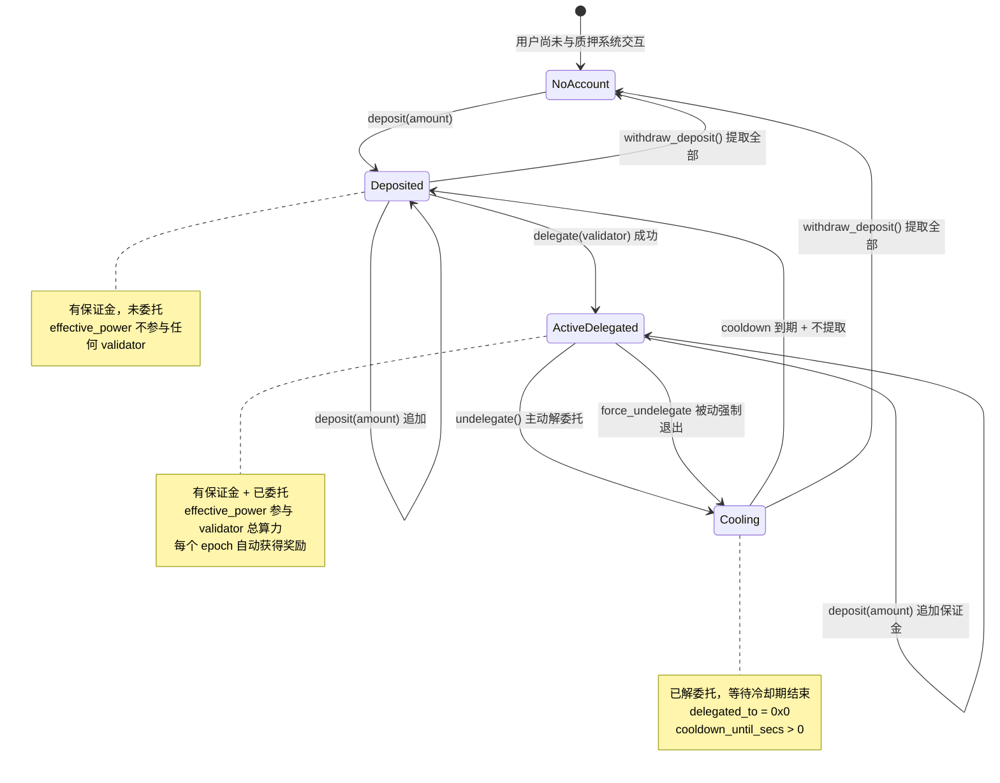

## 14.2 UserStakeInfo 字段语义

```move
struct UserStakeInfo has store {
    deposit: Coin<TopoCoin>,       // 保证金（含已 mint 的奖励）
    delegated_to: address,         // 委托目标（@0x0 = 未委托）
    cooldown_until_secs: u64,      // 冷却到期时间戳（0 = 无冷却）
}
```

三个字段的组合决定用户当前状态：

| deposit > 0 | delegated_to | cooldown | 状态 |
|-------------|-------------|----------|------|
| 否 | @0x0 | 0 | 无账户 / 已提取 |
| 是 | @0x0 | 0 | 已存款，可委托或提取 |
| 是 | validator | 0 | 活跃委托中 |
| 是 | @0x0 | > now | 冷却中，不可委托也不可提取 |
| 是 | @0x0 | <= now | 冷却已到期，可委托或提取 |

## 14.3 deposit：存入保证金

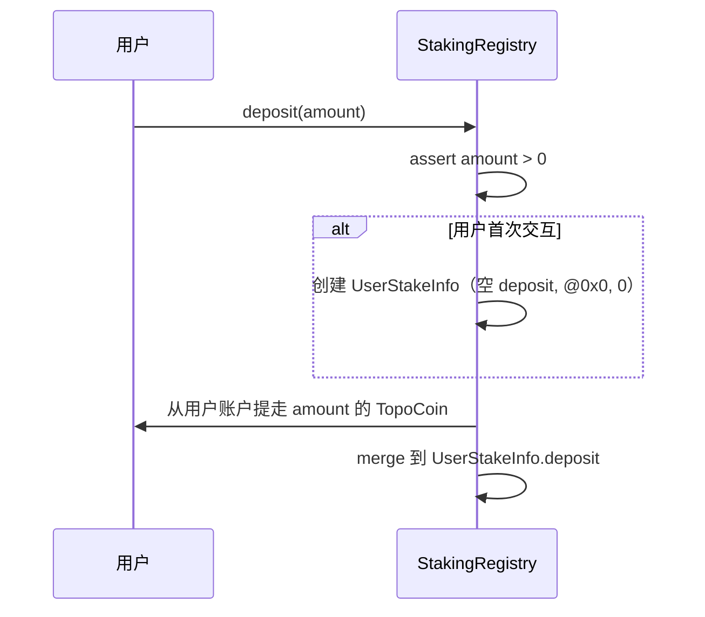

关键点：
- `deposit()` 只做一件事：把钱存进来
- 不会自动 delegate，不会自动进入活跃集合
- 可以多次调用追加保证金
- 即使已经在委托状态，也可以追加 deposit（会提升 deposit_cover，可能提升 effective_power）

当前入口：
- `deposit(user: &signer, amount: u64)` — entry 函数，从用户账户提走 TopoCoin

## 14.4 delegate：委托给 validator

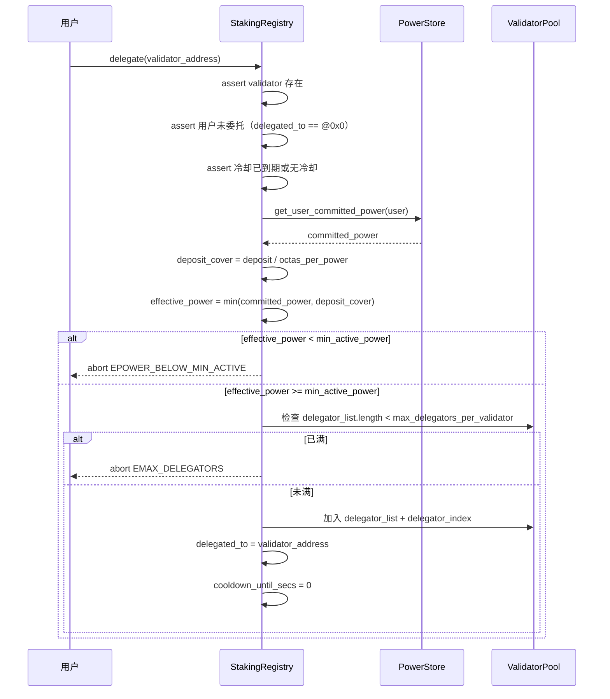

### 14.4.1 delegate 的五个前置条件

| # | 条件 | 错误码 | 说明 |
|---|------|--------|------|
| 1 | validator 必须存在 | ENOT_VALIDATOR | 目标地址必须已注册为 validator |
| 2 | 用户当前未委托 | EALREADY_DELEGATED | delegated_to 必须是 @0x0 |
| 3 | 冷却已到期 | ECOOLDOWN_ACTIVE | cooldown_until_secs == 0 或 now >= cooldown_until_secs |
| 4 | effective_power >= min_active_power | EPOWER_BELOW_MIN_ACTIVE | 有效算力必须达到入场门槛 |
| 5 | delegator 数量未满 | EMAX_DELEGATORS | validator 的活跃委托人数不超过上限 |

### 14.4.2 用户可能"存了钱但没法委托"的场景

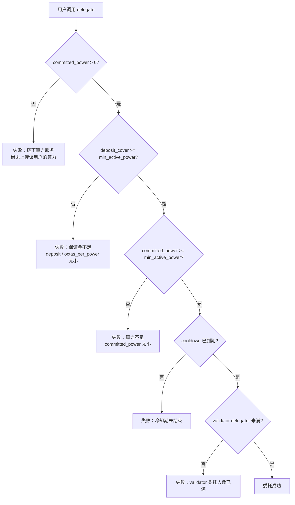

## 14.5 有效算力（effective_power）详解

### 14.5.1 计算公式

```
committed_power = poc_power_store::get_user_committed_power(user)
if committed_power == 0:
    effective_power = 0
else:
    deposit_octas = coin::value(&info.deposit)
    deposit_cover = deposit_octas / octas_per_power
    effective_power = min(committed_power, deposit_cover)
```

### 14.5.2 双重约束模型

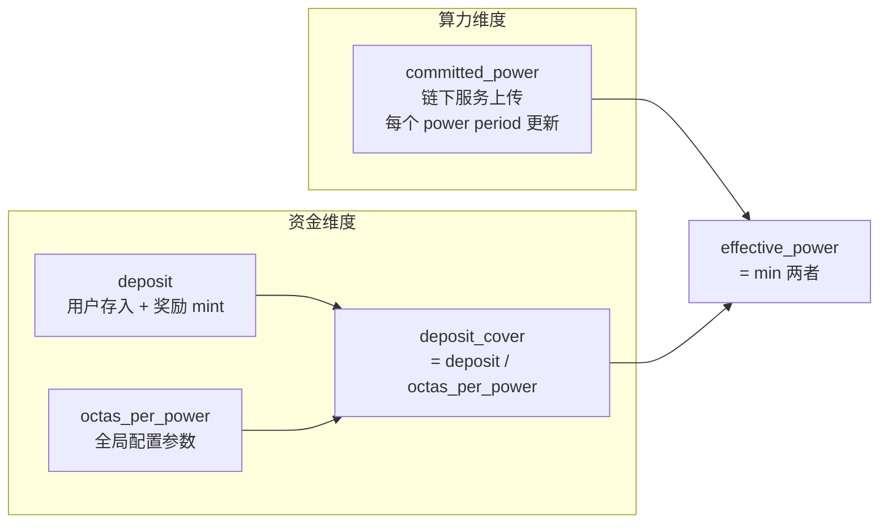

### 14.5.3 effective_power 返回 0 的所有情况

| 情况 | 原因 |
|------|------|
| 用户未委托 | `delegated_to == @0x0`，不参与任何 validator |
| committed_power == 0 | 链下服务未上传或已衰减为 0 |
| deposit == 0 | 无保证金 |
| 委托到不存在的 validator | validator 不在 registry 中 |
| 委托到 inactive / pending_active 的 validator | `get_effective_power()` 的 active 视角下返回 0 |

### 14.5.4 奖励对 effective_power 的正反馈

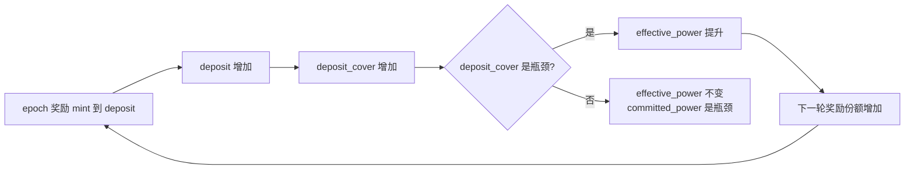

当前实现是"自动复利"模型：奖励直接 mint 到 deposit，不需要用户手动 claim。

## 14.6 undelegate：解除委托

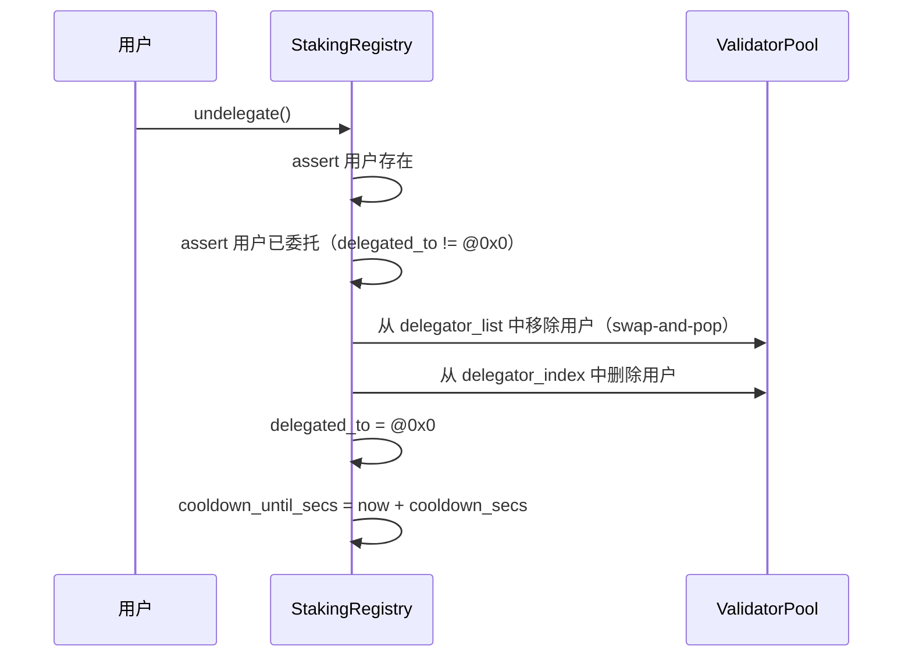

关键点：
- 解委托后立即进入冷却期
- 冷却期内不能重新委托，也不能提取保证金
- 保证金仍然在 deposit 中，不会丢失
- 解委托后不再参与任何 validator 的算力计算，不再获得奖励

### 14.6.1 swap-and-pop 移除机制

`remove_delegator()` 使用 swap-and-pop 技术维护 `delegator_list`：

```
假设 delegator_list = [A, B, C, D]，要移除 B（index=1）：
1. 取最后一个元素 D
2. 用 D 覆盖 B 的位置：[A, D, C, D]
3. pop 最后一个：[A, D, C]
4. 更新 D 的 index 为 1
5. 从 delegator_index 中删除 B
```

这保证了 O(1) 的移除操作。

## 14.7 withdraw_deposit：提取保证金

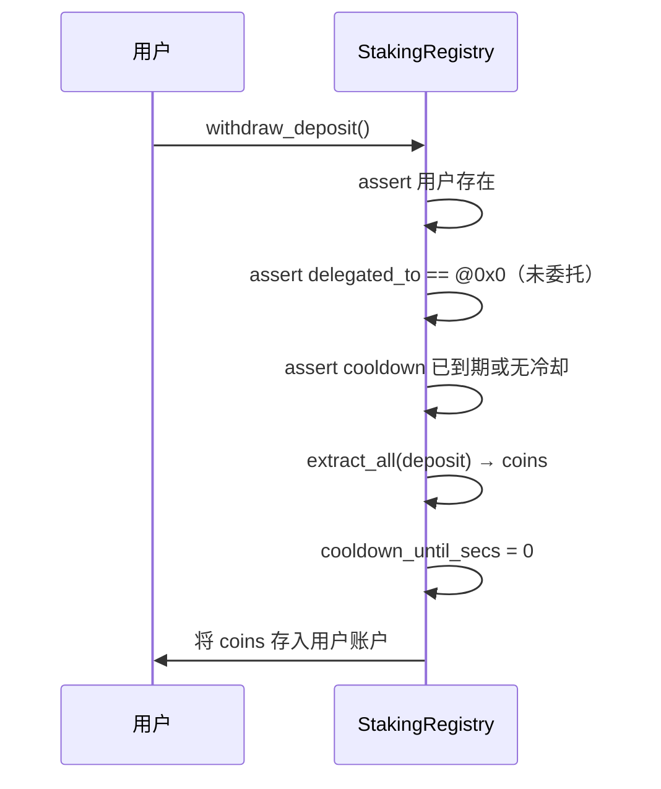

提取条件：
1. 用户必须存在（EUSER_NOT_FOUND）
2. 用户必须未委托（EDEPOSIT_LOCKED）
3. 冷却期必须已到期：`cooldown_until_secs == 0` 或 `now >= cooldown_until_secs`（ECOOLDOWN_ACTIVE）

提取时：
- deposit 被一次性 `extract_all`，全部提走
- `cooldown_until_secs` 清零

## 14.8 强制退出机制

### 14.8.1 触发时机

强制退出在每个 epoch 边界的 `on_new_epoch()` 中执行，位于：
- 奖励/手续费分配之后
- power period 提交之后
- validator set 重建之前

### 14.8.2 维持门槛计算

```
maintain_threshold = ceil(min_active_power × force_exit_power_bps / BPS_DENOMINATOR)
                   = (min_active_power × force_exit_power_bps + BPS_DENOMINATOR - 1) / BPS_DENOMINATOR
```

默认配置：`force_exit_power_bps = 8000`，即维持门槛 = 入场门槛的 80%。

### 14.8.3 sweep 流程

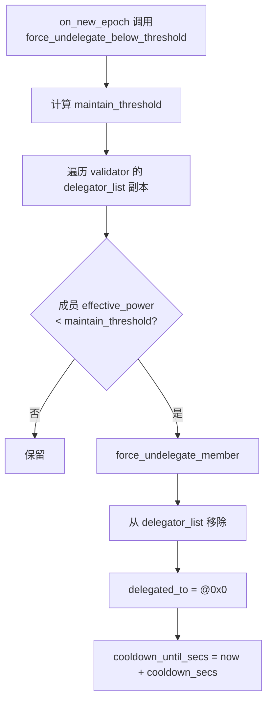

sweep 对三类 validator 都执行：
- `active_validators`
- `pending_inactive`
- `pending_active`

### 14.8.4 强制退出 vs 主动解委托

| 维度 | 主动 undelegate | 强制退出 |
|------|----------------|---------|
| 触发者 | 用户自己 | 系统（epoch 边界） |
| 触发条件 | 用户调用 undelegate() | effective_power < maintain_threshold |
| 结果 | 进入冷却期 | 进入冷却期（完全相同） |
| 冷却时长 | cooldown_secs | cooldown_secs（相同） |

### 14.8.5 什么情况下用户会被强制退出

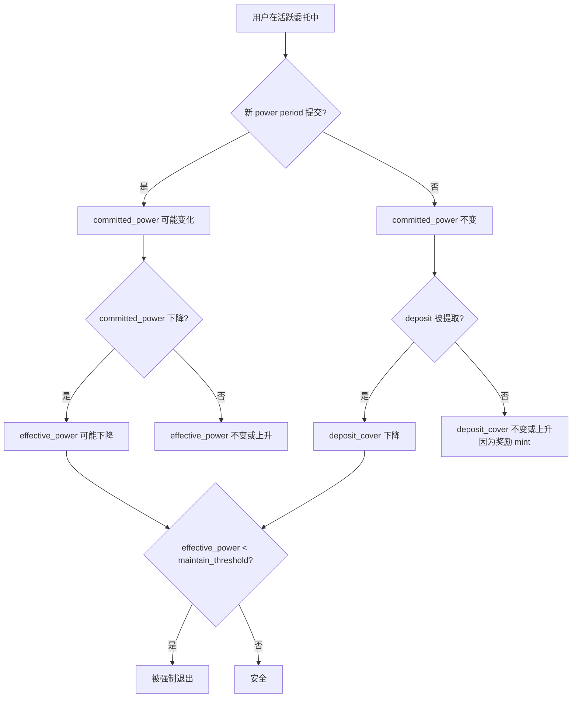

常见触发场景：
1. 链下算力服务在新 power period 降低了用户的 committed_power
2. retention 衰减：用户在新 period 没有被上传算力，committed_power 按 retention_bps 衰减
3. 用户主动减少保证金覆盖能力的链上路径目前只剩解委托后提取 deposit

## 14.9 旧奖励兼容接口已删除

当前源码已经删除：
- `claim_pending_income()`
- `claim_pending_income_as_coins()`
- `get_user_pending_income()`

因为奖励已经直接 mint 到 `deposit`，不再需要单独的 pending income 账本。

## 14.10 完整用户生命周期时序

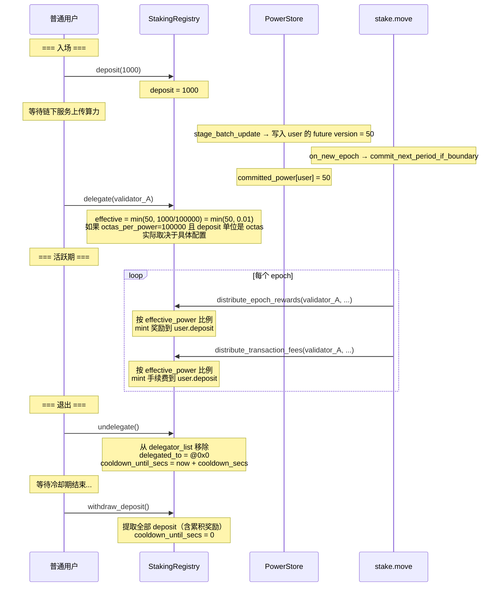

## 14.11 已删除的 staking_contract 路径

当前源码已删除 `staking_contract.move`。

因此普通用户只存在一条主路径：
- `deposit`
- `delegate`
- 自动发奖到 `deposit`
- `undelegate`
- cooldown 到期后 `withdraw_deposit`

## 14.12 关键判断总结

| 问题 | 答案 |
|------|------|
| 用户什么时候算"已质押"？ | 有 deposit + 有 delegated_to + validator 处于 active/pending_inactive + committed_power > 0 |
| 奖励需要手动 claim 吗？ | 不需要。奖励直接 mint 到 deposit，自动复利 |
| 冷却期内能追加 deposit 吗？ | 能。deposit() 不检查冷却状态 |
| 冷却期内能重新 delegate 吗？ | 不能。delegate 检查冷却必须到期 |
| 部分提取 deposit 可以吗？ | 不可以。withdraw_deposit 是全量提取 |
| 用户能同时委托给多个 validator 吗？ | 不能。delegated_to 只有一个地址 |
| 强制退出后保证金会丢失吗？ | 不会。保证金仍在 deposit 中，只是进入冷却期 |
