# 15. Epoch 边界与奖励分配

本文档基于当前代码实现，完整梳理 `on_new_epoch()` 的执行顺序、奖励/手续费分配机制、算力周期提交、强制退出 sweep，以及 validator set 重建逻辑。

## 15.1 on_new_epoch 完整执行顺序

```mermaid
flowchart TD
    START[epoch 切换开始<br/>on_new_epoch] --> A

    subgraph Phase1["阶段一：奖励结算（旧快照 + 旧集合）"]
        A[遍历 active_validators] --> A1[update_stake_pool<br/>合并 pending_active → active 币]
        A1 --> A2[collect_transaction_fee_for_validator<br/>收集本 epoch 手续费]
        A2 --> A3[distribute_transaction_fees<br/>按 effective_power 分配手续费]
        A3 --> A4[distribute_epoch_rewards<br/>按 effective_power 分配出块奖励]
        A4 --> B

        B[遍历 pending_inactive_validators] --> B1[update_stake_pool]
        B1 --> B2[collect_transaction_fee_for_validator]
        B2 --> B3[distribute_transaction_fees]
        B3 --> B4[distribute_epoch_rewards]
    end

    B4 --> C

    subgraph Phase2["阶段二：算力换期"]
        C[commit_next_period_if_boundary<br/>推进 epoch 计数<br/>如果跨期则提交新 power period]
    end

    C --> D

    subgraph Phase3["阶段三：强制退出 sweep"]
        D[force_undelegate_below_threshold<br/>对 active validators] --> E[force_undelegate_below_threshold<br/>对 pending_inactive validators]
        E --> F[force_undelegate_below_threshold<br/>对 pending_active validators]
    end

    F --> G

    subgraph Phase4["阶段四：状态转换"]
        G[set_validator_active<br/>pending_active → ACTIVE] --> H[set_validator_inactive<br/>pending_inactive → INACTIVE]
        H --> I[append pending_active → active_validators]
        I --> J[清空 pending_inactive]
    end

    J --> K

    subgraph Phase5["阶段五：validator set 重建"]
        K[遍历 active_validators] --> L[get_validator_total_power<br/>重新计算每个 validator 的 voting_power]
        L --> M{voting_power >= minimum_stake?}
        M -->|是| N[保留在新 active_validators]
        M -->|否| O[丢弃，设为 INACTIVE]
    end

    N --> P
    O --> P

    P{新 active_validators 非空?}
    P -->|是| Q[正常完成：更新 validator_index / total_staked_power]
    P -->|否| R[紧急活性回退：保留所有旧 validator]

    Q --> END[epoch 切换完成]
    R --> END
```

## 15.2 阶段一：奖励结算

### 15.2.1 为什么先发奖再切 power period

当前实现的核心设计决策：

```
本 epoch 的收益 → 按旧 committed snapshot + 旧活跃集合分配
新上传到 future period 版本的算力 → 不参与本 epoch 收益
```

这意味着：
- 链下服务在本 epoch 内上传的 `stage_batch_update` 不会影响本轮奖励
- 奖励归属于"产生贡献的那个周期"，而非"提交算力的那个周期"
- 避免了"抢跑上传算力以获取更多奖励"的激励偏差

### 15.2.2 手续费分配

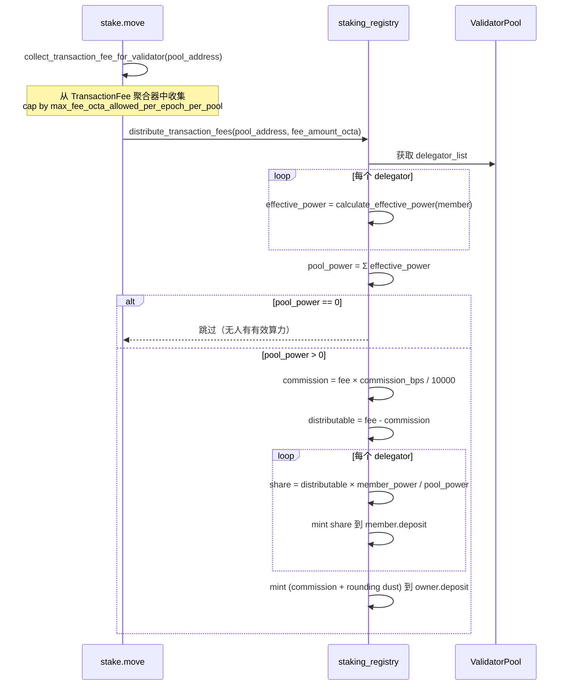

### 15.2.3 出块奖励分配

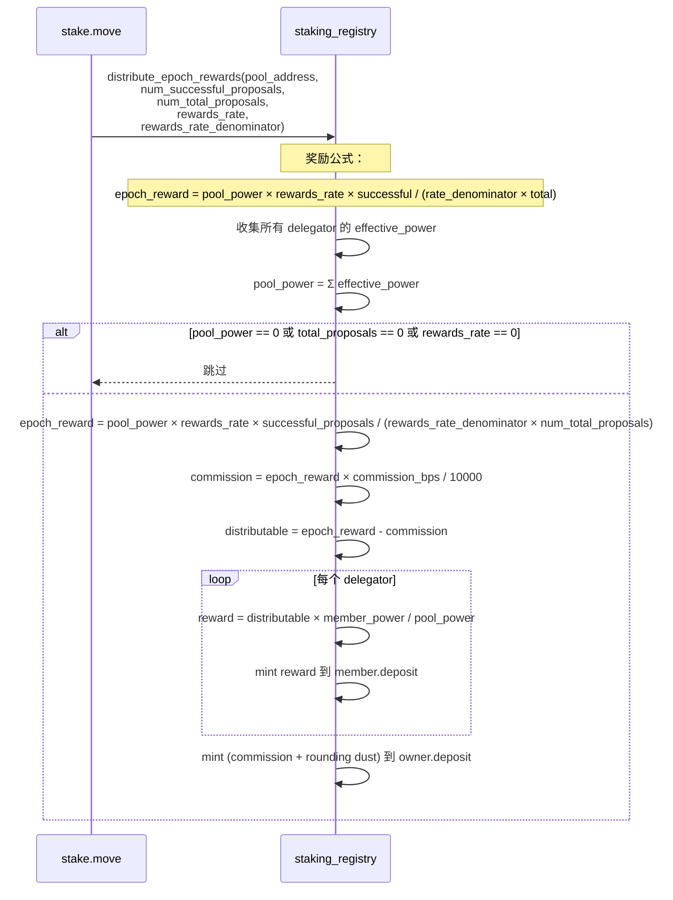

### 15.2.4 奖励公式详解

```
epoch_reward = (pool_power × rewards_rate × num_successful_proposals)
             / (rewards_rate_denominator × num_total_proposals)
```

| 变量 | 来源 | 含义 |
|------|------|------|
| pool_power | Σ delegator effective_power | validator 池总有效算力 |
| rewards_rate | StakingRewardsConfig | 奖励率分子 |
| rewards_rate_denominator | StakingRewardsConfig | 奖励率分母 |
| num_successful_proposals | ValidatorPerformance | 本 epoch 成功出块数 |
| num_total_proposals | ValidatorPerformance | 本 epoch 总出块机会数 |

奖励与出块表现成正比：如果 validator 错过了一半的出块机会，奖励减半。

### 15.2.5 佣金与 rounding dust 处理

```
commission = epoch_reward × commission_bps / 10000
distributable = epoch_reward - commission

对每个 delegator:
    reward_i = distributable × member_power_i / pool_power

sum_distributed = Σ reward_i
owner_receives = commission + (distributable - sum_distributed)
```

由于整数除法的 rounding，`sum_distributed` 可能小于 `distributable`。差额（dust）归 validator owner。

这保证了：
- 所有 mint 的总量 = epoch_reward（精确）
- 不会因为 rounding 导致多 mint 或少 mint

### 15.2.6 pending_inactive 也参与奖励

`pending_inactive` 的 validator 在本 epoch 仍然参与奖励和手续费分配。这是因为：
- 它们在本 epoch 仍然参与了共识
- 只有在 `on_new_epoch` 完成后才正式退出
- 这保证了"贡献了就有回报"的公平性

## 15.3 阶段二：算力换期

### 15.3.1 commit_next_period_if_boundary 流程

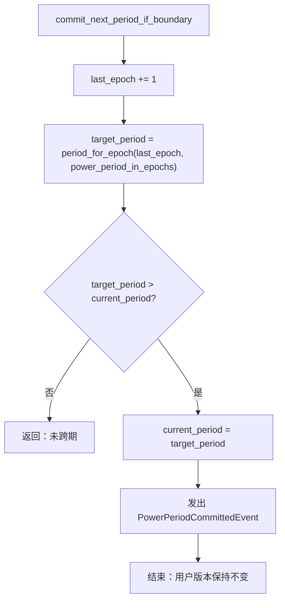

### 15.3.2 retention 衰减公式

```
apply_retention(power, periods_elapsed, retention_bps_per_period):
    retained = power
    repeat periods_elapsed times:
        retained = retained × retention_bps_per_period / 10000
    return retained
```

默认 `retention_bps_per_period = 9950`（99.5%），即每个 period 保留 99.5%，衰减 0.5%。

这里的 retention 不再发生在 epoch 边界全表重写时，而是发生在读取时：

```text
读取 target_period = T 时：
1. 选择 latest version where effective_period <= T
2. committed_power(T) = apply_retention(base_power, T - effective_period, retention_bps)
```

因此：
- 边界提交只推进 `current_period`
- 历史静默用户不需要在边界被重写
- 跳过多个 period 时会一次性应用多次 retention

示例：
| 初始 power | 经过 1 period | 经过 2 periods | 经过 3 periods |
|-----------|--------------|---------------|---------------|
| 100 | 99 | 98 | 97 |
| 50 | 49 | 48 | 47 |
| 10 | 9 | 8 | 7 |

### 15.3.3 epoch 到 period 的映射

```
period_for_epoch(epoch, power_period_in_epochs):
    if epoch == 0: return 0
    return (epoch - 1) / power_period_in_epochs
```

当 `power_period_in_epochs = 60` 时，默认部署下每 60 个 epoch 才进入一个新 period。
当 `power_period_in_epochs = 10` 时：

| epoch 范围 | period |
|-----------|--------|
| 0 | 0 |
| 1-10 | 0 |
| 11-20 | 1 |
| 21-30 | 2 |

### 15.3.4 长周期行为

在 `power_period_in_epochs > 1` 的配置下：
- 周期中途的 `deposit / delegate / undelegate` 只影响保证金与委托关系
- 不会提前改写当期 committed snapshot
- 整个 power period 内，所有模块看到的是同一份 committed_power
- 链下服务上传的 `stage_batch_update` 会写入 `effective_period = current_period + 1` 的 future version，等到跨期后才会被读取侧选中
- 边界跨期时不会扫描全量用户；未更新用户仍然依靠历史版本 + retention 提供 committed power

## 15.4 阶段三：强制退出 sweep

### 15.4.1 sweep 执行范围

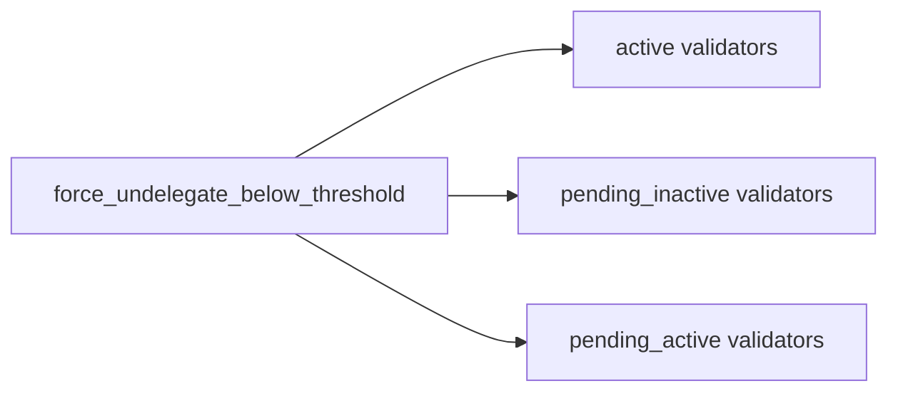

三类 validator 的活跃 delegator 集合都会被 sweep。

### 15.4.2 维持门槛计算

```
maintain_threshold = ceil(min_active_power × force_exit_power_bps / BPS_DENOMINATOR)
```

使用向上取整（ceiling division）：
```move
numerator = (min_active_power * force_exit_power_bps) + (BPS_DENOMINATOR - 1)
maintain_threshold = numerator / BPS_DENOMINATOR
```

### 15.4.3 sweep 与奖励的时序关系

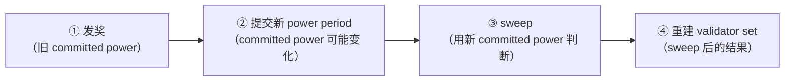

这个顺序意味着：
- 用户在被 sweep 之前，已经拿到了本 epoch 的奖励
- sweep 使用的是新提交的 committed power（如果跨期了）
- 所以如果用户的算力在新 period 下降，会在拿完奖励后被踢出

### 15.4.4 sweep 后的连锁效应

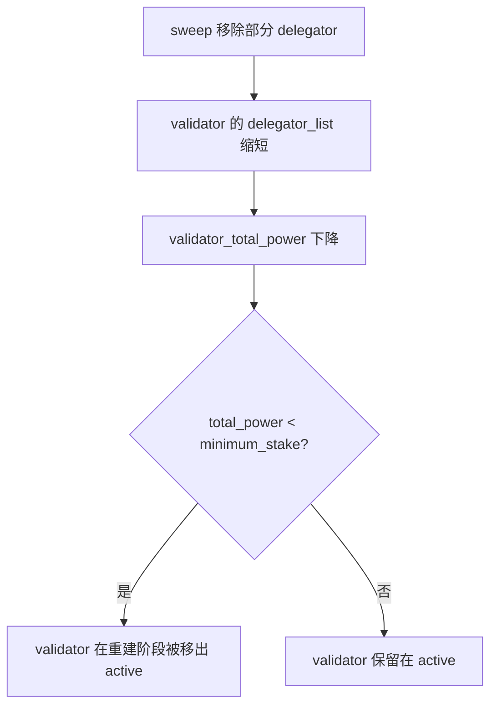

## 15.5 阶段四：状态转换

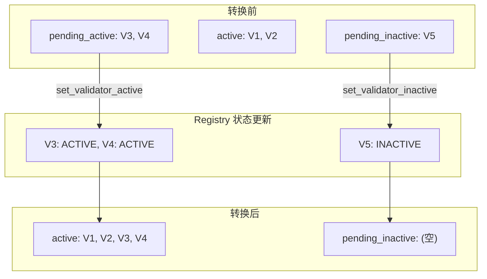

`append()` 操作将 `pending_active` 中的所有 validator 追加到 `active_validators`，同时清空 `pending_active`。

## 15.6 阶段五：validator set 重建

### 15.6.1 正常重建流程

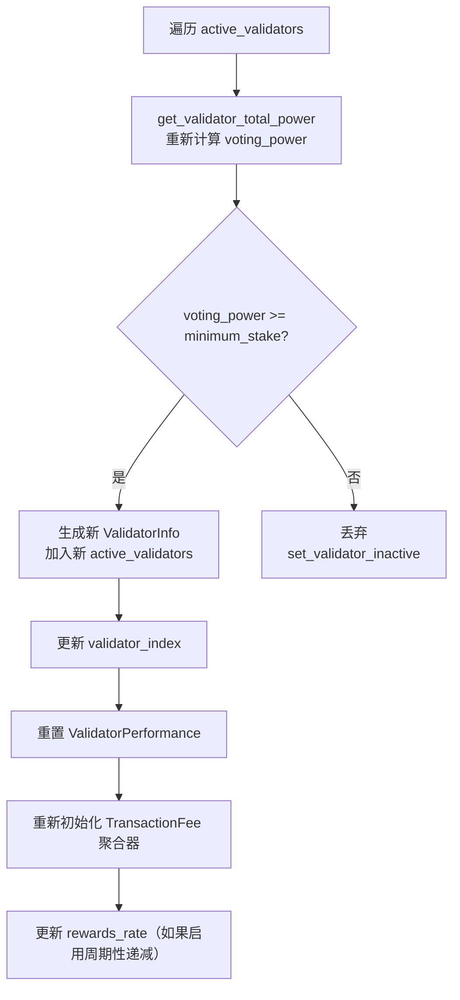

### 15.6.2 紧急活性回退

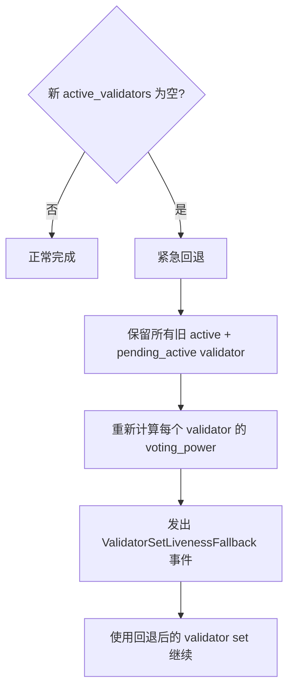

紧急回退确保链永远不会因为没有 validator 而停止。即使所有 validator 的 voting_power 都低于 minimum_stake，也会保留它们。

## 15.7 next_validator_consensus_infos：下一 epoch 预测

### 15.7.1 预测流程

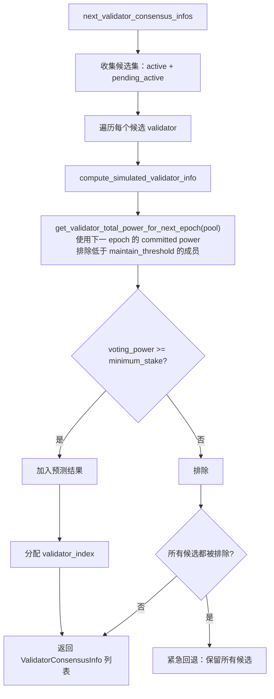

### 15.7.2 预测的局限性

当前预测已经考虑了：
- 下一 epoch 的 committed power（前瞻 `target_period` 对应的版本选择结果与 retention 衰减）
- 强制退出阈值（排除低于 maintain_threshold 的成员）

但还没有精确前瞻：
- 本轮 reward / fee mint 进 deposit 后的效果
- 因此在极端接近门槛的场景下，预测值与 `on_new_epoch()` 真实执行值之间可能存在细微偏差

## 15.8 奖励经济模型总结

### 15.8.1 资金流向

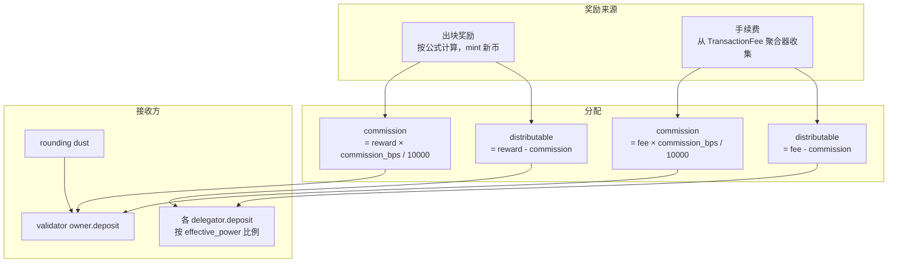

### 15.8.2 自动复利效应

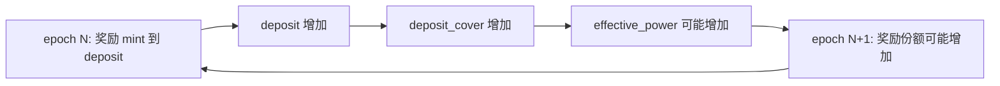

当前实现是自动复利模型：
- 奖励直接 mint 到 `deposit`
- 不需要用户手动 claim
- 如果 `deposit_cover` 是瓶颈，奖励会自动提升 effective_power
- 如果 `committed_power` 是瓶颈，奖励不会改变 effective_power（但保证金仍然增长）

### 15.8.3 validator owner 的双重收益

validator owner 同时获得：
1. 作为 delegator 的按比例奖励（如果 owner 自己也在 delegator_list 中）
2. 佣金（commission）
3. rounding dust

## 15.9 完整 epoch 边界时序图

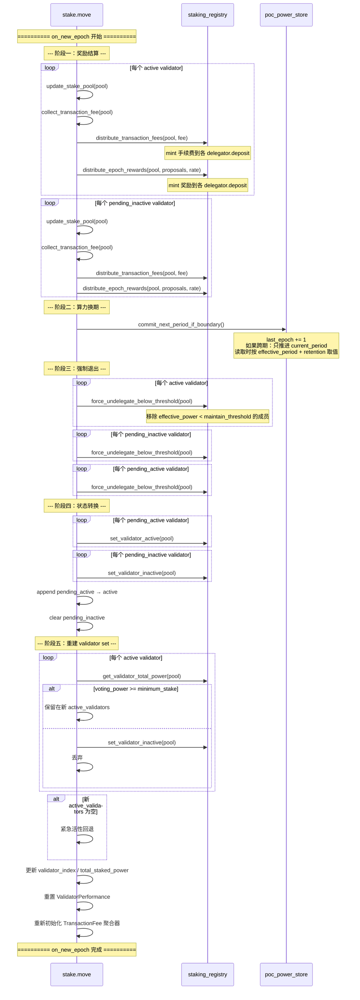

## 15.10 关键设计决策总结

| 决策 | 理由 |
|------|------|
| 先发奖再切 power period | 奖励归属于产生贡献的周期，避免抢跑上传算力 |
| sweep 在发奖之后 | 被踢出的用户仍能拿到本 epoch 奖励（公平性） |
| sweep 在 power period 提交之后 | 使用最新的 committed power 判断，避免用旧数据误判 |
| validator set 重建在 sweep 之后 | sweep 可能导致 validator 总算力下降，重建时能正确反映 |
| 紧急活性回退 | 保证链永远不会因为没有 validator 而停止 |
| rounding dust 归 owner | 保证 mint 总量精确等于计算值，不多不少 |
| 奖励直接 mint 到 deposit | 自动复利，减少用户操作，简化状态管理 |
