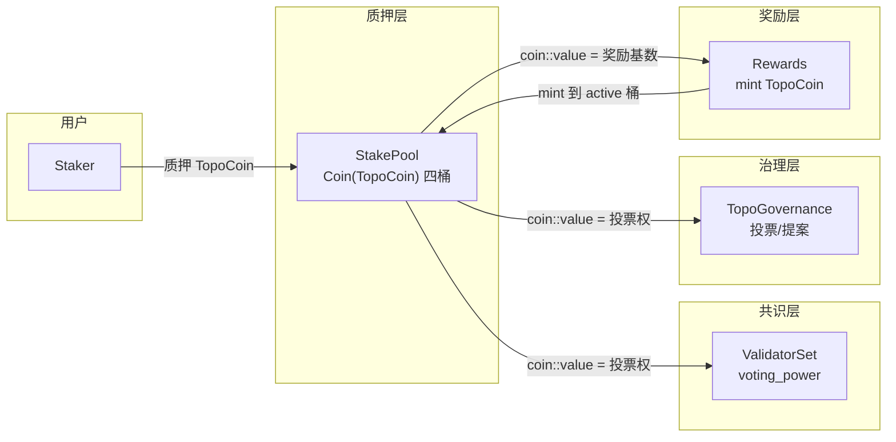
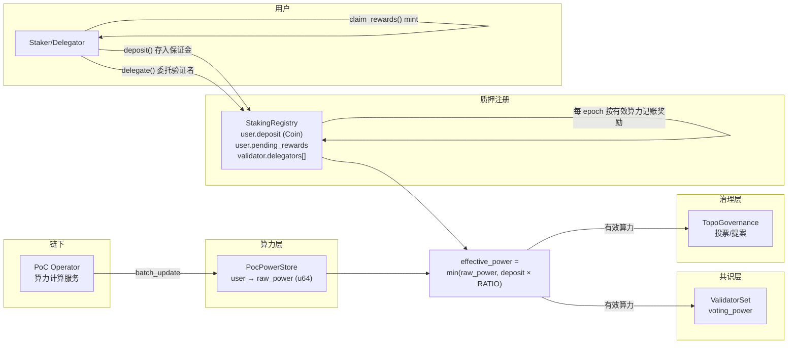
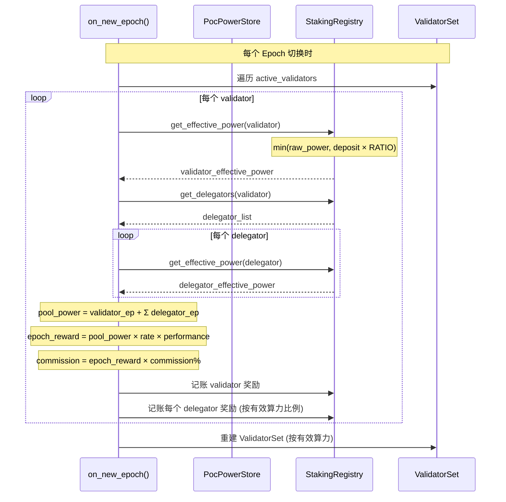
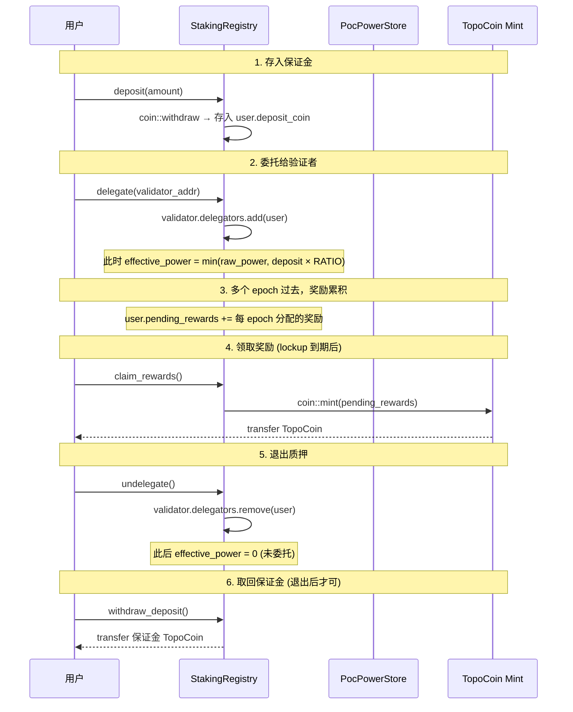
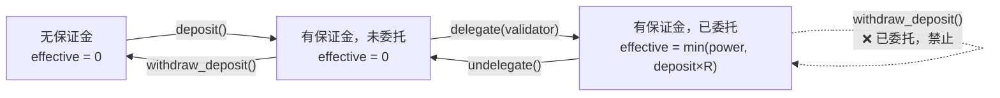
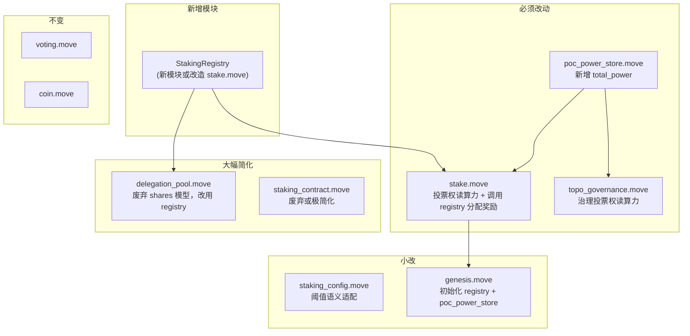
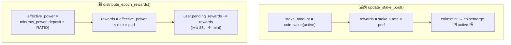
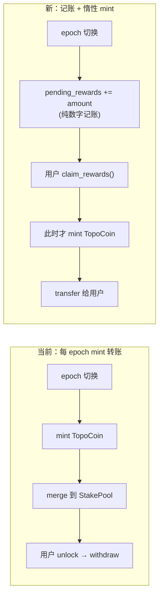
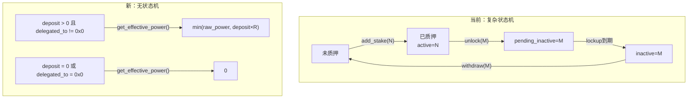
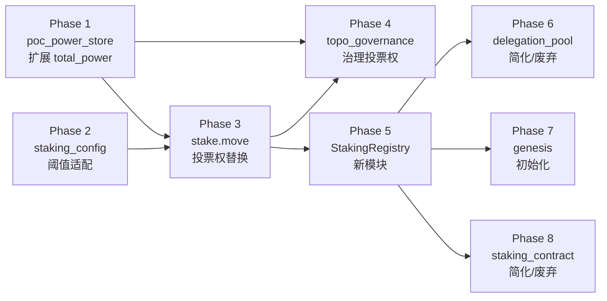

# PoC 算力质押模型改造技术方案 v3

## 1. 背景与目标

### 1.1 现状

当前 Topo Chain 沿用 Aptos 原生质押模型，原生代币 TopoCoin 的质押量同时决定共识投票权、治理投票权和出块奖励比例。

### 1.2 目标

将上述三者全部替换为 PoC（Proof of Contribution）算力值，TopoCoin 仅保留 Gas 费支付和作为出块奖励货币。

### 1.3 新模型核心规则

| 维度 | 当前模型 | 新模型 |
|------|---------|--------|
| 共识投票权 | 质押量 | 有效算力 |
| 治理投票权 | 质押量 | 有效算力 |
| 奖励分配比例 | 质押量 | 有效算力 |
| 质押行为 | 质押 N 个 TopoCoin | 全部质押或不质押，不可部分质押 |
| 保证金 | 质押量即权重 | 按算力比例存入 TopoCoin 保证金，不足则有效算力打折 |
| 退出质押 | unlock → withdraw | 取消委托 → 取回保证金 |
| 委托质押 | 转移 TopoCoin 到 pool | 注册地址到验证者，保证金锁定在 registry 中 |
| 奖励发放 | mint TopoCoin 到 StakePool | 记账到用户记录，claim 时 mint |
| 奖励锁定期 | lockup 控制质押解锁 | lockup 控制奖励提取 |

### 1.4 保证金与算力的绑定关系

保证金不是固定金额，而是与算力按比例绑定：

```
有效算力 = min(原始算力, 保证金 × DEPOSIT_POWER_RATIO)
```

例如 `DEPOSIT_POWER_RATIO = 1000`：

| 原始算力 | 保证金 (TOPO) | 保证金可覆盖算力 | 有效算力 | 说明 |
|---------|--------------|----------------|---------|------|
| 500 | 1.0 | 1000 | 500 | 保证金充足，算力全额生效 |
| 500 | 0.3 | 300 | 300 | 保证金不足，算力打折 |
| 500 | 0 | 0 | 0 | 无保证金，等同未质押 |
| 0 | 10.0 | 10000 | 0 | 无算力，保证金无意义 |

这个设计的核心优势：
- 不需要"质押/未质押"的布尔状态 — 有保证金就有有效算力，没有就是 0
- 不需要 lock/unlock 状态机 — 存入保证金 = 质押，取走 = 退出
- 保证金不足自动降级 — 不需要额外检查或管理员干预
- 质押中不能提取保证金 — 只需检查 `delegated_to != 0x0` 即可阻止提取

---

## 2. 架构总览

### 2.1 当前数据流



### 2.2 目标数据流



### 2.3 Epoch 奖励分配流程



### 2.4 用户质押与领取流程



---

## 3. 核心新模块：StakingRegistry

当前方案最大的架构变化是引入 `StakingRegistry` 模块（可以是新模块，也可以改造 `stake.move`），替代原有的 StakePool 四桶 + pool_u64 shares 模型。

### 3.1 为什么不复用 StakePool

| StakePool 特性 | 新模型需求 | 冲突 |
|---------------|-----------|------|
| 4 个 Coin 桶存储实际代币 | 奖励只记账不转账 | 不需要 Coin 桶 |
| coin::value 决定投票权 | 算力决定投票权 | 数据源不同 |
| add_stake 转移代币 | stake_power 只是布尔开关 | 不需要转移代币 |
| shares 模型分配奖励 | 按算力比例记账 | 不需要 shares |
| unlock → withdraw 提取代币 | claim 时 mint 新代币 | 流程不同 |

### 3.2 StakingRegistry 数据结构

```move
/// 保证金与算力的兑换比例
/// 1 TOPO (10^8 octas) 的保证金可覆盖 DEPOSIT_POWER_RATIO 点算力
const DEPOSIT_POWER_RATIO: u64 = 1000;

/// 全局质押注册表
struct StakingRegistry has key {
    /// validator_address → ValidatorPool
    validators: Table<address, ValidatorPool>,
    /// user_address → UserStakeInfo
    users: Table<address, UserStakeInfo>,
    /// 全网已质押有效总算力（每 epoch 更新）
    total_staked_power: u64,
    /// TopoCoin mint 能力（用于 claim 时 mint 奖励）
    mint_cap: MintCapability<TopoCoin>,
}

/// 验证者节点信息
struct ValidatorPool has store {
    /// 委托人地址列表
    delegators: vector<address>,
    /// operator 佣金比例 (basis points, 如 1000 = 10%)
    commission_bps: u64,
}

/// 用户质押信息（验证者和普通用户共用）
struct UserStakeInfo has store {
    /// 保证金 (实际持有的 Coin)
    deposit: Coin<TopoCoin>,
    /// 委托给哪个验证者 (0x0 = 未委托)
    delegated_to: address,
    /// 累积待领取奖励 (octas)
    pending_rewards: u64,
    /// 奖励锁定到期时间
    rewards_locked_until_secs: u64,
}
```

### 3.3 有效算力计算（核心公式）

```move
/// 获取用户有效算力
/// effective_power = min(raw_power, deposit_value * DEPOSIT_POWER_RATIO)
/// 未委托的用户有效算力为 0（保证金在但不参与质押）
public fun get_effective_power(user: address): u64 {
    let raw_power = poc_power_store::get_user_power(user);
    if (raw_power == 0) return 0;

    let info = borrow_user_stake_info(user);
    // 未委托 → 不参与质押
    if (info.delegated_to == @0x0) return 0;

    let deposit_value = coin::value(&info.deposit);
    let deposit_covers = deposit_value * DEPOSIT_POWER_RATIO;
    // 取较小值
    if (raw_power < deposit_covers) { raw_power } else { deposit_covers }
}
```

状态转换完全由保证金和委托关系驱动，不需要额外的布尔标记：



### 3.4 核心函数

```move
/// 存入保证金（可多次追加）
public entry fun deposit(user: &signer, amount: u64)

/// 取回保证金（必须先 undelegate）
public entry fun withdraw_deposit(user: &signer, amount: u64)

/// 委托给验证者（保证金 > 0 才有意义）
public entry fun delegate(user: &signer, validator: address)

/// 取消委托
public entry fun undelegate(user: &signer)

/// 验证者注册
public entry fun register_validator(
    validator: &signer,
    commission_bps: u64,
)

/// 每 epoch 由 on_new_epoch 调用：分配奖励（只记账）
public(friend) fun distribute_epoch_rewards(
    validator_perf: &ValidatorPerformance,
    rewards_rate: u64,
    rewards_rate_denominator: u64,
)

/// 用户领取奖励（此时才 mint TopoCoin，需 lockup 到期）
public entry fun claim_rewards(user: &signer)
```

### 3.5 distribute_epoch_rewards 核心逻辑

```
对每个 active validator:
  1. validator_ep = get_effective_power(validator)
  2. pool_power = validator_ep
  3. 遍历 validator.delegators:
     delegator_ep = get_effective_power(delegator)
     pool_power += delegator_ep
  4. epoch_reward = calculate_rewards(pool_power, performance, rate)
  5. commission = epoch_reward × commission_bps / 10000
  6. distributable = epoch_reward - commission
  7. validator.pending_rewards += commission + (distributable × validator_ep / pool_power)
  8. 遍历 delegators:
     delegator.pending_rewards += distributable × delegator_ep / pool_power
```

注意：遍历 delegators 是 O(n)，发生在 `on_new_epoch()` 中（系统交易，不受普通 gas 限制）。可设置每个 validator 的 delegator 上限。

### 3.6 保证金管理规则

| 操作 | 前置条件 | 说明 |
|------|---------|------|
| `deposit(amount)` | 无 | 随时可存入，追加保证金 |
| `withdraw_deposit(amount)` | `delegated_to == 0x0` | 必须先 undelegate 才能取回 |
| `delegate(validator)` | `deposit > 0` | 有保证金才能委托 |
| `undelegate()` | `delegated_to != 0x0` | 取消委托，有效算力归零 |
| `claim_rewards()` | `now >= rewards_locked_until_secs` | lockup 到期才能领取 |

不需要 pending/inactive 状态机：
- 质押中 = `delegated_to != 0x0`（保证金锁定）
- 退出 = `delegated_to == 0x0`（保证金可自由提取）

---

## 4. 对现有模块的影响

### 4.1 改动范围总览



### 4.2 poc_power_store.move

文件: `sources/poc/poc_power_store.move`

power 已改为 u64，不再需要缩放函数。

新增字段和函数：

```move
struct PowerStore has key {
    operator: address,
    users: Table<address, UserPowerInfo>,
    total_power: u64,  // 【新增】全网总算力
}

/// batch_update 中维护 total_power
/// total_power = total_power - old_power + new_power

#[view]
public fun get_total_power(): u64
```

新增 friend：
```move
friend aptos_framework::stake;
friend aptos_framework::topo_governance;
```

### 4.3 stake.move

文件: `sources/stake.move`

#### 投票权来源替换

| 函数 | 改动 |
|------|------|
| `get_next_epoch_voting_power()` | 从 `coin::value` 改为 `staking_registry::get_effective_power(addr)` |
| `generate_validator_info()` | 去掉 `stake_pool` 参数，读有效算力 |
| `get_current_epoch_voting_power()` | 读有效算力 |
| `join_validator_set_internal()` | 入场门槛从质押量改为有效算力阈值 |
| `on_new_epoch()` | 调用 `staking_registry::distribute_epoch_rewards()` 记账奖励 |

#### 奖励分配

`update_stake_pool()` 中的奖励逻辑迁移到 `staking_registry::distribute_epoch_rewards()`：



#### StakePool 结构体

保留但大幅简化用途：
- 保证金不再存放在 StakePool 中，而是存放在 `StakingRegistry.UserStakeInfo.deposit` 中
- StakePool 四桶保留结构兼容性（避免破坏 ValidatorSet 等依赖），但不再承载经济逻辑
- `update_stake_pool()` 中的奖励 mint/merge 逻辑移除

#### 不需要改的部分

- `ValidatorInfo` / `ValidatorSet` / `ValidatorConfig` 结构体
- `ValidatorPerformance` 追踪
- `set_operator()` / `set_delegated_voter()`
- `OwnerCapability`
- lockup 续期逻辑（语义变为奖励锁定期）

### 4.4 topo_governance.move

文件: `sources/topo_governance.move`

```move
// 投票权来源：改为读有效算力
fun get_voting_power(pool_address: address): u64 {
    staking_registry::get_effective_power(pool_address)
}

// 早期决议阈值
// 当前: coin::supply<TopoCoin>() / 2 + 1
// 改为: (staking_registry::get_total_staked_power() / 2) + 1
```

其余保留不变：GovernanceConfig、VotingRecords、提案流程、lockup 检查。

### 4.5 delegation_pool.move

文件: `sources/delegation_pool.move`

大幅简化。当前的 `pool_u64` shares 模型、`active_shares`、`inactive_shares`、`pending_withdrawals` 全部不再需要。

委托功能迁移到 `StakingRegistry`：
- `add_stake()` → `StakingRegistry::delegate(user, validator)`
- `unlock()` / `withdraw()` → `StakingRegistry::undelegate()` + `claim_rewards()`
- `synchronize_delegation_pool()` → 不再需要（奖励在 epoch 切换时自动记账）
- `calculate_total_voting_power()` → 直接读 `poc_power_store`

可以选择：
- 方案 A：废弃 delegation_pool，功能全部由 StakingRegistry 承担
- 方案 B：保留 delegation_pool 作为 StakingRegistry 的前端封装

### 4.6 staking_contract.move

文件: `sources/staking_contract.move`

当前的 principal/distribution_pool/commission 模型不再适用。

- 方案 A（推荐）：废弃，功能由 StakingRegistry 承担
- 方案 B：简化为仅管理保证金

### 4.7 staking_config.move

| 原字段 | 新语义 |
|--------|--------|
| `minimum_required_stake` | 最低算力阈值 |
| `maximum_allowed_stake` | 最高算力上限 |
| `rewards_rate` | 算力奖励率 |
| `recurring_lockup_duration_secs` | 奖励锁定期 |

### 4.8 genesis.move

```move
// 初始化
poc_power_store::initialize(&framework, operator);
staking_registry::initialize(&framework);

// 为 genesis 验证者设置算力 + 注册
poc_power_store::batch_update(&operator, 0, validators, powers);
staking_registry::register_validator(&validator, deposit, commission);
```

---

## 5. 关键设计决策

### 5.1 奖励记账 vs 实际转账



优势：
- 不需要 StakePool 四桶做奖励容器
- 不需要 pool_u64 shares 模型
- 不需要 synchronize_delegation_pool
- 减少每 epoch 的链上状态写入（不 mint 不 merge）
- 用户不 claim 就不产生 Coin 对象

### 5.2 每 epoch 读取最新算力

算力由链下 operator 通过 `batch_update()` 写入，长周期（如 30 天）更新一次。但每个 epoch（短周期）的 `on_new_epoch()` 都会重新读取 `poc_power_store::get_user_power()`。

```
算力更新周期 (30天)  |<---------- P1 ---------->|<---------- P2 ---------->|
epoch (几小时)       |e1|e2|e3|...|e700|e701|...|e702|e703|...|

e1~e700: 读到的都是 P1 的算力值（不变，但每次都是最新值）
e701:    operator 写入 P2 的算力
e702+:   读到 P2 的新算力值
```

不需要周期时钟或过期机制：
- 如果 operator 没更新，旧算力继续生效（这是预期行为——贡献值没变，算力就不该变）
- 如果需要"超时降级"，可以在 `poc_power_store` 中加 `last_updated_period` 检查，但这是可选的

### 5.3 delegator 遍历的 gas 问题

`distribute_epoch_rewards()` 在 `on_new_epoch()` 中执行，需要遍历每个 validator 的所有 delegator。

| 场景 | delegator 数量 | 可行性 |
|------|---------------|--------|
| 初期 | < 100 / validator | 无问题 |
| 中期 | 100~1000 / validator | 可行（系统交易无 gas 限制） |
| 大规模 | > 1000 / validator | 需要设置上限或分层 |

缓解措施：
- 每个 validator 设置 delegator 上限（如 1000）
- `on_new_epoch()` 是系统交易，不受普通 gas 限制
- 如果仍有问题，可以改为"惰性分配"：不在 epoch 切换时遍历，而是在用户 claim 时按比例计算

### 5.4 保证金机制的优势



保证金机制消除了所有中间状态：
- 没有 pending_active / pending_inactive / inactive 状态
- 没有 lockup 控制的状态迁移
- 没有 epoch 边界的桶间迁移
- 有效算力是一个纯函数：`f(raw_power, deposit, delegated_to)` — 任何时刻可计算，无需状态追踪

### 5.5 安全考量

| 风险 | 缓解措施 |
|------|---------|
| 算力 operator 被攻击 | operator 由 aptos_framework 管理，可通过治理更换 |
| 闪贷攻击 | 算力由链下写入，无法在单笔交易中操纵 |
| 保证金闪贷 | deposit 后必须 delegate 才生效，undelegate 后才能 withdraw，至少跨 2 笔交易 |
| 验证者 0 算力 | effective_power = 0，被踢出 ValidatorSet |
| 奖励超发 | pending_rewards 是 u64 记账，claim 时才 mint，可加总量上限检查 |
| delegator 重复注册 | user.delegated_to 是唯一值，不可同时委托多个 validator |
| 保证金不足 | effective_power 自动降级为 `deposit × RATIO`，无需管理员干预 |

---

## 6. 实施顺序与依赖



| 阶段 | 模块 | 依赖 | 说明 |
|------|------|------|------|
| Phase 1 | poc_power_store.move | 无 | 新增 total_power、friend |
| Phase 2 | staking_config.move | 无 | 阈值语义适配 |
| Phase 3 | stake.move | P1, P2 | 投票权来源替换 |
| Phase 4 | topo_governance.move | P1, P3 | 治理投票权替换 |
| Phase 5 | StakingRegistry (新) | P1, P3 | 质押注册 + 奖励记账 + claim |
| Phase 6 | delegation_pool.move | P5 | 简化或废弃 |
| Phase 7 | genesis.move | P1, P3, P5 | 初始化 |
| Phase 8 | staking_contract.move | P5 | 简化或废弃 |

---

## 7. 涉及文件清单

| 文件 | 改动量 | 说明 |
|------|--------|------|
| `sources/poc/poc_power_store.move` | 小 | 新增 total_power、friend |
| `sources/poc/staking_registry.move` | 新增 | 质押注册 + 委托 + 奖励记账 + claim |
| `sources/stake.move` | 中 | 投票权读算力，奖励逻辑迁移到 registry |
| `sources/topo_governance.move` | 中 | 投票权读算力 + 早期决议阈值 |
| `sources/delegation_pool.move` | 大(简化) | 废弃 shares 模型，改用 registry |
| `sources/staking_contract.move` | 大(简化) | 废弃或极简化 |
| `sources/configs/staking_config.move` | 小 | 阈值语义重解释 |
| `sources/genesis.move` | 小 | 初始化 registry + poc_power_store |
| `sources/staking_proxy.move` | 小 | 适配 registry |
| `sources/vesting.move` | 小 | 适配 |
| `sources/voting.move` | 无 | 通用框架不变 |
| `sources/coin.move` | 无 | Coin 体系不变 |

---

## 8. 验证方案

每个 Phase 完成后执行：

```bash
cargo build -p aptos-cached-packages
cargo test -p aptos-framework
```

关键测试场景：

1. 保证金充足：`deposit=1, power=500, RATIO=1000` → effective=500
2. 保证金不足：`deposit=0.3, power=500, RATIO=1000` → effective=300（自动降级）
3. 无保证金：effective=0，不参与奖励分配
4. 未委托：有保证金但 `delegated_to=0x0` → effective=0
5. 委托后 epoch 切换 → 按有效算力比例记账奖励（不 mint）
6. claim_rewards → lockup 到期后 mint TopoCoin 到用户账户
7. undelegate → effective 归零，后续 epoch 不再分配奖励
8. withdraw_deposit → 必须先 undelegate，否则拒绝
9. 验证者有效算力不足 minimum_power → 被踢出 ValidatorSet
10. 治理：按有效算力投票、提案、早期决议
11. genesis：初始验证者以算力 + 保证金启动
