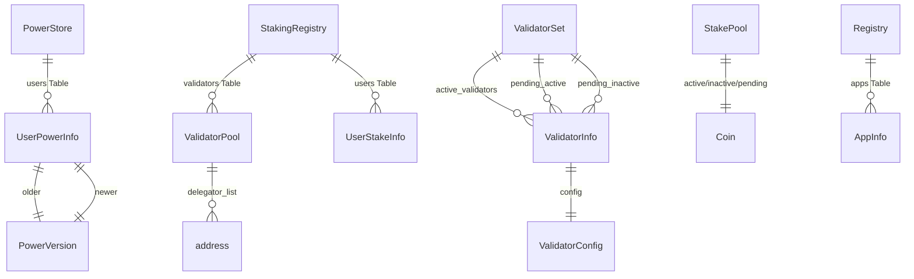
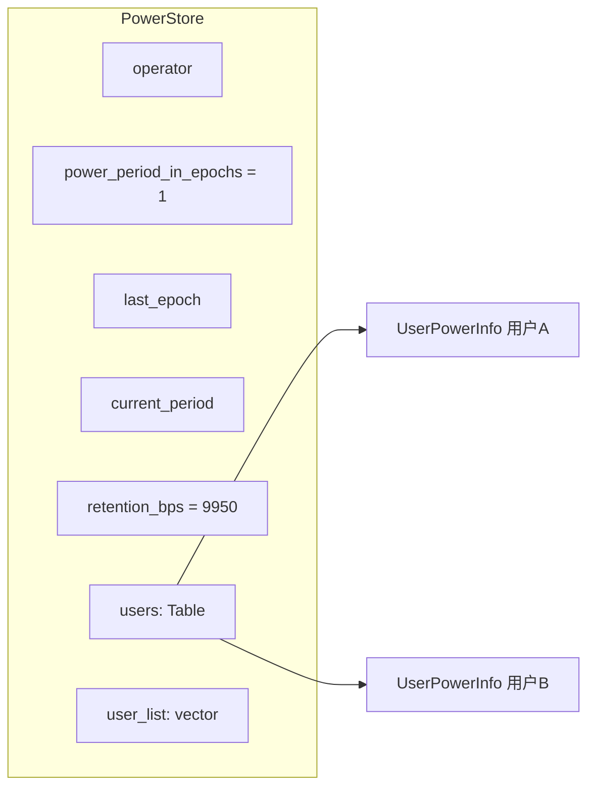
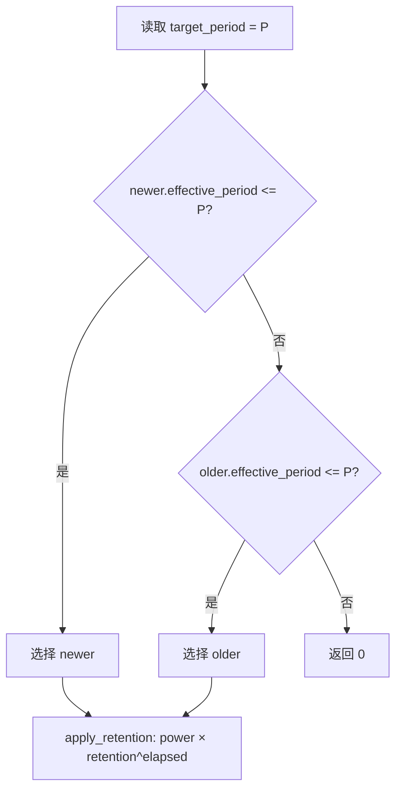
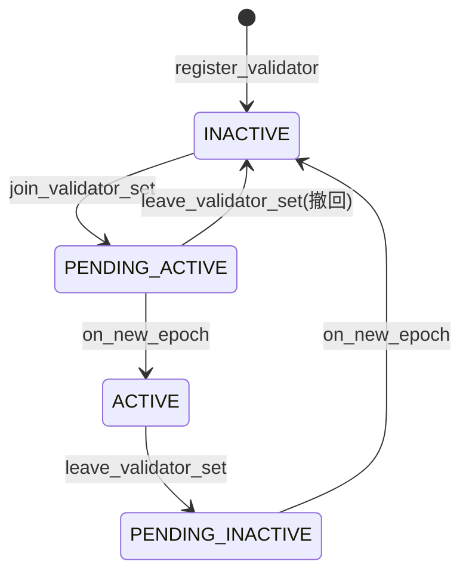
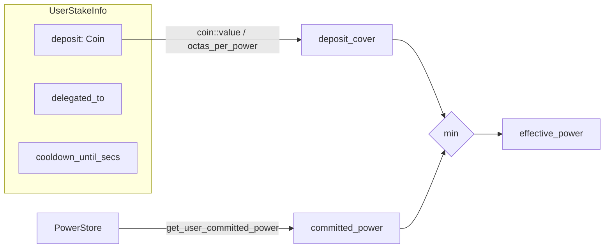
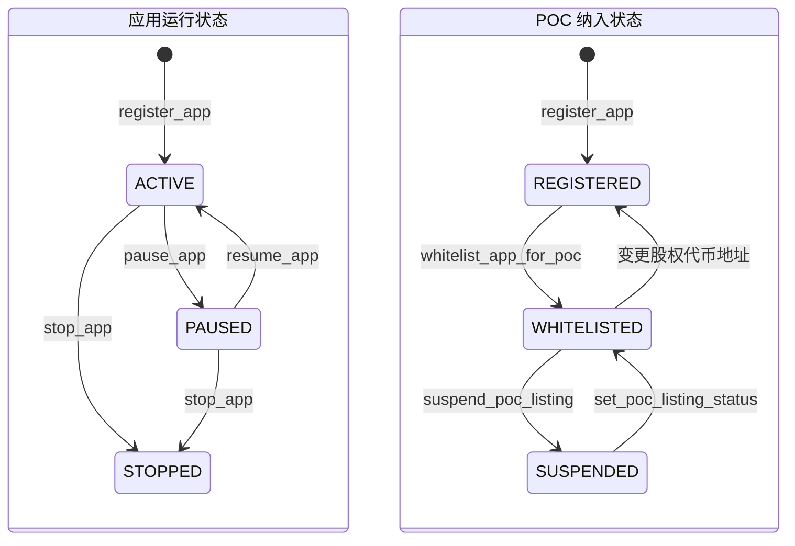
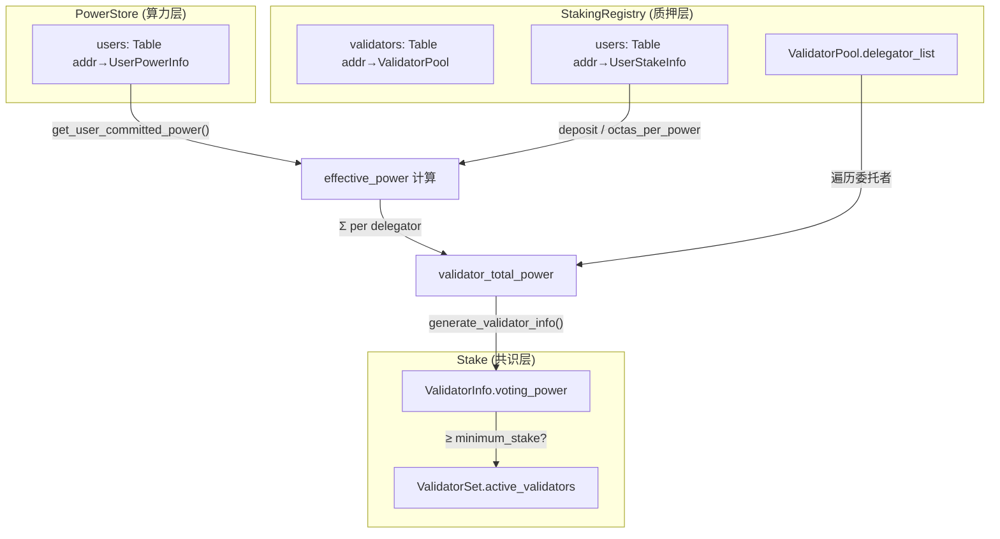

# 02 — 核心数据结构

本文档详细描述 PoC 共识系统中所有模块的核心数据结构、字段含义及模块间关系。

## 2.1 模块间数据关系总览



## 2.2 poc_power_store 模块

### PowerStore

全局算力存储，挂在 `@aptos_framework` 地址下。

```move
struct PowerStore has key {
    operator: address,                  // 唯一写入者（链下算力计算服务地址）
    power_period_in_epochs: u64,        // 一个 power period 包含多少个链上 epoch（默认 1）
    last_epoch: u64,                    // 本地记录的已进入链 epoch 数
    current_period: u64,                // 当前已进入的 power period
    users: Table<address, UserPowerInfo>, // 用户 → 最近两个算力版本
    user_list: vector<address>,         // 用户索引（遍历/迁移用）
    retention_bps_per_period: u64,      // 每个 period 的保留比例（bps，默认 9950 = 99.5%）
}
```



### UserPowerInfo

每个用户保留最近两个可生效版本。`newer` 总是较新的槽位，`older` 保留上一个版本。

```move
struct UserPowerInfo has copy, drop, store {
    older: PowerVersion,    // 上一个版本
    newer: PowerVersion,    // 较新版本
}
```

### PowerVersion

单个算力版本快照。

```move
struct PowerVersion has copy, drop, store {
    effective_period: u64,  // 该版本从哪个 period 开始生效
    power: u64,             // 原始算力值
}
```

**双版本选择逻辑**：读取时选择 `effective_period <= target_period` 的最新版本，然后按 `retention_bps` 惰性衰减。



## 2.3 staking_registry 模块

### StakingRegistry

全局质押注册中心，管理所有验证者和用户的质押状态。

```move
struct StakingRegistry has key {
    validators: Table<address, ValidatorPool>,  // 验证者地址 → 验证者池
    users: Table<address, UserStakeInfo>,        // 用户地址 → 质押信息
    total_staked_power: u64,                     // 全网总有效算力（治理用）
    mint_cap: MintCapability<TopoCoin>,          // 奖励铸币能力
    config: StakingRegistryConfig,               // 可治理参数
}
```

### StakingRegistryConfig

可通过治理调整的参数集合。

```move
struct StakingRegistryConfig has copy, drop, store {
    octas_per_power: u64,                   // 每单位算力需要的质押担保（默认 100,000 octas）
    max_delegators_per_validator: u64,      // 每个验证者最大委托者数（默认 1,000）
    cooldown_secs: u64,                     // 解委托冷却期（秒）
    genesis_stake_power_multiplier: u64,    // 创世质押→算力乘数（默认 1）
    min_active_power: u64,                  // 委托进入门槛（默认 1）
    force_exit_power_bps: u64,              // 强制退出阈值比例（默认 8000 = 80%）
}
```

### ValidatorPool

单个验证者的委托池。

```move
struct ValidatorPool has store {
    owner_address: address,                     // 验证者所有者地址
    delegator_index: SmartTable<address, u64>,  // 委托者 → 在 list 中的索引
    delegator_list: vector<address>,            // 活跃委托者列表
    commission_bps: u64,                        // 佣金比例（基点，0-10000）
    status: u64,                                // 验证者状态
}
```

**验证者状态枚举**：

```
PENDING_ACTIVE  = 1  // 等待下个 epoch 激活
ACTIVE          = 2  // 活跃出块中
PENDING_INACTIVE = 3 // 等待下个 epoch 退出
INACTIVE        = 4  // 已退出
```



### UserStakeInfo

单个用户的质押状态。

```move
struct UserStakeInfo has store {
    deposit: Coin<TopoCoin>,        // 质押担保金（含累积奖励）
    delegated_to: address,          // 委托的验证者地址（0x0 = 未委托）
    cooldown_until_secs: u64,       // 冷却期截止时间（0 = 无冷却）
}
```



### PendingMintCapability

创世阶段的临时存储，初始化完成后被消费。

```move
struct PendingMintCapability has key {
    mint_cap: MintCapability<TopoCoin>,
}
```

## 2.4 stake 模块

### ValidatorSet

全局验证者集合，存储在 `@aptos_framework`。

```move
struct ValidatorSet has copy, key, drop, store {
    consensus_scheme: u8,                       // 共识方案（0 = BLS）
    active_validators: vector<ValidatorInfo>,   // 当前活跃验证者
    pending_inactive: vector<ValidatorInfo>,    // 等待退出（本 epoch 仍可投票）
    pending_active: vector<ValidatorInfo>,      // 等待激活
    total_voting_power: u128,                   // 当前总投票权
    total_joining_power: u128,                  // 等待加入的总投票权
}
```

### ValidatorInfo

单个验证者在集合中的信息。

```move
struct ValidatorInfo has copy, store, drop {
    addr: address,              // 验证者地址
    voting_power: u64,          // 投票权（= 验证者总有效算力）
    config: ValidatorConfig,    // 共识配置
}
```

### ValidatorConfig

验证者的共识网络配置。

```move
struct ValidatorConfig has key, copy, store, drop {
    consensus_pubkey: vector<u8>,   // BLS 共识公钥
    network_addresses: vector<u8>,  // 网络地址
    fullnode_addresses: vector<u8>, // 全节点地址
    validator_index: u64,           // 在活跃集合中的索引
}
```

### StakePool

每个验证者的质押池（PoC 模型下仅保留骨架，实际经济逻辑在 staking_registry）。

```move
struct StakePool has key {
    active: Coin<TopoCoin>,             // 活跃质押（PoC 下为空壳）
    inactive: Coin<TopoCoin>,           // 非活跃质押
    pending_active: Coin<TopoCoin>,     // 待激活质押
    pending_inactive: Coin<TopoCoin>,   // 待退出质押
    locked_until_secs: u64,             // 锁定截止时间
    operator_address: address,          // 运营者地址
    // ... 事件句柄（省略）
}
```

### ValidatorPerformance

每个 epoch 的验证者出块表现统计。

```move
struct ValidatorPerformance has key {
    validators: vector<IndividualValidatorPerformance>,
}

struct IndividualValidatorPerformance has store, drop {
    successful_proposals: u64,  // 成功提案数
    failed_proposals: u64,      // 失败提案数
}
```

### OwnerCapability

验证者所有权凭证，可转移。

```move
struct OwnerCapability has key, store {
    pool_address: address,  // 关联的质押池地址
}
```

## 2.5 poc_registry 模块

### Registry

全局 Dapp 注册中心，支持四维度反查。

```move
struct Registry has key {
    apps: Table<address, AppInfo>,              // 管理者地址 → 应用信息
    app_address_to_admin: Table<address, address>,    // 合约地址 → 管理者
    custody_address_to_admin: Table<address, address>, // 托管地址 → 管理者
    equity_token_to_admin: Table<address, address>,    // 股权代币 → 管理者
}
```

### AppInfo

单个 Dapp 的完整注册信息。

```move
struct AppInfo has copy, drop, store {
    app_admin: address,             // 管理者身份地址（主键）
    app_address: address,           // 合约部署地址
    equity_token_address: address,  // 股权代币地址（FA Metadata）
    custody_address: address,       // 托管地址（转出代币的签名者）
    app_state: u8,                  // 应用运行状态
    poc_listing_status: u8,         // POC 纳入状态
    metadata_uri: String,           // 应用官网链接
}
```

**应用状态枚举**：

| 常量 | 值 | 含义 |
|------|----|------|
| `APP_STATE_ACTIVE` | 1 | 运行中 |
| `APP_STATE_PAUSED` | 2 | 暂停（可恢复） |
| `APP_STATE_STOPPED` | 3 | 永久停运（不可逆） |

**POC 纳入状态枚举**：

| 常量 | 值 | 含义 |
|------|----|------|
| `POC_LISTING_STATUS_REGISTERED` | 1 | 已注册，未纳入 POC |
| `POC_LISTING_STATUS_WHITELISTED` | 2 | 白名单，贡献计入算力 |
| `POC_LISTING_STATUS_SUSPENDED` | 3 | 挂起，待调查 |



## 2.6 数据结构间的关键关联


