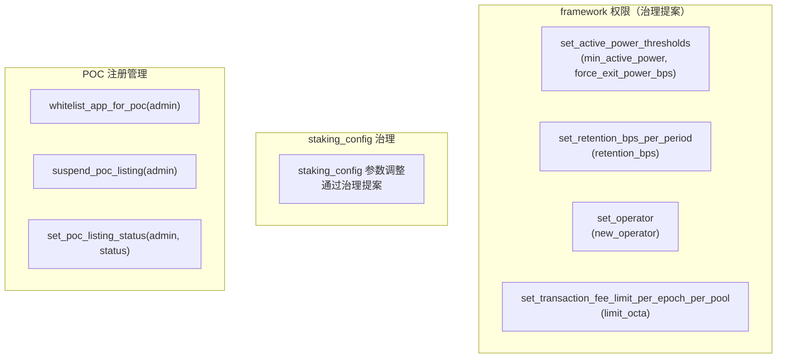
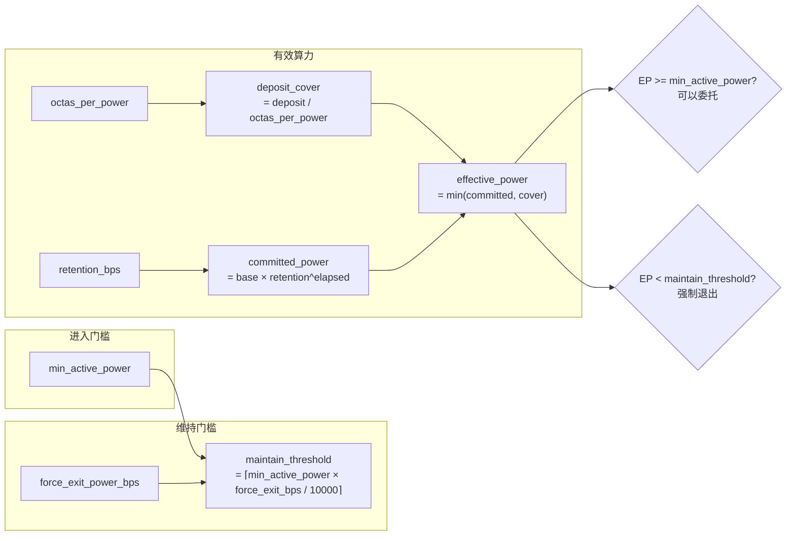

# 11 — 治理与参数配置

本文档汇总所有可治理参数、错误码速查表和事件索引。

## 11.1 可治理参数总览

### StakingRegistryConfig 参数

| 参数 | 默认值 | 调整方式 | 影响范围 |
|------|--------|---------|---------|
| `octas_per_power` | 100,000 | genesis 设定 | 每单位算力的质押担保成本 |
| `max_delegators_per_validator` | 1,000 | genesis 设定 | 单个验证者的委托者上限 |
| `cooldown_secs` | max(lockup, voting) | genesis 设定 | 解委托冷却期时长 |
| `genesis_stake_power_multiplier` | 1 | genesis 设定 | 创世质押→算力转换乘数 |
| `min_active_power` | 1 | `set_active_power_thresholds()` | 委托进入门槛 |
| `force_exit_power_bps` | 8000 (80%) | `set_active_power_thresholds()` | 强制退出维持阈值比例 |

### PowerStore 参数

| 参数 | 默认值 | 调整方式 | 影响范围 |
|------|--------|---------|---------|
| `operator` | @aptos_framework | `set_operator()` | 算力上传的唯一写入者 |
| `power_period_in_epochs` | 1 | genesis 设定 | 一个 period 包含的 epoch 数 |
| `retention_bps_per_period` | 9950 (99.5%) | `set_retention_bps_per_period()` | 每 period 算力保留比例 |

### StakingConfig 参数（stake 模块）

| 参数 | 调整方式 | 影响范围 |
|------|---------|---------|
| `minimum_stake` | 治理提案 | 验证者最低投票权要求 |
| `maximum_stake` | 治理提案 | 验证者最高投票权限制 |
| `recurring_lockup_duration_secs` | 治理提案 | lockup 续期时长 |
| `allow_validator_set_change` | 治理提案 | 是否允许验证者集合变更 |
| `rewards_rate` / `rewards_rate_denominator` | 治理提案 | epoch 奖励率 |
| `voting_power_increase_limit` | 治理提案 | 每 epoch 新增投票权上限(%) |

## 11.2 参数调整入口



### set_active_power_thresholds

```move
public entry fun set_active_power_thresholds(
    aptos_framework: &signer,
    min_active_power: u64,      // 必须 > 0
    force_exit_power_bps: u64,  // 必须在 (0, 10000] 范围
)
```

**校验规则**：
- `min_active_power > 0`
- `force_exit_power_bps > 0 && force_exit_power_bps <= 10000`

**影响**：
- 提高 `min_active_power` → 更多低算力用户无法委托
- 降低 `force_exit_power_bps` → 维持阈值降低，更少用户被强制退出
- 提高 `force_exit_power_bps` → 维持阈值接近进入门槛，迟滞区间缩小

### set_retention_bps_per_period

```move
public entry fun set_retention_bps_per_period(
    aptos_framework: &signer,
    retention_bps_per_period: u64,  // 必须在 (0, 10000] 范围
)
```

**影响**：
- 提高 → 算力衰减更慢，用户不更新也能维持较长时间
- 降低 → 算力衰减更快，激励用户持续贡献

## 11.3 参数间的关联关系



## 11.4 错误码速查表

### poc_power_store 模块

| 错误码 | 常量 | 含义 | 触发场景 |
|--------|------|------|---------|
| 1 | `ESTORE_NOT_INITIALIZED` | 算力存储未初始化 | PowerStore 不存在时调用 |
| 2 | `ENOT_OPERATOR` | 非 operator 调用 | 非授权地址调用 stage_batch_update |
| 3 | `EINVALID_BATCH_LENGTH` | 批量参数长度不匹配 | users 和 powers 长度不同 |
| 4 | `EINVALID_RETENTION_BPS` | retention 参数非法 | 不在 (0, 10000] 范围 |
| 5 | `EINVALID_POWER_PERIOD` | period 参数非法 | power_period_in_epochs <= 0 |
| 6 | `EINVALID_TARGET_PERIOD` | 目标 period 非法 | target_period != current_period + 1 |
| 7 | `EGENESIS_COMMIT_ONLY` | 非创世阶段写入 | last_epoch != 0 或 current_period != 0 |

### staking_registry 模块

| 错误码 | 常量 | 含义 | 触发场景 |
|--------|------|------|---------|
| 1 | `ENOT_VALIDATOR` | 非验证者 | 目标地址未注册为验证者 |
| 2 | `EALREADY_VALIDATOR` | 已是验证者 | 重复注册 |
| 3 | `EALREADY_DELEGATED` | 已委托 | 重复委托 |
| 4 | `ENOT_DELEGATED` | 未委托 | 解委托时未处于委托状态 |
| 5 | `EDEPOSIT_LOCKED` | 存款锁定 | 仍在委托中时提取 |
| 6 | `ECOOLDOWN_ACTIVE` | 冷却期中 | 冷却期未过时委托或提取 |
| 7 | `EZERO_DEPOSIT` | 零存款 | deposit(0) |
| 8 | `EMAX_DELEGATORS` | 委托者已满 | 超过 max_delegators_per_validator |
| 9 | `EUSER_NOT_FOUND` | 用户不存在 | 操作未注册用户 |
| 10 | `EINVALID_COMMISSION` | 佣金非法 | commission_bps > 10000 |
| 11 | `EREGISTRY_NOT_INITIALIZED` | 注册中心未初始化 | StakingRegistry 不存在 |
| 12 | `EMINT_CAP_NOT_STORED` | MintCap 未存储 | PendingMintCapability 不存在 |
| 13 | `EINVALID_CONFIG` | 配置非法 | octas_per_power=0 等 |
| 14 | `EALREADY_INITIALIZED` | 已初始化 | 重复存储 MintCap |
| 15 | `EPOWER_BELOW_MIN_ACTIVE` | 算力低于门槛 | effective_power < min_active_power |

### stake 模块

| 错误码 | 常量 | 含义 |
|--------|------|------|
| 1 | `EVALIDATOR_CONFIG` | ValidatorConfig 未发布 |
| 2 | `ESTAKE_TOO_LOW` | 投票权低于 minimum_stake |
| 3 | `ESTAKE_TOO_HIGH` | 投票权高于 maximum_stake |
| 4 | `EALREADY_ACTIVE_VALIDATOR` | 已是活跃验证者 |
| 5 | `ENOT_VALIDATOR` | 非验证者 |
| 6 | `ELAST_VALIDATOR` | 最后一个验证者不能离开 |
| 8 | `EALREADY_REGISTERED` | 已注册 |
| 9 | `ENOT_OPERATOR` | 非 operator |
| 10 | `ENO_POST_GENESIS_VALIDATOR_SET_CHANGE_ALLOWED` | 不允许验证者集合变更 |
| 11 | `EINVALID_PUBLIC_KEY` | 无效共识公钥 |
| 12 | `EVALIDATOR_SET_TOO_LARGE` | 验证者集合超限 |
| 13 | `EVOTING_POWER_INCREASE_EXCEEDS_LIMIT` | 投票权增长超限 |
| 14 | `ESTAKE_POOL_DOES_NOT_EXIST` | StakePool 不存在 |
| 20 | `ERECONFIGURATION_IN_PROGRESS` | 重配置进行中 |
| 28 | `ENO_STAKE_PERMISSION` | 无质押权限 |
| 29 | `ETRANSACTION_FEE_NOT_FULLY_DISTRIBUTED` | 交易费未完全分配 |
| 30 | `EINITIAL_STAKE_NOT_SUPPORTED` | 不支持初始质押 |

### poc_registry 模块

| 错误码 | 常量 | 含义 |
|--------|------|------|
| 1 | `EREGISTRY_NOT_INITIALIZED` | 注册中心未初始化 |
| 2 | `EAPP_ADMIN_ALREADY_EXISTS` | admin 已注册 |
| 3 | `EAPP_ADDRESS_ALREADY_EXISTS` | 合约地址已占用 |
| 4 | `EEQUITY_TOKEN_ALREADY_EXISTS` | 代币地址已占用 |
| 5 | `ECUSTODY_ADDRESS_ALREADY_EXISTS` | 托管地址已占用 |
| 6 | `EAPP_ADMIN_NOT_FOUND` | admin 未找到 |
| 7 | `EAPP_ADDRESS_NOT_FOUND` | 合约地址未找到 |
| 8 | `ECUSTODY_ADDRESS_NOT_FOUND` | 托管地址未找到 |
| 9 | `EEQUITY_TOKEN_NOT_FOUND` | 代币地址未找到 |
| 12 | `EAPP_NOT_ACTIVE` | 应用未运行 |
| 13 | `EAPP_NOT_WHITELISTED_FOR_POC` | 应用未在白名单 |
| 14 | `EAPP_STOPPED` | 应用已永久停运 |

### poc_contribution 模块

| 错误码 | 常量 | 含义 |
|--------|------|------|
| 1 | `EZERO_AMOUNT` | 发放金额为 0 |

## 11.5 事件索引

### poc_power_store 事件

| 事件 | 触发函数 | 字段 |
|------|---------|------|
| `OperatorChangedEvent` | `set_operator()` | `old_operator`, `new_operator` |
| `PowerUpdateStagedEvent` | `stage_batch_update()` | `target_period`, `effective_period`, `user`, `power` |
| `PowerPeriodCommittedEvent` | `commit_next_period_if_boundary()` | `previous_period`, `current_period` |

### staking_registry 事件

奖励分配和强制退出不直接发出事件，通过 `stake` 模块的事件间接记录。

### stake 事件

| 事件 | 触发函数 | 字段 |
|------|---------|------|
| `RegisterValidatorCandidate` | `initialize_validator()` | `pool_address` |
| `SetOperator` | `set_operator()` | `pool_address`, `old_operator`, `new_operator` |
| `RotateConsensusKey` | `rotate_consensus_key()` | `pool_address`, `old_pubkey`, `new_pubkey` |
| `UpdateNetworkAndFullnodeAddresses` | `update_network_and_fullnode_addresses()` | `pool_address`, 旧/新地址 |
| `IncreaseLockup` | `increase_lockup()` | `pool_address`, `old_locked`, `new_locked` |
| `JoinValidatorSet` | `join_validator_set()` | `pool_address` |
| `LeaveValidatorSet` | `leave_validator_set()` | `pool_address` |
| `DistributeRewards` | `on_new_epoch()` | `pool_address`, `rewards_amount` |
| `DistributeTransactionFee` | `on_new_epoch()` | `pool_address`, `fee_amount` |
| `ValidatorSetLivenessFallback` | `on_new_epoch()` | `minimum_stake`, `count`, `total_power` |

### poc_registry 事件

| 事件 | 触发函数 | 字段 |
|------|---------|------|
| `AppRegisteredEvent` | `register_app()` | `app_admin`, `app_address`, `equity_token`, `custody` |
| `AppAddressUpdatedEvent` | `update_app_address()` | `app_admin`, `old`, `new` |
| `AppEquityTokenUpdatedEvent` | `update_equity_token_address()` | `app_admin`, `old`, `new` |
| `AppCustodyUpdatedEvent` | `update_custody_address()` | `app_admin`, `old`, `new` |
| `AppStateChangedEvent` | `pause/resume/stop_app()` | `app_admin`, `old_state`, `new_state` |
| `AppPocListingStatusChangedEvent` | POC 状态变更 | `app_admin`, `old_status`, `new_status` |

### poc_contribution 事件

| 事件 | 触发函数 | 字段 |
|------|---------|------|
| `ContributionEvent` | `grant_equity_with_contribution()` | `contributor`, `equity_token`, `equity_amount`, `app_address` |

## 11.6 View 函数索引

### poc_power_store

| 函数 | 返回值 | 说明 |
|------|--------|------|
| `get_power_deciamls()` | `u64` | 算力精度（18） |
| `get_user_power(user)` | `u64` | 用户当前算力 |
| `get_user_committed_power(user)` | `u64` | 用户当前 period 算力 |
| `get_user_power_for_period(user, period)` | `u64` | 用户指定 period 算力 |
| `get_user_power_info(user)` | `UserPowerInfo` | 用户双版本信息 |
| `get_user_decayed_power(user)` | `u64` | 用户衰减后算力 |
| `get_operator()` | `address` | 当前 operator |
| `get_current_period()` | `u64` | 当前 period |
| `get_power_period_in_epochs()` | `u64` | period 包含的 epoch 数 |
| `get_retention_bps_per_period()` | `u64` | 保留比例 |

### staking_registry

| 函数 | 返回值 | 说明 |
|------|--------|------|
| `registry_exists()` | `bool` | 注册中心是否存在 |
| `get_effective_power(user)` | `u64` | 用户有效算力 |
| `get_validator_total_power(validator)` | `u64` | 验证者总算力 |
| `get_total_staked_power()` | `u64` | 全网总算力 |
| `validator_exists(validator)` | `bool` | 验证者是否存在 |
| `get_user_stake_info(user)` | `(u64, address, u64)` | (deposit, delegated_to, cooldown) |
| `get_validator_owner(validator)` | `address` | 验证者 owner |
| `get_validator_commission_bps(validator)` | `u64` | 验证者佣金 |
| `get_genesis_stake_power_multiplier()` | `u64` | 创世乘数 |
| `get_min_active_power()` | `u64` | 最低活跃算力 |
| `get_force_exit_power_bps()` | `u64` | 强制退出比例 |

### poc_registry

| 函数 | 返回值 | 说明 |
|------|--------|------|
| `exists_app(admin)` | `bool` | 应用是否存在 |
| `get_app_info(admin)` | `AppInfo` | 完整注册信息 |
| `get_app_address(admin)` | `address` | 合约地址 |
| `get_equity_token_address(admin)` | `address` | 代币地址 |
| `get_custody_address(admin)` | `address` | 托管地址 |
| `get_app_state(admin)` | `u8` | 应用状态 |
| `get_poc_listing_status(admin)` | `u8` | POC 纳入状态 |
| `is_app_active(admin)` | `bool` | 是否运行中 |
| `is_poc_listed(admin)` | `bool` | 是否在白名单 |
| `is_app_eligible_for_poc(admin)` | `bool` | 是否有 POC 资格 |
| `get_app_admin_by_app_address(addr)` | `address` | 通过合约地址反查 admin |
| `get_app_admin_by_custody_address(addr)` | `address` | 通过托管地址反查 admin |
| `get_app_admin_by_equity_token(addr)` | `address` | 通过代币地址反查 admin |
