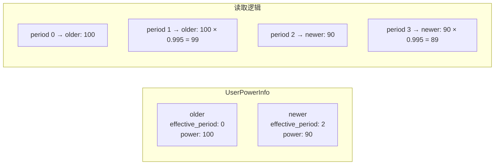
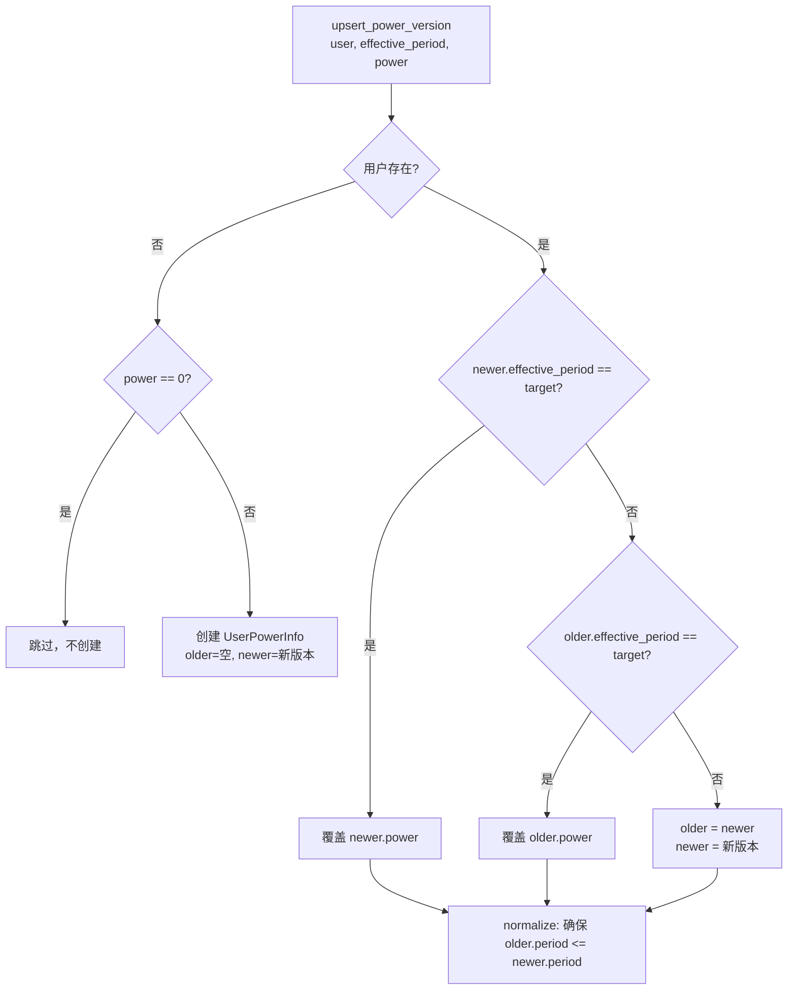
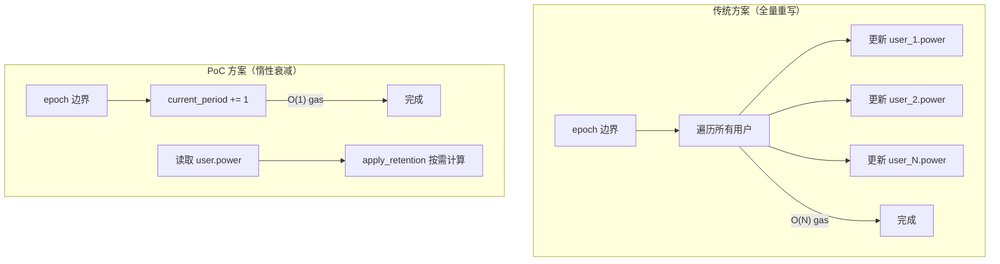
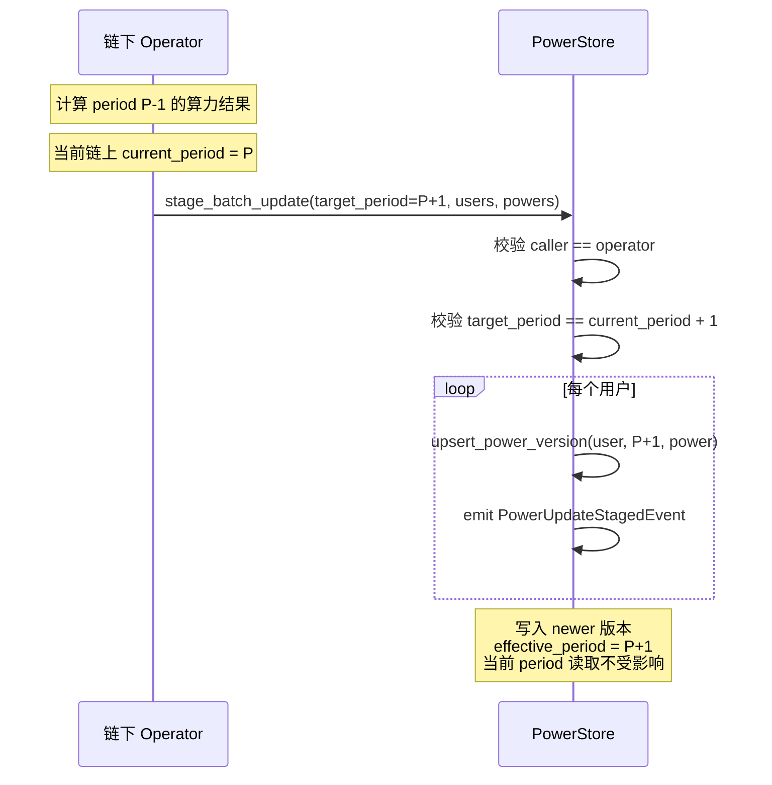
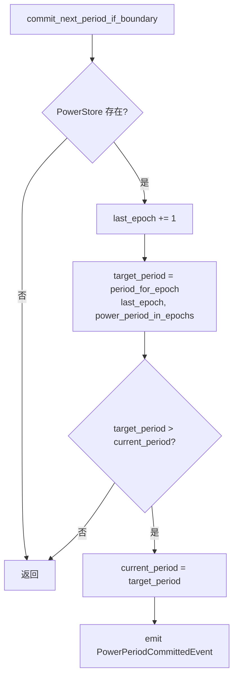
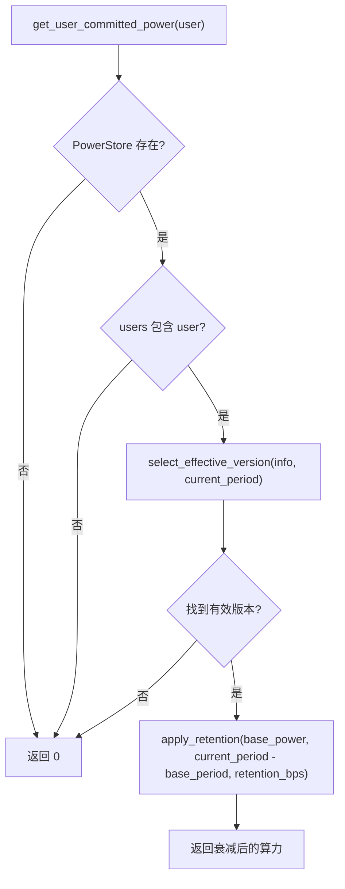

# 03 — 算力存储与版本管理

本文档深入分析 `poc_power_store` 模块的双版本算力存储机制、惰性衰减策略和 period 边界提交逻辑。

**源文件**：`poc/poc_power_store.move`

## 3.1 核心概念：Power Period

Power Period 是算力版本的时间单位，一个 period 包含若干个链上 epoch。

```
power_period_in_epochs = 60（默认）

epoch:    0    1    2   ...   60   61   ...  120  121
period:   0    0    0   ...    0    1   ...    1    2
          ↑                    ↑              ↑
       genesis              period 1       period 2
```

**Period 计算公式**（`period_for_epoch`）：

```
period = (epoch == 0) ? 0 : (epoch - 1) / power_period_in_epochs
```

当 `power_period_in_epochs = 60` 时：
- epoch 0 → period 0
- epoch 1 → period 0
- epoch 2 → period 0
- epoch 60 → period 0
- epoch 61 → period 1
- epoch 120 → period 1
- epoch 121 → period 2

当 `power_period_in_epochs = 2` 时：
- epoch 0 → period 0
- epoch 1 → period 0
- epoch 2 → period 0
- epoch 3 → period 1
- epoch 4 → period 1
- epoch 5 → period 2

## 3.2 双版本存储机制

每个用户保留 **恰好两个** 算力版本：`older` 和 `newer`。



### 版本选择算法（`select_effective_version`）

```
输入: target_period
1. 检查 newer: 如果 newer.effective_period <= target_period 且 newer 非空 → 返回 newer
2. 检查 older: 如果 older.effective_period <= target_period 且 older 非空 → 返回 older
3. 都不满足 → 返回 (0, 0)
```

**关键设计**：newer 优先。因为 newer 总是较新的版本，如果它已经生效（`effective_period <= target_period`），就应该使用它。

### 版本写入算法（`upsert_power_version`）



**同 period 多次更新**：最后一次写入生效（覆盖语义）。

## 3.3 惰性衰减（Lazy Retention Decay）

### 衰减公式

```
retained_power = base_power × (retention_bps / 10000) ^ periods_elapsed
```

默认 `retention_bps = 9950`（99.5%），衰减示例：

| 经过 period 数 | 衰减系数 | 原始 1000 的结果 |
|---------------|---------|----------------|
| 0 | 100% | 1000 |
| 1 | 99.5% | 995 |
| 2 | 99.0% | 990 |
| 5 | 97.5% | 975 |
| 10 | 95.1% | 951 |
| 50 | 77.8% | 778 |
| 100 | 60.6% | 606 |

### 衰减实现（`apply_retention`）

```move
fun apply_retention(power: u64, periods_elapsed: u64, retention_bps: u64): u64 {
    if (power == 0 || periods_elapsed == 0) return power;
    let retained = power;
    let i = 0;
    while (i < periods_elapsed) {
        if (retained == 0) return 0;
        retained = ((retained as u128) * (retention_bps as u128) / (10000 as u128)) as u64;
        i += 1;
    };
    retained
}
```

**注意**：使用 u128 中间运算防止溢出，逐 period 迭代乘法（非指数公式），确保与链上整数除法的截断行为一致。

### 惰性衰减的优势



- **epoch 边界**：仅推进 `current_period` 计数器，O(1) 复杂度
- **读取时**：按 `periods_elapsed` 计算衰减，O(periods_elapsed) 但通常很小
- **写入时**：`stage_batch_update` 只更新有新数据的用户

## 3.4 算力上传流程

### stage_batch_update

链下 Operator 批量上传下一 period 的算力数据。



**约定**：
- 链下上传的是 period P-1 的计算结果
- 但该结果从 P+1 开始生效（`effective_period = current_period + 1`）
- 当前 period 的读取始终稳定，不受上传影响

### set_genesis_committed_power

创世特例：直接写入 period 0 的算力快照。

```move
// 仅在 last_epoch == 0 && current_period == 0 时允许
public entry fun set_genesis_committed_power(
    topo_framework: &signer,
    user: address,
    power: u64,
)
```

## 3.5 Period 边界提交

### commit_next_period_if_boundary

在 `stake::on_new_epoch()` 中调用，推进 period 计数器。



**关键时序**：在 `on_new_epoch` 中的调用位置：

```
1. 奖励分配（使用 OLD power 快照）  ← 先分配
2. commit_next_period_if_boundary()  ← 再推进 period
3. force_undelegate_below_threshold  ← 用 NEW power 检查
4. 状态转换
5. 验证者集合重建
```

这确保了：
- 奖励按旧 period 的算力分配（公平性）
- 强制退出按新 period 的算力检查（及时性）

## 3.6 完整读取流程



### 数值走查示例

假设 `retention_bps = 9950`, `power_period_in_epochs = 1`（这里使用短周期只是为了便于演示，不代表默认值）：

```
Period 0: set_genesis_committed_power(Alice, 1000)
          → older={0,0}, newer={0,1000}

Period 0: stage_batch_update(target=1, [Alice], [900])
          → older={0,1000}, newer={1,900}

读取 period 0: select newer? 1 > 0 不行 → select older? 0 <= 0 ✓
               → base=(0, 1000), elapsed=0, result=1000

读取 period 1: select newer? 1 <= 1 ✓
               → base=(1, 900), elapsed=0, result=900

读取 period 2: select newer? 1 <= 2 ✓
               → base=(1, 900), elapsed=1, result=900×0.995=895

读取 period 3: select newer? 1 <= 3 ✓
               → base=(1, 900), elapsed=2, result=900×0.995×0.995=890
```

## 3.7 下一 Epoch 算力预测

`get_user_committed_power_for_next_epoch` 用于 `stake` 模块预测下一 epoch 的验证者投票权。

```move
public(friend) fun get_user_committed_power_for_next_epoch(user: address): u64 {
    let target_period = period_for_epoch(store.last_epoch + 1, store.power_period_in_epochs);
    get_user_power_for_period_internal(store, user, target_period)
}
```

如果下一 epoch 跨越 period 边界，`target_period` 会比 `current_period` 大 1，此时：
- 已上传的 `stage_batch_update` 数据会被读取到
- 未上传的用户会按 retention 多衰减一个 period

## 3.8 事件索引

| 事件 | 触发时机 | 关键字段 |
|------|---------|---------|
| `OperatorChangedEvent` | `set_operator()` | old_operator, new_operator |
| `PowerUpdateStagedEvent` | `stage_batch_update()` 每个用户 | target_period, effective_period, user, power |
| `PowerPeriodCommittedEvent` | `commit_next_period_if_boundary()` 跨越边界时 | previous_period, current_period |
