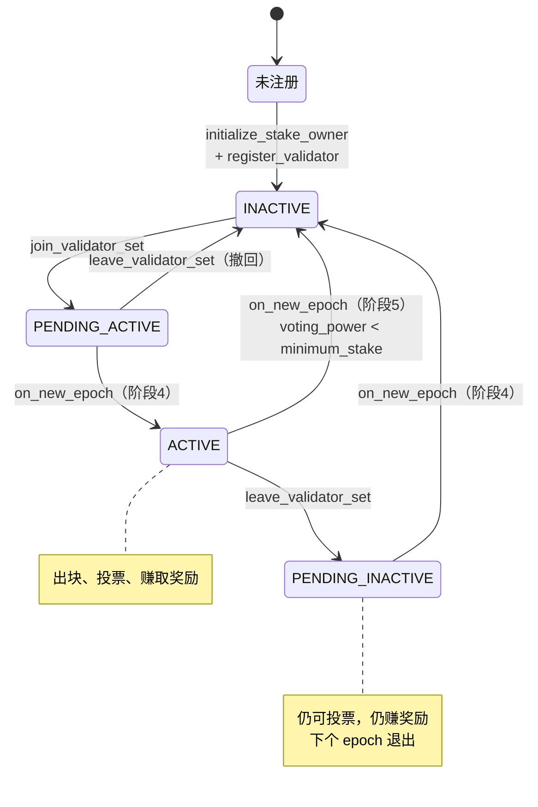
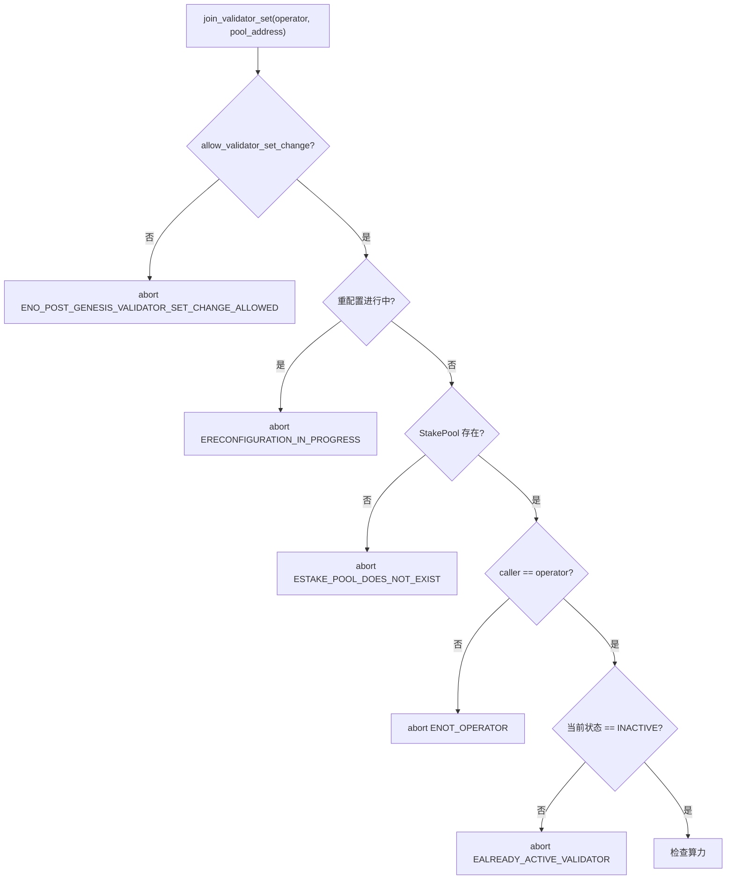
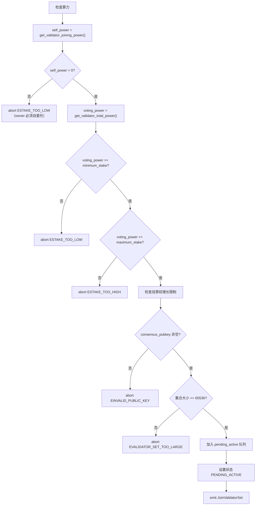
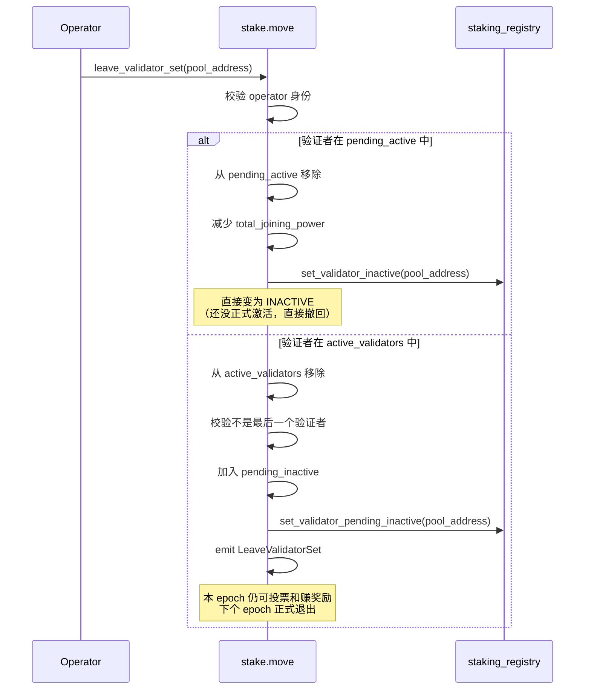
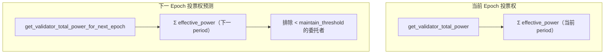
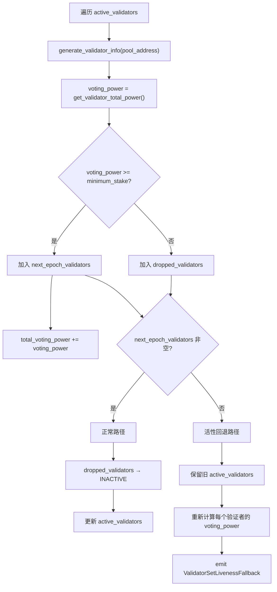
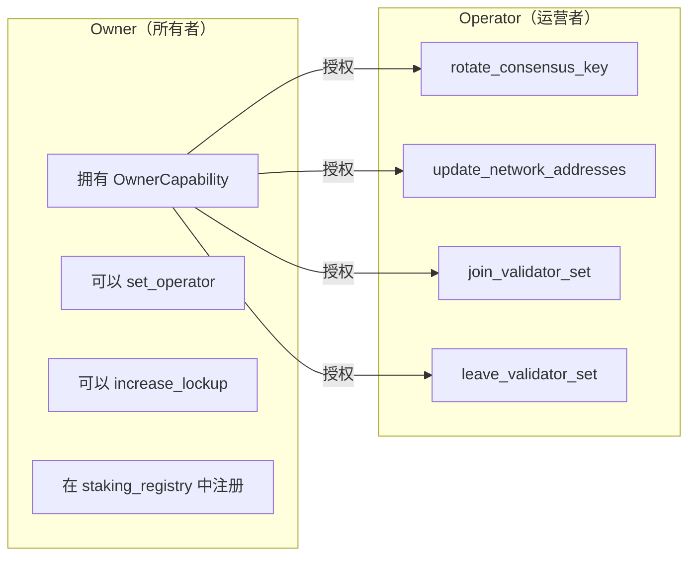

# 08 — 验证者集合管理

本文档详细分析验证者的加入/离开流程、投票权重计算、活性回退机制。

**源文件**：`stake.move:892-958, 966-1022, 1198-1355`

## 8.1 验证者生命周期总览



## 8.2 加入验证者集合

### 前置条件



### 算力检查



### 投票权增长限制

```move
fun update_voting_power_increase(new_voting_power: u64) {
    let validator_set = borrow_global_mut<ValidatorSet>(@topo_framework);
    let voting_power_increase_limit =
        staking_config::get_voting_power_increase_limit(&staking_config::get());
    validator_set.total_joining_power += (new_voting_power as u128);

    // 检查新加入的总投票权不超过当前总投票权的 limit%
    assert!(
        validator_set.total_joining_power
            <= validator_set.total_voting_power * (voting_power_increase_limit as u128) / 100,
        EVOTING_POWER_INCREASE_EXCEEDS_LIMIT
    );
}
```

这防止单个 epoch 内大量新验证者涌入导致投票权剧烈变化。

## 8.3 离开验证者集合



**关键规则**：
- 最后一个活跃验证者不能离开（`ELAST_VALIDATOR`）
- pending_active 的验证者可以直接撤回（不经过 pending_inactive）
- pending_inactive 的验证者在本 epoch 仍然参与共识和奖励

## 8.4 投票权重计算

### 当前 Epoch 投票权

```move
public fun get_current_epoch_voting_power(pool_address: address): u64 {
    let validator_state = get_validator_state(pool_address);
    if (validator_state == ACTIVE || validator_state == PENDING_INACTIVE) {
        staking_registry::get_validator_total_power(pool_address)
    } else {
        0
    }
}
```

投票权 = 验证者所有委托者的 `effective_power` 之和。

### 下一 Epoch 投票权预测

```move
fun compute_simulated_validator_info(candidate, ...): (u64, ValidatorInfo) {
    let new_voting_power =
        staking_registry::get_validator_total_power_for_next_epoch(candidate.addr);
    // ...
}
```

`get_validator_total_power_for_next_epoch` 额外考虑：
- 下一 period 的算力衰减
- 低于维持阈值的委托者将被排除（预测强制退出）



## 8.5 验证者集合重建（阶段 5 详解）

### 重建流程



### 正常路径

```move
if (!next_epoch_validators.is_empty()) {
    dropped_validators.for_each_ref(|addr| {
        staking_registry::set_validator_inactive(*addr);
    });
    validator_set.active_validators = next_epoch_validators;
    validator_set.total_voting_power = total_voting_power;
}
```

### 活性回退路径

```move
if (next_epoch_validators.is_empty()) {
    // 保留旧验证者集合，刷新投票权
    let refreshed_validators = vector::empty();
    let emergency_total_voting_power = 0u128;
    // 遍历旧 active_validators，重新生成 ValidatorInfo
    // ...
    validator_set.active_validators = refreshed_validators;
    validator_set.total_voting_power = emergency_total_voting_power;

    event::emit(ValidatorSetLivenessFallback {
        minimum_stake,
        emergency_validator_count: validator_set.active_validators.length(),
        total_emergency_voting_power: validator_set.total_voting_power,
    });
}
```

**活性回退的触发条件**：所有验证者的 `voting_power` 都低于 `minimum_stake`。

**设计意图**：宁可让不合格的验证者继续出块，也不能让链停机。

## 8.6 后续处理

### 更新 validator_index

```move
let validator_index = 0;
while (validator_index < vlen) {
    let validator_info = validator_set.active_validators.borrow_mut(validator_index);
    validator_info.config.validator_index = validator_index;
    let validator_config = borrow_global_mut<ValidatorConfig>(validator_info.addr);
    validator_config.validator_index = validator_index;
    // ...
    validator_index += 1;
}
```

每个验证者的 `validator_index` 在每个 epoch 重新分配，用于：
- 交易费记录（`record_fee` 按 index 累积）
- 性能统计（`ValidatorPerformance` 按 index 索引）

### 重置性能统计

```move
validator_perf.validators = vector::empty();
// 为每个活跃验证者创建新的性能记录
validator_perf.validators.push_back(IndividualValidatorPerformance {
    successful_proposals: 0,
    failed_proposals: 0,
});
```

### 续期 Lockup

```move
if (stake_pool.locked_until_secs <= reconfig_start_secs) {
    stake_pool.locked_until_secs = now_secs + recurring_lockup_duration_secs;
}
```

活跃验证者的 lockup 自动续期，确保治理投票权的持续性。

### 重建交易费聚合器

```move
if (exists<PendingTransactionFee>(@topo_framework)) {
    let pending_fee_by_validator = &mut ...;
    assert!(pending_fee_by_validator.is_empty(), ETRANSACTION_FEE_NOT_FULLY_DISTRIBUTED);
    validator_set.active_validators.for_each_ref(|v| {
        pending_fee_by_validator.add(
            v.config.validator_index,
            aggregator_v2::create_unbounded_aggregator<u64>()
        );
    });
}
```

### 更新 total_staked_power

```move
let total_staked_power = if (validator_set.total_voting_power > MAX_U64) {
    MAX_U64 as u64
} else {
    validator_set.total_voting_power as u64
};
staking_registry::set_total_staked_power(total_staked_power);
```

`total_staked_power` 用于治理模块计算投票权重。

## 8.7 Operator 与 Owner 的分离



Owner 和 Operator 可以是不同地址：
- Owner 控制经济权益（质押、委托、提取）
- Operator 控制运营操作（共识密钥、网络地址、加入/离开集合）
- Owner 可以随时更换 Operator

## 8.8 共识密钥轮换

```move
public entry fun rotate_consensus_key(
    operator: &signer,
    pool_address: address,
    new_consensus_pubkey: vector<u8>,
    proof_of_possession: vector<u8>,
)
```

- 需要 BLS proof-of-possession 防止 rogue-key 攻击
- 下个 epoch 生效（写入 `ValidatorConfig`，在 `on_new_epoch` 中被读取）
- 不能在重配置进行中执行

## 8.9 验证者集合大小限制

| 参数 | 值 | 说明 |
|------|-----|------|
| `MAX_VALIDATOR_SET_SIZE` | 65536 | 硬上限，受 bitvec 限制 |
| `minimum_stake` | 创世配置 | 最低投票权要求 |
| `maximum_stake` | 创世配置 | 最高投票权限制 |
| `voting_power_increase_limit` | 创世配置 | 每 epoch 新增投票权上限（%） |
