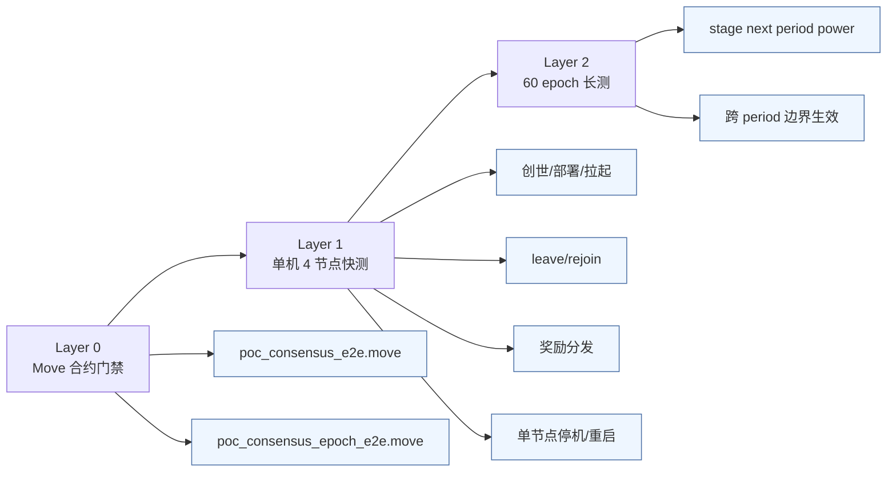
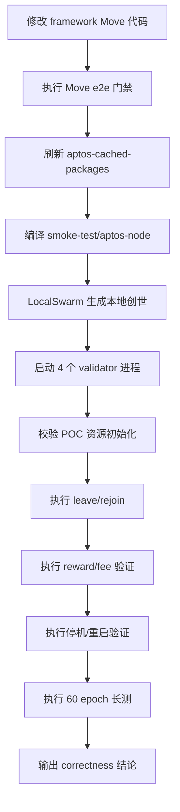
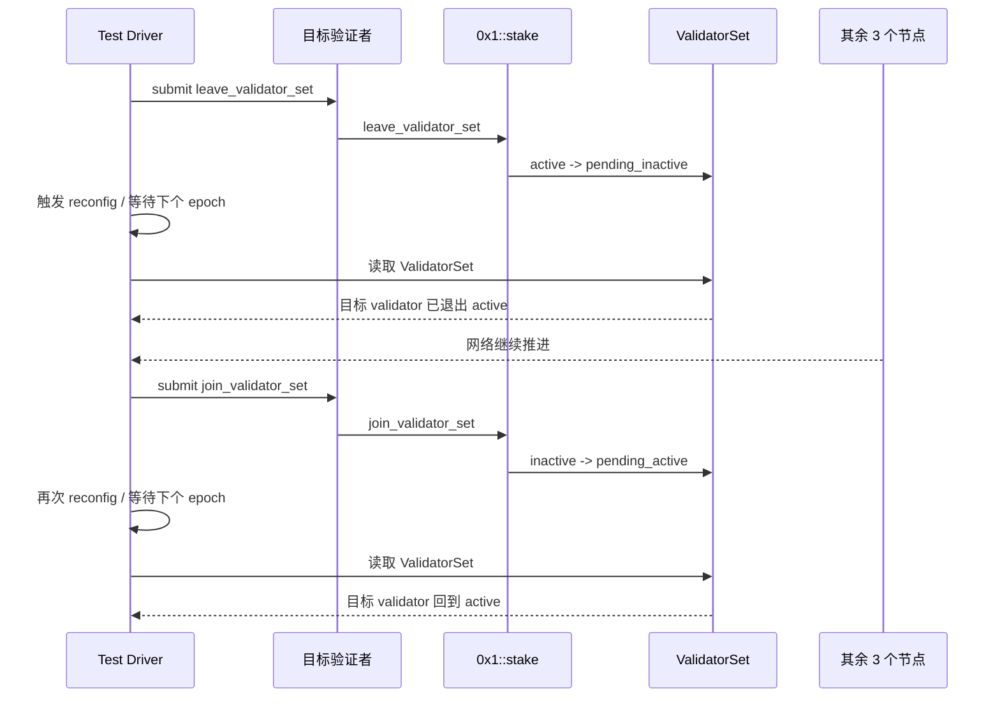

# 15 - POC 单机 4 节点模拟运行测试方案

本文档回答一个具体问题：

**在当前 POC 修改主要位于 `aptos-move/framework/aptos-framework` 的前提下，如何用单机 4 节点环境，对编译、部署、创世、验证者加入/退出、奖励分发、单点故障恢复进行一套完整且可落地的 correctness 测试。**

本文档的结论先写在前面：

1. 主测试宿主应选择 `testsuite/smoke-test` 的 `LocalSwarm + SwarmBuilder`，而不是零散 shell 脚本。
2. Move 合约层 correctness 仍然要以前置门禁的方式保留，不能直接跳过。
3. 单机 4 节点测试的重点是 **运行态正确性**，不是性能压测。
4. 当前 `power_period_in_epochs = 60`，因此必须把测试拆成两条链路：
   - 快测：验证编译、创世、4 节点拉起、validator set 变化、奖励路径、单点故障恢复
   - 长测：专门跨越 60 个 epoch，验证 POC power period 边界生效语义

## 15.1 为什么单机 4 节点测试必须落在 LocalSwarm

单机 4 节点测试如果只靠手写脚本启动 4 个 `aptos-node` 进程，问题很多：

- 创世配置、端口、密钥、数据目录容易漂移
- 很难稳定复用仓库内已有的 epoch/reconfig/test helper
- 很难把 Move framework 改动和真实节点进程串起来
- 很难把验证者加入/退出、停机/重启、catch-up 变成可重复断言

仓库里现成的正确路径已经很明确：

- `testsuite/smoke-test/src/smoke_test_environment.rs`
- `testsuite/smoke-test/src/aptos_cli/validator.rs`
- `testsuite/testcases/src/validator_join_leave_test.rs`

`LocalSwarm` 的价值不是“方便启动”，而是它同时覆盖了：

- 真实创世
- 真实节点进程
- 真实 REST 接口
- 真实 reconfiguration
- 真实 validator set 变化
- 真实 stop/start/catchup

这正好覆盖 POC 修改最需要验证的 Move-Rust 接缝。

## 15.2 单机 4 节点到底能验证什么

### 能验证的内容

| 类别 | 能力 |
| --- | --- |
| 编译与部署 | framework 改动是否真的进入本地创世产物，并被节点进程加载 |
| 创世初始化 | `genesis.move` 是否正确初始化 `poc_power_store`、`staking_registry`、初始 validator set |
| 生命周期 | 验证者 leave / rejoin 是否通过 `stake` 和 `ValidatorSet` 正确生效 |
| 奖励路径 | epoch reward、交易费分发是否真的回写到 `staking_registry` 的 deposit |
| 运行态接缝 | Move view、REST resource、Rust node process 读取是否一致 |
| 故障恢复 | 4 节点下单节点停机、重启、追块后网络是否仍正确推进 |
| 长周期语义 | `power_period_in_epochs = 60` 下 staged power 是否只在 period 边界生效 |

### 不能验证的内容

| 类别 | 说明 |
| --- | --- |
| 性能结论 | 单机 4 节点不是吞吐、延迟、资源占用压测 |
| 双节点故障可用性 | 4 validators = 3f + 1，只能容忍 1 个拜占庭/停机节点 |
| 多机网络抖动 | 无法覆盖真实跨机房网络延迟、丢包、抖动 |
| 严格 4 进程下的“新增第 5 个验证者” | 这不是 4 节点拓扑，属于 `4 active + 1 standby` 或 5 节点扩展场景 |

**关键边界**：

- 严格单机 4 节点，最稳妥的“加入/退出” correctness 场景是：**已有验证者 leave，再 rejoin**
- 如果要测“全新验证者从链外加入活跃集合”，建议扩成单机 `4 active + 1 standby`

## 15.3 测试总分层



### Layer 0：Move 合约门禁

目的不是替代 4 节点测试，而是先把合约状态机卡死在最小范围内。

当前已有的关键测试：

- `aptos-move/framework/aptos-framework/tests/poc_consensus_e2e.move`
- `aptos-move/framework/aptos-framework/tests/poc_consensus_epoch_e2e.move`

这两类测试先通过，再进入节点级运行态测试。

### Layer 1：单机 4 节点快测

目标：

- framework 改动能否被真实节点加载
- 创世后资源是否正确
- validator leave / rejoin 是否正确
- reward / fee 路径是否真的进账
- 单节点停机后链是否还能推进

### Layer 2：60 epoch 长测

目标只有一个：

- 在 `power_period_in_epochs = 60` 的真实配置下，验证 staged power 不会提前生效，只会在真正跨 period 时切换

这一层必须和快测拆开，否则每次 PR 都会被长时测试拖慢。

## 15.4 推荐的代码落点

推荐新增单独 smoke test 文件：

```text
testsuite/smoke-test/src/poc_four_node.rs
```

并在：

```text
testsuite/smoke-test/src/lib.rs
```

中注册：

```rust
#[cfg(test)]
mod poc_four_node;
```

这样做的原因很直接：

- POC 逻辑集中在 framework Move
- 4 节点运行态验证集中在 smoke-test
- 不需要引入额外的 shell orchestration
- 可以直接复用 `SwarmBuilder`、`reconfig()`、`wait_for_all_nodes_to_catchup()`、CLI helper、REST resource 读取

## 15.5 编译、部署、创世的真实执行链路

### 15.5.1 总链路



### 15.5.2 为什么必须刷新 cached packages

`testsuite/smoke-test` 在创建本地链时，默认走的是：

- `SwarmBuilder::with_aptos()`
- `aptos_cached_packages::head_release_bundle()`

这意味着：

**你改了 `aptos-move/framework/` 下的 Move 代码，并不等于 LocalSwarm 会自动吃到新代码。**

如果不刷新 `aptos-cached-packages`，单机 4 节点创世仍可能加载旧的 `head.mrb`。

因此，改动 framework Move 后，必须执行：

```bash
scripts/cargo_build_aptos_cached_packages.sh
```

这是单机 4 节点测试最容易被忽略、但最致命的前置条件。

## 15.6 推荐的执行顺序与命令

### Step 0：先跑 Move 门禁

```bash
env RUST_MIN_STACK=33554432 TEST_FILTER=poc_consensus_e2e cargo test -p aptos-framework move_framework_unit_tests -- --nocapture
env RUST_MIN_STACK=33554432 TEST_FILTER=poc_consensus_epoch_e2e cargo test -p aptos-framework move_framework_unit_tests -- --nocapture
```

### Step 1：刷新 cached packages

```bash
scripts/cargo_build_aptos_cached_packages.sh
```

### Step 2：预编译节点与 smoke-test

```bash
cargo test -p smoke-test --no-run
```

如果希望显式预编译节点二进制，也可以加：

```bash
cargo build -p aptos-node -p aptos
```

### Step 3：执行单机 4 节点测试

假设后续新增了 `testsuite/smoke-test/src/poc_four_node.rs`，建议按测试函数名过滤，并串行执行：

```bash
cargo test -p smoke-test test_poc_four_node_genesis_bootstrap -- --nocapture --test-threads=1
cargo test -p smoke-test test_poc_four_node_leave_rejoin -- --nocapture --test-threads=1
cargo test -p smoke-test test_poc_four_node_rewards -- --nocapture --test-threads=1
cargo test -p smoke-test test_poc_four_node_node_restart -- --nocapture --test-threads=1
cargo test -p smoke-test test_poc_four_node_power_period_boundary -- --nocapture --test-threads=1
```

`--test-threads=1` 很重要，因为 LocalSwarm 会占用大量端口和本地进程资源，并发跑多个 swarm 容易制造伪失败。

## 15.7 推荐的 4 节点创世配置

建议在测试中使用如下初始化方式：

```rust
let (mut swarm, mut cli, _faucet) = SwarmBuilder::new_local(4)
    .with_aptos()
    .with_init_config(Arc::new(|_, conf, _| {
        conf.consensus.round_initial_timeout_ms = 200;
        conf.consensus.quorum_store_poll_time_ms = 100;
        conf.api.failpoints_enabled = true;
        conf.indexer_db_config.enable_event = true;
    }))
    .with_init_genesis_config(Arc::new(|genesis_config| {
        genesis_config.allow_new_validators = true;
        genesis_config.epoch_duration_secs = 4;
        genesis_config.recurring_lockup_duration_secs = 4;
        genesis_config.voting_duration_secs = 3;
        genesis_config.rewards_apy_percentage = 10;
    }))
    .build_with_cli(0)
    .await;
```

### 参数解释

| 参数 | 推荐值 | 作用 |
| --- | --- | --- |
| `allow_new_validators` | `true` | 允许 validator set 变化 |
| `epoch_duration_secs` | `4` | 缩短一个 epoch 的墙钟时间 |
| `recurring_lockup_duration_secs` | `4` | 缩短测试等待时间 |
| `voting_duration_secs` | `3` | 避免治理窗口拖慢测试 |
| `rewards_apy_percentage` | `10` | 让奖励变化更容易观测 |
| `round_initial_timeout_ms` | `200` | 提升本地故障场景收敛速度 |

### 关于 genesis stake 的一个关键事实

POC 当前的 genesis validator 不是“只有 stake，没有 power”。

在创世时：

- `genesis.move` 会调用 `ensure_poc_staking_initialized`
- `staking_registry::calculate_genesis_power_from_stake()` 会从 genesis stake 推导初始 power
- `poc_power_store` 会写入 genesis committed power

所以：

**在 period 0，genesis stake 直接影响初始 validator power。**

这意味着如果你用 `with_init_genesis_stake()` 做非对称配置，测到的不只是经济质押差异，还会连带改变初始 POC power。

## 15.8 创世完成后必须检查的权威状态

单机 4 节点测试不要只看日志和交易提交成功，权威状态必须直接读链上资源或 Move view。

### 核心观测对象

| 对象 | 推荐读取方式 | 为什么必须看 |
| --- | --- | --- |
| `0x1::poc_power_store::PowerStore` | Move view | 确认 operator、current_period、`power_period_in_epochs = 60` |
| `0x1::staking_registry::StakingRegistry` | Move view 或 REST BCS resource | 确认 registry 已初始化、cooldown 参数正确、用户 deposit 可观测 |
| `0x1::stake::ValidatorSet` | REST BCS resource | 确认 active/pending_active/pending_inactive 的真实集合 |
| `stake` 相关 view | Move view | 确认 validator state、current voting power |
| 节点健康状态 | `wait_for_all_nodes_to_catchup()` | 确认不是“部分节点没跟上”的假通过 |

### 推荐使用的 view 接口

#### `poc_power_store`

- `0x1::poc_power_store::get_operator`
- `0x1::poc_power_store::get_current_period`
- `0x1::poc_power_store::get_power_period_in_epochs`
- `0x1::poc_power_store::get_user_decayed_power`
- `0x1::poc_power_store::get_user_power_for_period`

#### `staking_registry`

- `0x1::staking_registry::registry_exists`
- `0x1::staking_registry::get_user_stake_info`
- `0x1::staking_registry::get_effective_power`
- `0x1::staking_registry::get_validator_total_power`
- `0x1::staking_registry::get_total_staked_power`
- `0x1::staking_registry::get_cooldown_secs`
- `0x1::staking_registry::get_validator_commission_bps`

#### `stake`

- `0x1::stake::get_validator_state`
- `0x1::stake::get_current_epoch_voting_power`
- `0x1::stake::get_stake`
- 原始资源 `0x1::stake::ValidatorSet`

### 一个非常重要的原则

**事件只能作为辅助证据，不能作为唯一 correctness 依据。**

优先级应为：

1. 链上最终状态
2. `ValidatorSet` / `StakingRegistry` / `PowerStore` 资源
3. Move view 返回值
4. 事件与日志

## 15.9 场景一：编译、部署、创世正确性

### 目标

验证 framework Move 改动已经真正进入本地 4 节点链，并且创世后 POC 资源处于正确状态。

### 执行步骤

1. 通过 Move e2e 门禁
2. 刷新 `aptos-cached-packages`
3. 创建 `SwarmBuilder::new_local(4).with_aptos()`
4. 拉起 4 个 validator
5. 等待所有节点健康并追平
6. 读取 `PowerStore`、`StakingRegistry`、`ValidatorSet`

### 必须通过的断言

- `staking_registry::registry_exists() == true`
- `poc_power_store::get_operator() == @topo_framework`
- `poc_power_store::get_power_period_in_epochs() == 60`
- `ValidatorSet.active_validators.len() == 4`
- 4 个节点都能返回 ledger info
- `wait_for_all_nodes_to_catchup()` 成功

### 为什么这是“部署验证”

在 LocalSwarm 模型里，“部署”不是单独执行 package publish。

它的真实含义是：

- 生成本地 genesis
- 把 framework release bundle 注入 genesis
- 启动真实 validator 进程

因此，**创世校验本身就是部署校验的一部分**。

## 15.10 场景二：验证者退出再加入

### 这个场景为什么是 4 节点主测试

严格 4 节点拓扑下，最稳的 membership correctness 场景不是“新加第 5 个节点”，而是：

- 一个现有 validator 从 active set leave
- 经过 reconfig 后退出生效
- 同一 validator 再次 join
- 再经过 reconfig 后重新回到 active set

这条链路能够验证：

- Move 层 `stake::leave_validator_set`
- Move 层 `stake::join_validator_set`
- `ValidatorSet.pending_inactive` / `pending_active`
- Rust 节点对 epoch/reconfig 的消费
- 节点进程在集合变化后的继续运行

### 推荐时序



### 必须通过的断言

#### leave 阶段

- leave 交易执行成功
- leave 后，目标 validator 先出现在 `pending_inactive`
- reconfig 后，目标 validator 从 `active_validators` 消失
- `stake::get_validator_state(pool)` 从 `ACTIVE` 变成 `PENDING_INACTIVE`，再变成 `INACTIVE` 或不在 active set
- 其余 3 个 validator 继续推进版本号和 epoch

#### rejoin 阶段

- join 交易执行成功
- join 后，目标 validator 出现在 `pending_active`
- reconfig 后，目标 validator 回到 `active_validators`
- `stake::get_validator_state(pool)` 恢复为 `ACTIVE`
- 全网重新追平

### 不能只看什么

以下现象都不能单独当作通过标准：

- 交易返回 success
- CLI 显示命令执行完成
- 某一个节点日志里出现 `new epoch`

必须直接检查 `ValidatorSet`。

## 15.11 场景三：奖励分发 correctness

奖励分发至少要拆成两块：

1. epoch staking reward
2. transaction fee 分发

### 15.11.1 epoch reward

#### 目标

验证奖励不是只在 Move 内部“算过了”，而是真的从节点运行态回写进：

- `staking_registry` 的用户 deposit
- validator set 的 voting power 演化

#### 推荐设计

1. 记录目标 validator owner 的初始 deposit
2. 记录该 validator 某个 delegator 的初始 deposit
3. 让链运行数个 epoch，并制造足够交易/出块活动
4. 读取奖励后的 owner/delegator deposit
5. 比较增量与 commission 预期关系

#### 推荐断言

- owner deposit 增长
- delegator deposit 增长
- 同一 validator pool 内，owner 增量应包含：
  - owner 自身按 power 分到的部分
  - commission
  - 舍入 dust
- 退出 active set 的 validator，在退出后的奖励窗口中不应继续按 active 身份累计奖励

#### 一个重要实现细节

现有 `testsuite/smoke-test/src/aptos_cli/validator.rs::test_nodes_rewards()` 已经提供了很好的参考：

- 通过 4 节点 LocalSwarm 跑真实 epoch
- 读取 `ValidatorSet`
- 结合 block metadata / proposal success 做奖励推断

POC 版本可以直接借用这套结构，但把断言中心放到：

- `staking_registry::get_user_stake_info(user).0`
- `stake::get_current_epoch_voting_power(pool)`
- `ValidatorSet` 中的 voting power

### 15.11.2 transaction fee 分发

#### 目标

验证 gas fee 分发最终也回写到 POC deposit，而不是卡在 pending accumulator。

#### 推荐步骤

1. 记录 owner/delegator 的初始 deposit
2. 发送一批付费交易，制造 gas fee
3. 在 epoch 结束前读取 `stake::get_pending_transaction_fee()`，确认 accumulator 非空
4. 触发 reconfig 或等待 epoch 结束
5. 再读 `get_pending_transaction_fee()`，确认 fee 已被清空/结转
6. 再读 owner/delegator 的 deposit，确认增加

#### 推荐断言

- fee 分发前 `pending_transaction_fee` 非空
- fee 分发后 `pending_transaction_fee` 被清空或显著减少
- owner/delegator deposit 都发生正向变化
- 带 commission 的 pool 中，owner 增量不小于纯按 power 分账的结果

## 15.12 场景四：单节点失效、恢复与奖励抑制

这个场景验证的是两件不同的事情，不能混为一谈：

1. **逻辑退出**：调用 `leave_validator_set`
2. **进程故障**：节点 stop 或 failpoint

前者验证 membership correctness，后者验证 liveness/recovery correctness。

### 推荐设计

#### 场景 A：单节点广播失败但不退出集合

参考 `test_nodes_rewards()` 的现成打法：

- 对一个 validator 注入 failpoint
- 让它 proposal 广播失败或部分失败
- 跑几个 epoch
- 观察它奖励增长低于正常 validator

推荐 failpoint：

- `consensus::send::broadcast_proposal`
- `consensus::send::broadcast_opt_proposal`

#### 场景 B：单节点直接 stop，再 restart

步骤：

1. 记录当前 epoch/version
2. 停掉 1 个 validator 进程
3. 对其余 3 个节点发送交易，确认链继续推进
4. 重启被停节点
5. 等待该节点 catch up
6. 校验它最终追到最新 version 和 epoch

### 必须通过的断言

- 停 1 个节点后，其余 3 个节点仍能继续出块
- 被停节点恢复后能重新追平
- 恢复后的节点读取到的 `ValidatorSet` 与其他节点一致
- 故障 validator 的奖励表现应低于正常 validator，或至少不高于正常 validator

### 4 节点容错边界

4 validators 对应：

- `3f + 1`
- `f = 1`

所以：

- 停 1 个节点仍应有正确性结论
- 停 2 个节点不应宣称“网络仍有强可用性”

## 15.13 场景五：`power_period_in_epochs = 60` 的边界验证

这是当前 POC 机制里最需要单独拉出的长测。

### 为什么必须单独设计

当前 `power_period_in_epochs = 60`，其含义是：

- epoch `1..60` 属于 period `0`
- epoch `61` 开始才进入 period `1`

也就是说：

- 在 period `0` 中上传的 next-period power
- 不应在 epoch `2..60` 的任意时刻提前生效
- 只能在真正跨入下一个 period 后生效

### 推荐验证步骤

1. 创世后读取：
   - `get_current_period() == 0`
   - `get_power_period_in_epochs() == 60`
2. 为目标 validator 或 delegator 调用 `stage_batch_update(target_period = 1, ...)`
3. 在 period `0` 内多次读取：
   - `get_user_decayed_power`
   - `get_user_power_for_period(user, 0)`
   - `get_user_power_for_period(user, 1)`
   - `staking_registry::get_effective_power`
4. 验证当前 effective power 仍基于 period `0`
5. 推进到下一个 power period
6. 再读取上述接口，确认 period `1` 值正式接管

### 如何推进 60 个 epoch

这里有两种做法：

#### 做法 A：自然时间推进

若 `epoch_duration_secs = 4`，跨 60 个 epoch 大约需要：

- `60 * 4 = 240` 秒
- 再加启动与同步缓冲，通常接近 5 到 8 分钟

优点：

- 最接近真实运行态

缺点：

- 太慢，不适合每次 PR 都跑

#### 做法 B：循环触发 reconfig

在 smoke test 中可以通过循环 `reconfig()` 快速推进 epoch。

优点：

- 大幅缩短测试时间

缺点：

- 更适合验证 period 边界生效语义
- 不适合顺便拿来做“精确奖励金额”结论

### 最佳实践

把 60-epoch 测试拆成单独 lane：

- PR 快测默认不跨 full power period
- Nightly 或手动 correctness run 执行跨 60 epoch 长测

## 15.14 单机 4 节点的完整场景矩阵

| 编号 | 场景 | 目标 | 推荐类型 |
| --- | --- | --- | --- |
| S0 | Move e2e 门禁 | 先锁定合约状态机 | 每次提交必跑 |
| S1 | 创世与 4 节点启动 | 验证 framework 改动被真实链加载 | 每次提交必跑 |
| S2 | 初始 validator set 校验 | 验证 4 个活跃验证者都在集合中 | 每次提交必跑 |
| S3 | existing validator leave | 验证 pending_inactive -> inactive | 每次提交必跑 |
| S4 | existing validator rejoin | 验证 pending_active -> active | 每次提交必跑 |
| S5 | epoch reward 分发 | 验证 deposit 增长与 voting power 演化 | 每次提交必跑 |
| S6 | transaction fee 分发 | 验证 fee 最终回写 deposit | 每次提交建议跑 |
| S7 | 单节点 failpoint/停机 | 验证 4 节点容错边界内 correctness | 每次提交建议跑 |
| S8 | 单节点重启追平 | 验证 catch-up 与状态一致性 | 每次提交建议跑 |
| S9 | 60 epoch period 边界 | 验证 staged power 的真实生效时机 | Nightly 或手动长测 |

## 15.15 推荐的通过标准

最终不应只输出“测试成功”，而应输出一组分层结论。

### 必须同时满足

1. Move e2e 门禁全部通过
2. `scripts/cargo_build_aptos_cached_packages.sh` 后无遗漏
3. 4 节点 LocalSwarm 启动成功，全部追平
4. 创世后：
   - `registry_exists == true`
   - `power_period_in_epochs == 60`
   - active validator 数量正确
5. leave/rejoin 过程中：
   - `ValidatorSet` pending/active 变化正确
   - reconfig 后状态真正生效
6. 奖励分发过程中：
   - owner/delegator deposit 出现正确方向变化
   - fee accumulator 在 epoch 边界被消化
7. 单节点停机/恢复过程中：
   - 其余节点继续推进
   - 恢复节点最终追平
8. 长测中：
   - staged power 只在跨 period 时生效

只有这 8 类条件同时成立，才能说：

**POC 机制在单机 4 节点模拟运行测试下通过 correctness 验证。**

## 15.16 常见误判与风险点

### 误判 1：改了 Move 代码，但没刷新 cached packages

结果：

- 单机 4 节点创世仍可能跑的是旧 framework

这是最常见的伪通过来源。

### 误判 2：只看交易成功，不看 `ValidatorSet`

结果：

- `leave_validator_set` 或 `join_validator_set` 只是提交成功
- 但实际尚未经过 reconfig 生效

### 误判 3：把“逻辑退出”和“进程停机”混成一个测试

结果：

- 无法判断失败到底来自 membership 逻辑还是节点可用性

### 误判 4：在严格 4 进程拓扑里宣称完成了“新验证者加入”

结果：

- 测到的其实通常只是 existing validator rejoin
- 不是 cold join of a new validator

### 误判 5：在 `power_period_in_epochs = 60` 下用 1 到 2 个 epoch 就断言 staged power 已生效

结果：

- 结论是错的
- 这只能说明 staging 成功，不能说明生效成功

### 误判 6：把事件当成唯一证据

结果：

- 事件存在不等于最终状态正确
- 必须回到链上资源和 view

### 误判 7：使用 faucet 或 root 交易后不处理 sequence 漂移

在 CLI 型 smoke test 中，faucet 可能让 root 本地序列号失步。

必要时应在根账户发交易前执行：

- `swarm.chain_info().resync_root_account_seq_num(&rest_client)`

否则会引入和 POC 逻辑无关的伪失败。

## 15.17 最终建议

如果目标是验证“POC 修改是否真的在链上 4 节点运行时正确”，建议采用以下固定套路：

1. Move e2e 先做合约门禁
2. 刷新 `aptos-cached-packages`
3. 用 `LocalSwarm` 启动单机 4 节点
4. 先验证创世资源
5. 再验证 leave/rejoin
6. 再验证 reward/fee
7. 再验证单节点 stop/restart
8. 最后单独跑 60 epoch power period 长测

其中最关键的不是“把所有场景塞进一个大测试”，而是：

**把快测和长测拆开，把状态断言放在链上资源上，把 4 节点严格边界写清楚。**

这才是一套对 POC 机制真正有判定力的单机 4 节点模拟运行测试方案。
